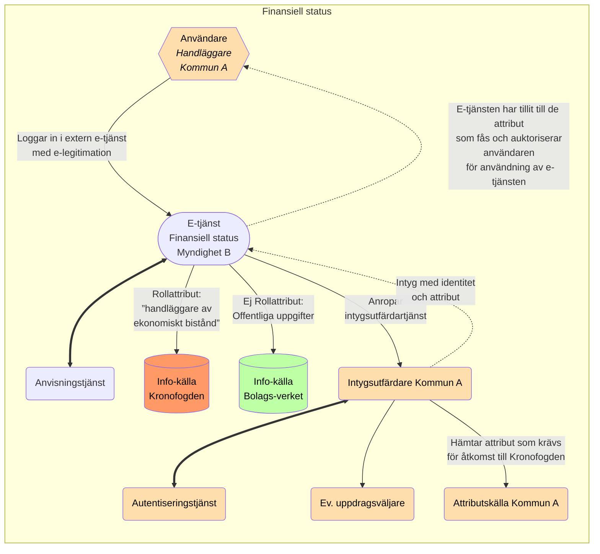

### Flowchart Finansiell status

```mermaid
graph LR
classDef Amber color:#000000,fill:#FFDEAD
classDef Green color:#000000,fill:#BDFFA4
classDef orange color:#000000,fill:#f96
subgraph Finansiell status
A{{Användare<br><i>Handläggare<i><br>Kommun A}}:::Amber
B([E-tjänst<br>Finansiell status<br>Myndighet B])
C(Anvisningstjänst)
D[(Info-källa<br>Kronofogden)]:::orange
E[(Info-källa<br>Bolags-verket)]:::Green
F(Intygsutfärdare Kommun A):::Amber
G(Autentiseringstjänst):::Amber
H(Ev. uppdragsväljare):::Amber
I(Attributskälla Kommun A):::Amber
A -->|Loggar in i extern e-tjänst<br> med e-legitimation | B
B <==> C
B -->|Rollattribut:<br>”handläggare av<br> ekonomiskt bistånd” | D
B --> |Ej Rollattribut:<br>Offentliga uppgifter| E
B --> |Anropar<br>intygsutfärdartjänst| F
F <==> G
F --> H
F --> |Hämtar attribut som krävs<br>för åtkomst till Kronofogden| I
F -.-> |Intyg med identitet<br>och attribut| B
B-.->|E-tjänsten har tillit till de attribut<br> som fås och auktoriserar användaren<br> för användning av e-tjänsten |A
end
```

