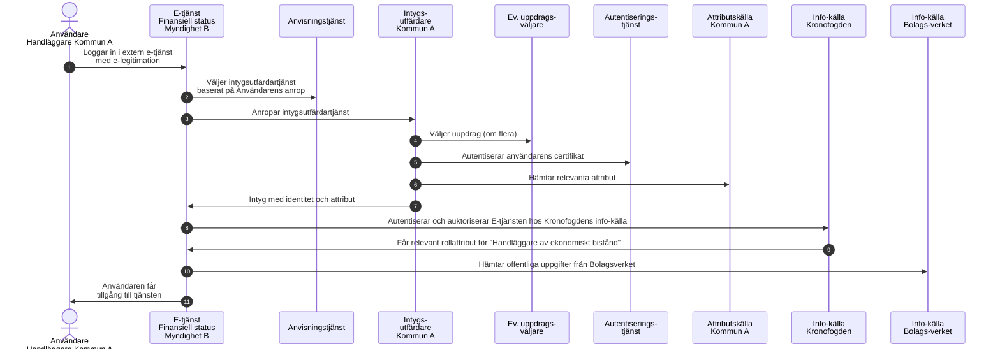

### Sekvensdiagram Finansiell status

```mermaid
sequenceDiagram 
autonumber
actor A as Användare<br>Handläggare Kommun A
participant B as E-tjänst<br>Finansiell status<br>Myndighet B
participant C as Anvisningstjänst
participant D as Intygs-<br>utfärdare<br>Kommun A
participant E as Ev. uppdrags-<br>väljare
participant F as Autentiserings-<br>tjänst
participant G as Attributskälla<br>Kommun A
participant H as Info-källa<br>Kronofogden
participant I as Info-källa<br>Bolags-verket
A->>B: Loggar in i extern e-tjänst<br> med e-legitimation
B->>C: Väljer intygsutfärdartjänst<br>baserat på Användarens anrop
B->>D: Anropar intygsutfärdartjänst
D->>E: Väljer uupdrag (om flera)
D->>F: Autentiserar användarens certifikat
D->>G: Hämtar relevanta attribut
D->>B: Intyg med identitet och attribut
B->>H: Autentiserar och auktoriserar E-tjänsten hos Kronofogdens info-källa
H->>B: Får relevant rollattribut för "Handläggare av ekonomiskt bistånd"
B->>I: Hämtar offentliga uppgifter från Bolagsverket
B->>A: Användaren får<br>tillgång till tjänsten
```

