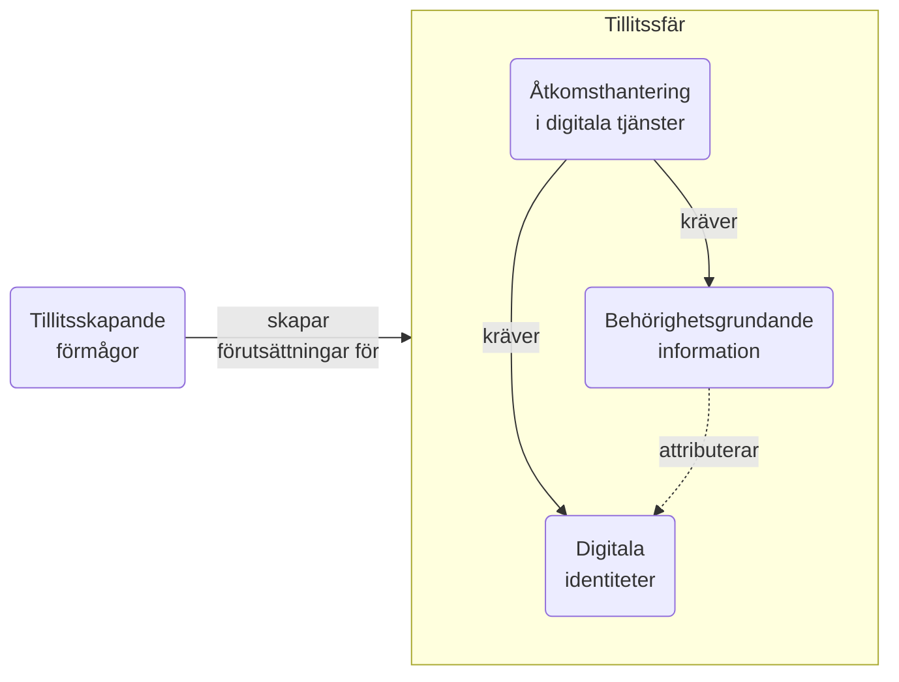
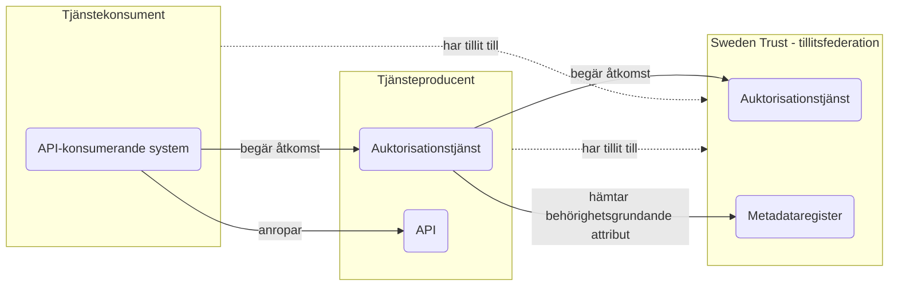
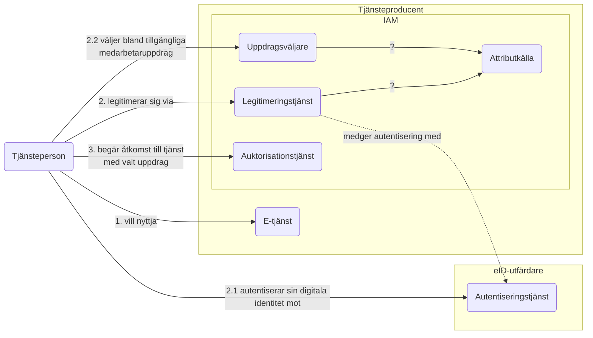

# Målarkitektur för nationell hantering av tillit, identitet och behörighet

## Inledning

För en tillitsfull och kostnadseffektiv samverkan inom offentlig förvaltning behöver vi utveckla och förankra nationella anvisningar för IAM inom områdena visade i nedanstående bild

*Bild över hur områdena tillitsskapande förmågor, digitala identiteter, behörighetsgrundande information och åtkomsthantering i digitala tjänster beror av varandra*

Inom alla dessa områden finns det redan idag olika grad av standardisering i syfte att möjliggöra digitaliseringen av olika verksamhetsområden. Få lösningar idag är dock förankrade och nyttjade på nationell skala och det försöker vi adressera med denna målarkitektur.

För varje område presenteras kort nuläget, visionen och strategiska förflyttningar som tar oss mot visionen.

### Principer för målarkitekturens utformning

I vårt arbete med målarkitekturen utgår vi ifrån principerna i  [Svenskt ramverk för digital samverkan, Digg](https://www.digg.se/kunskap-och-stod/svenskt-ramverk-for-digital-samverkan). 

1. Samverka som förstahandsval 
1. Arbeta aktivt med juridiken
1. Öppna upp
1. Skapa transparens till den interna hanteringen
1. Återanvänd från andra
1. Se till att information och data kan överföras
1. Sätt användaren i centrum
1. Gör digitala tjänster tillgängliga och inkluderande
1. Gör det säkert
1. Hitta rätt balans för den personliga integriteten
1. Använd ett språk som användarna förstår
1. Gör administrationen enkel
1. Ha helhetssyn på informationshanteringen 

Svenskt ramverk för digital samverkan innehåller även ett antal rekommendationer för hur man tillämpar principerna.

I detta dokument kommer vi referera till principerna i våra analyser och när vi ger rekommendationer. 

<mark>Det finns ett förslag på en ny EU-förordning, [Interoperabilitetsförordningen](https://commission.europa.eu/system/files/2022-11/com2022720_0.pdf), vilken tar avstamp i European Interoperability Framwork (EIF) och reglerar hur man säkerställer att digitala tjänster som tas fram inom EU linjerar mot EIF.</mark>

<mark>Svenskt ramverk för digital samverkan är den svenska översättningen av EIF.</mark>

## Tillitsskapande förmågor

Vid all samverkan behöver man ha tillit till den part man samverkar med. Det finns idag ett antal strukturer för detta.

- Som privatperson litar du på att Google Play och Apple Store kvalitetssäkrat de appar som publicerats och att apparna inte missbrukar den information du som privatperson delar med dem.
- Som privatperson litar du på att leverantören av den webbläsare du använder realiserat säkerhetsmekanismer korrekt. Dessa säkerhetsmekanismer kan till exempel varna för ogiltiga servercertifikat när du surfar.
- Som privatperson litar du på att information du delar med dig av via e-tjänster hos olika aktörer inom samhället hanteras på ett korrekt sätt.

Som organisation som verkar inom offentlig förvaltning krävs som regel att du etablerar ett antal förmågor inom informationssäkerhetsområdet samt att du kan styrka detta på olika sätt.
- Självdeklaration
- Intern it-revision
- Extern it-revision
- Certifiering

Formerna för hur sådana tillitsskapande förmågor behöver styrkas regleras ofta i avtal bilateralt mellan parter eller med en federationsoperatör.

## Digitala identiteter

### Nuläge
För privatepersoner har Digg ansvar för kvalitetsmärket Svensk e-legitimation. Detta möjliggör olika aktörer att erbjuda digitala identiteter till privatpersoner förutsatt att de kvalitetssäkrats av Digg. Idag erbjuder BankId, Freja och Svenska Pass denna typ av e-legitimationer.

För medarbetare med behov av att legitimera sig digitalt inom sitt tjänsteutövande har Digg idag ett liknande kvalitetsmärke för utgivning av e-tjänstelegitimationer. Här har Freja och EFOS(???) avtal med Digg idag. Det finns sedan ett antal fristående utgivare av e-tjänstelegitimationer - störst här är SITHS som ger ut e-tjänstelegitimationer till en majoritet av medarbetarna inom Svensk vård och omsorg.

De digitala identiteterna för fysiska personer autentiseras i regel av en legitimeringstjänst som ansvaras för av utgivaren. Den tjänsteproducerande aktören (även benämnd förlitande part) behöver ha explicit tillit till legitimeringstjänsten.

För systemaktörer finns idag ingen nationell samordning av utgivning av digitala identiteter. Det finns ett antal aktörer som ger ut certifikat som kan nyttjas i mer eller mindre avgränsade syften. SITHS och EFOS ger ut så kallade funktionscertifikat (X.509-certifikat att nyttjas av systemaktörer). Digg ger ut funktionscertifikat till avtalsparter inom Säker Digital Kommunikation (SDK). 

<mark>Tilliten mellan systemaktörer regleras ofta till det verksamhetskontext där utgivningen skett eller explicit till specifika certifikat baserat på bilaterala avtal</mark>

### Vision
Dagens utgivna digitala identiteter behöver fungera även för framtida samverkan inom svensk offentlig förvaltning. Detta då man under lång tid investerat stora summor inom IAM-området och ansvarsfullt användande av statens finanser och skattemedel är av stor betydelse. 

Vi ser även ett behov av ett nationellt kvalitetsmärke för utgivare av funktionscertifikat. Ett sådant kvalitetsmärke kan, i kombination med ett nationellt ramverk för organisationstillit, möjliggöra tillitsfull samverkan mellan system.

## Behörighetsgrundande information

## Åtkomsthantering i digitala tjänster

## Strategisk plan

### OICD Federation och tillit
1. Vad är skillnaden mellan trust anchors, intermediates och trust mark issuers? Är det två olika tillitsstrukturer?
2. Sparas trust marks i samma metadataregister som de digitala identiteterna?

### Nationella OAuth2-profiler - behovsinventering

#### 1. Tjänsteperson använder annan organisations e-tjänst

### Modell för behörighetgrundande attribut

### Attributprofiler

