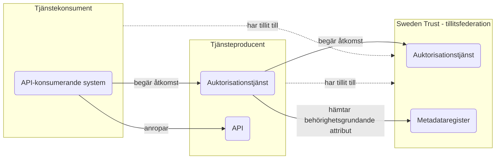
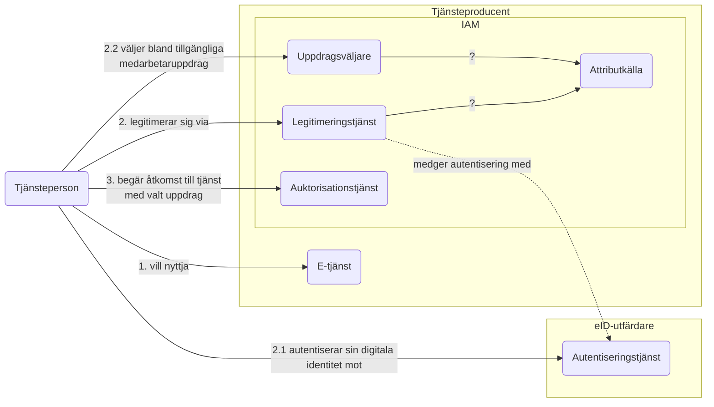

# Hantering av tillit, identitet och behörighet

## OICD Federation och tillit
1. Vad är skillnaden mellan trust anchors, intermediates och trust mark issuers? Är det två olika tillitsstrukturer?
2. Sparas trust marks i samma metadataregister som de digitala identiteterna?

## Nationella OAuth2-profiler - behovsinventering

### 1. Tjänsteperson använder annan organisations e-tjänst

## Modell för behörighetgrundande attribut

## Attributprofiler

