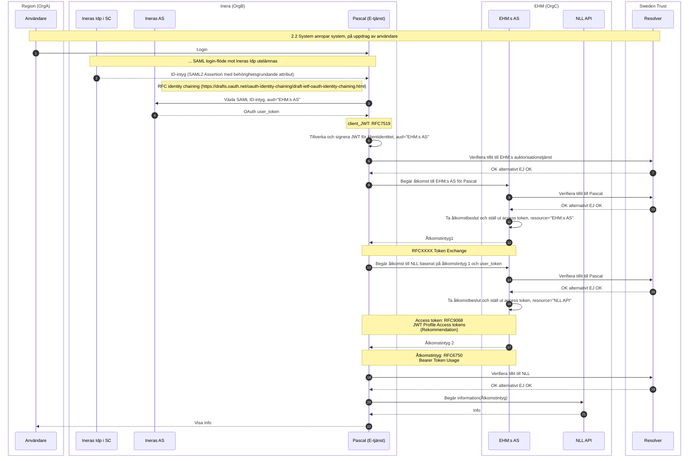

```mermaid
sequenceDiagram
    autonumber
    box Region (OrgA)
        participant ua as Användare
    end
    box Inera (OrgB)
        participant idpb as Ineras Idp i SC
        participant asb as Ineras AS
        participant rsb as Pascal (E-tjänst)
    end
    box EHM (OrgC)
        participant asc as EHM:s AS
        participant rsc as NLL API
    end
    box Sweden Trust
        participant rst as Resolver
    end

    Note over ua, rst: 2.2 System anropar system, på uppdrag av användare

    ua->>rsb: Login
    note over idpb, rsb: ... SAML login-flöde mot Ineras Idp utelämnas
    idpb-->>rsb: ID-intyg (SAML2 Assertion med behörighetsgrundande attribut)

    Note left of rsb:RFC identity chaining (https://drafts.oauth.net/oauth-identity-chaining/draft-ietf-oauth-identity-chaining.html)

    rsb->>asb: Växla SAML ID-intyg, aud="EHM:s AS" 
    asb-->>rsb: OAuth user_token

    Note over rsb: client_JWT: RFC7519
    rsb->>rsb: Tillverka och signera JWT för klientidentitet, aud="EHM:s AS"

    rsb->>rst: Verifiera tillit till EHM:s auktorisationstjänst
    rst-->>rsb: OK alternativt EJ OK
    rsb->>asc: Begär åtkomst till EHM:s AS för Pascal 
    asc->>rst: Verifiera tillit till Pascal
    rst-->>asc: OK alternativt EJ OK
    asc->>asc: Ta åtkomstbeslut och ställ ut access token, resource="EHM:s AS"
    asc-->>rsb: Åtkomstintyg1
    Note over rsb, asc: RFCXXXX Token Exchange
    rsb->>asc: Begär åtkomst till NLL baserat på åtkomstintyg 1 och user_token
    asc->>rst: Verifiera tillit till Pascal
    rst-->>asc: OK alternativt EJ OK
    asc->>asc: Ta åtkomstbeslut och ställ ut access token, resource="NLL API"

    Note over rsb, asc: Access token: RFC9068<br>JWT Profile Access tokens<br/>(Rekommendation)
    asc-->>rsb: Åtkomstintyg 2
    Note over rsb, asc: Åtkomstintyg: RFC6750<br/> Bearer Token Usage
    rsb->>rst: Verifiera tillit till NLL
    rst-->>rsb: OK alternativt EJ OK
    rsb->>rsc: Begär information(Åtkomstintyg)
    rsc-->>rsb: Info
    rsb-->>ua: Visa info
    
```
