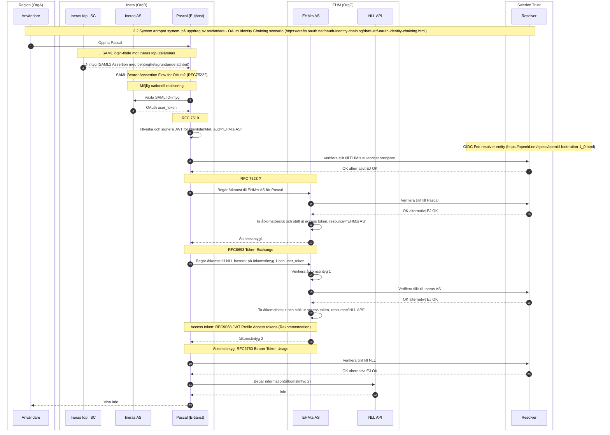

# Utestående frågor
1. Hur får klienten reda på NLL:s åtkomstpolicy? .well-known?? OpenAPI-spec?
2. Signaliering av kvalitetsmärken - standarder, best practice?
3. Behövs #8-12, dvs klientåtkomstbegäran före token exchange med user-info?
4. Introspect eller inte?
5. Krypterade eller bara signerade access-token a la NLL idag, rekommendation eller inte?

