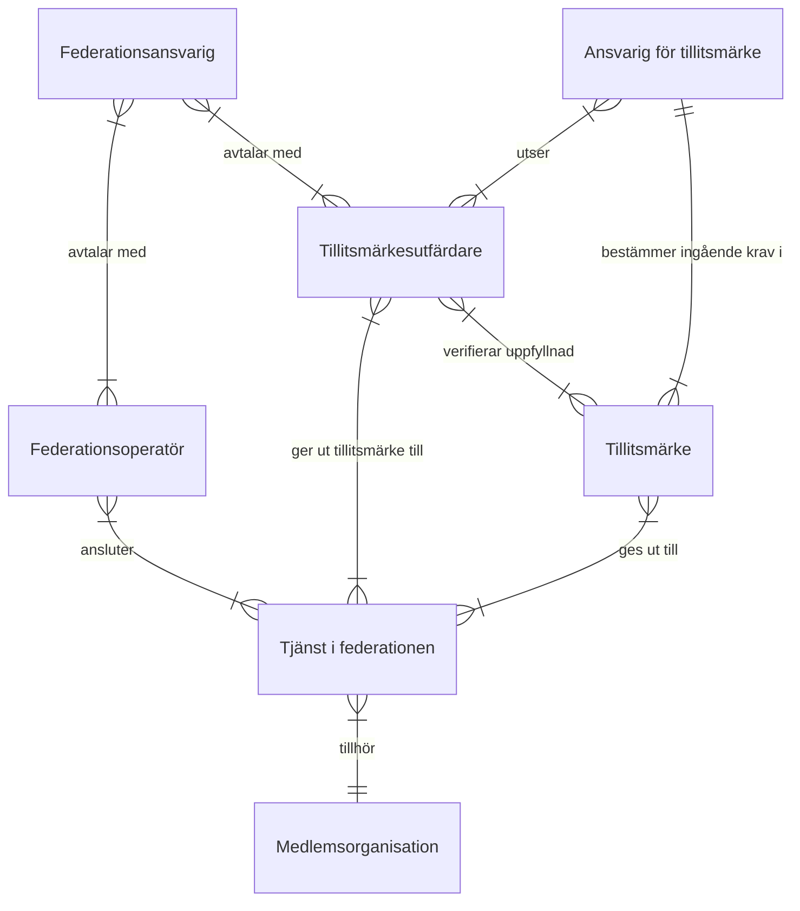
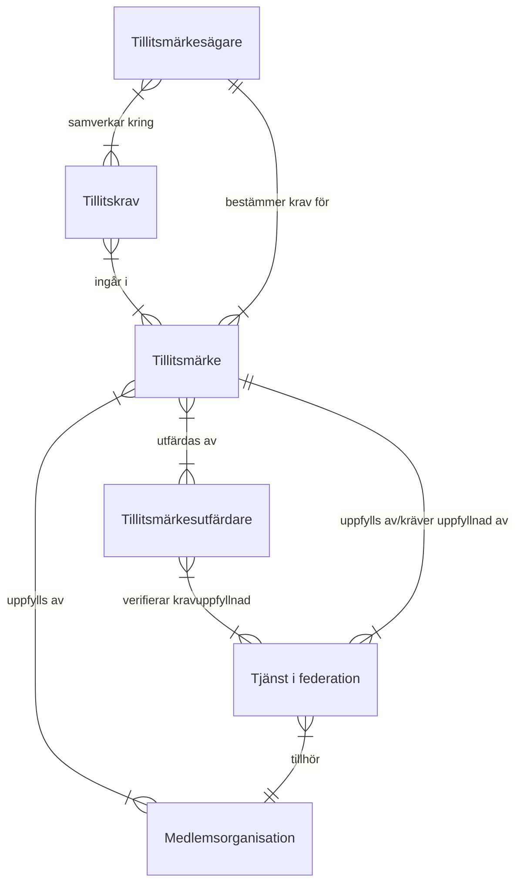
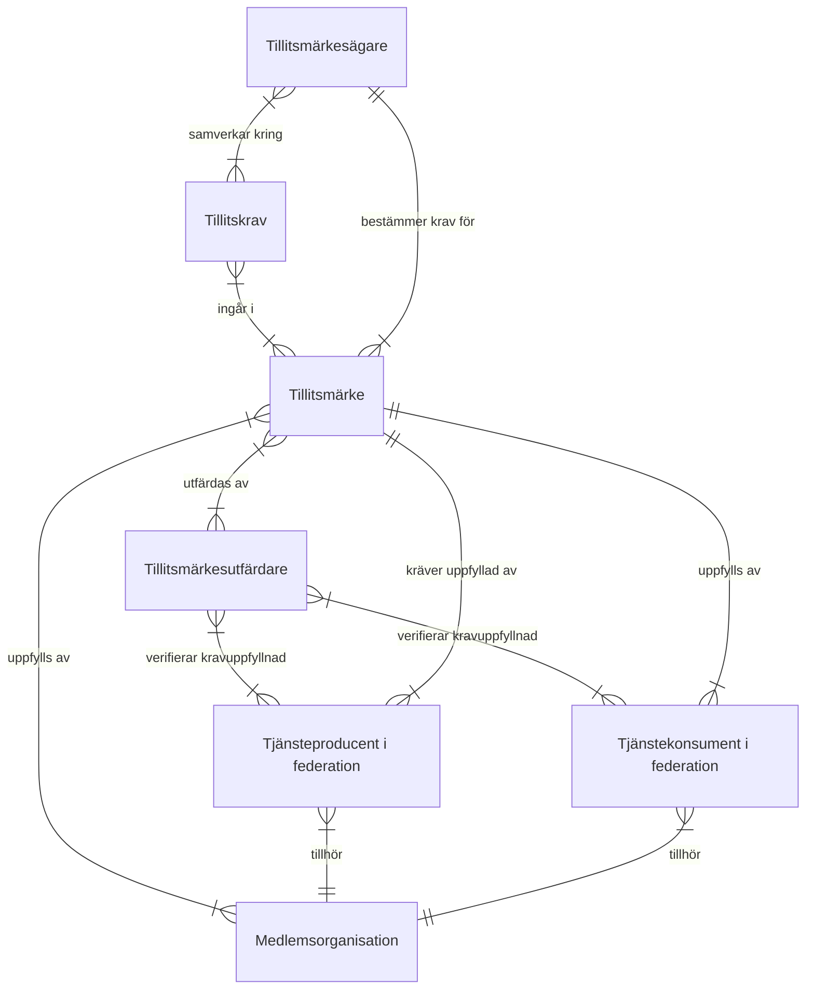

# Federationsinfrastruktur

## Tillitskapande federationsroller
* Federationsansvarig - test 
* Federationsoperatör 
* Tillitsmärkesutfärdare
* Ansvarig för tillitsmärke

## Tillitsmärke

### Alternativ 1 - förenklat

### Alternativ 2 - tjänsteproducent/tjänstekonsument

