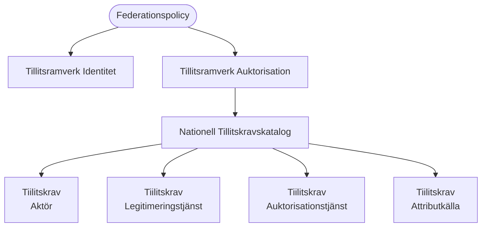
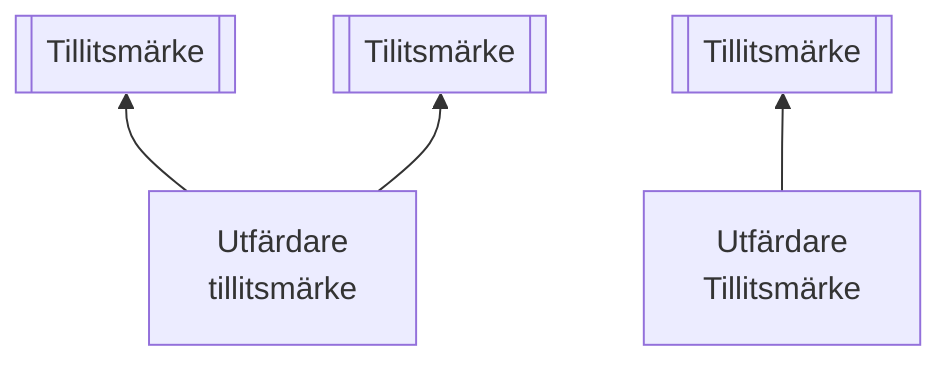

```mermaid 
flowchart TB
    FP([Federationspolicy])-->TRI
    FP-->TRA
    TRI[Tillitsramverk Identitet]

    TRA[Tillitsramverk Auktorisation]
    NTK[Nationell Tillitskravskatalog]
    TRA-->NTK
    NTK-->TK_AR[Tiilitskrav\nAktör]
    NTK-->TK_LT[Tiilitskrav\nLegitimeringstjänst]
    NTK-->TK_AT[Tiilitskrav\nAuktorisationstjänst]
    NTK-->TK_AK[Tiilitskrav\nAttributkälla]

```

```mermaid 
flowchart BT
    UTF_1[Utfärdare\ntillitsmärke]-->TM_1[[Tillitsmärke]]
    UTF_1-->TM_2[[Tilitsmärke]]
    UTF_2[Utfärdare\nTillitsmärke]-->TM_3[[Tillitsmärke]]
```