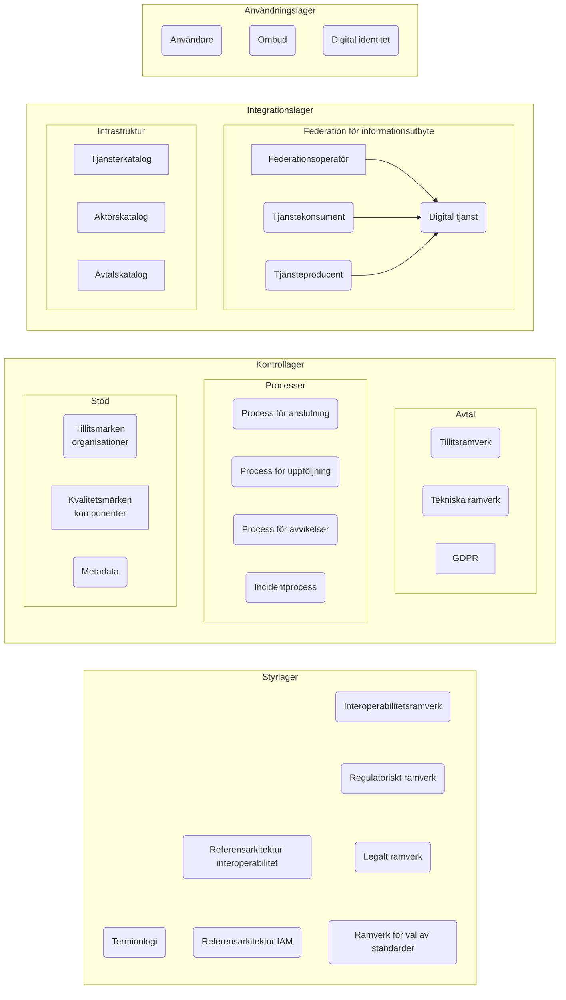

# Styrlager

```mermaid
graph TB
subgraph l1[Styrlager]
    direction TB
    l1t(Terminologi)
    
    l1i(Referensarkitektur interoperabilitet)
    ~~~l1iam(Referensarkitektur IAM)
    
    l1p(Interoperabilitetsramverk)
    ~~~l1r(Regulatoriskt ramverk)
    ~~~l1l(Legalt ramverk)
    ~~~l1s(Ramverk för val av standarder)
    
end

subgraph l2[Kontrollager]
    direction TB
    subgraph l2a[Avtal]
        tr(Tillitsramverk)
        fa(Tekniska ramverk)
        GDPR
    end
    subgraph l2p[Processer]
        pan(Process för anslutning)
        pu(Process för uppföljning)
        pav(Process för avvikelser)
        pi(Incidentprocess)
    end
    subgraph l2s[Stöd]
        tm(Tillitsmärken<br>organisationer)
        qa[Kvalitetsmärken<br>komponenter]
        mk(Metadata)
    end
end

subgraph l3[Integrationslager]
    direction TB
    subgraph l3a[Federation för informationsutbyte]
        p(Tjänsteproducent)
        k(Tjänstekonsument)
        t(Digital tjänst)

        Federationsoperatör-->t
        k-->t
        p-->t
    end
    subgraph infra[Infrastruktur]
        Tjänsterkatalog
        Aktörskatalog
        Avtalskatalog

    end
end

subgraph l4[Användningslager]
    direction TB
    u(Användare)
    o(Ombud)
    di(Digital identitet)
end

l4 ~~~ l3 ~~~ l2 ~~~ l1
```