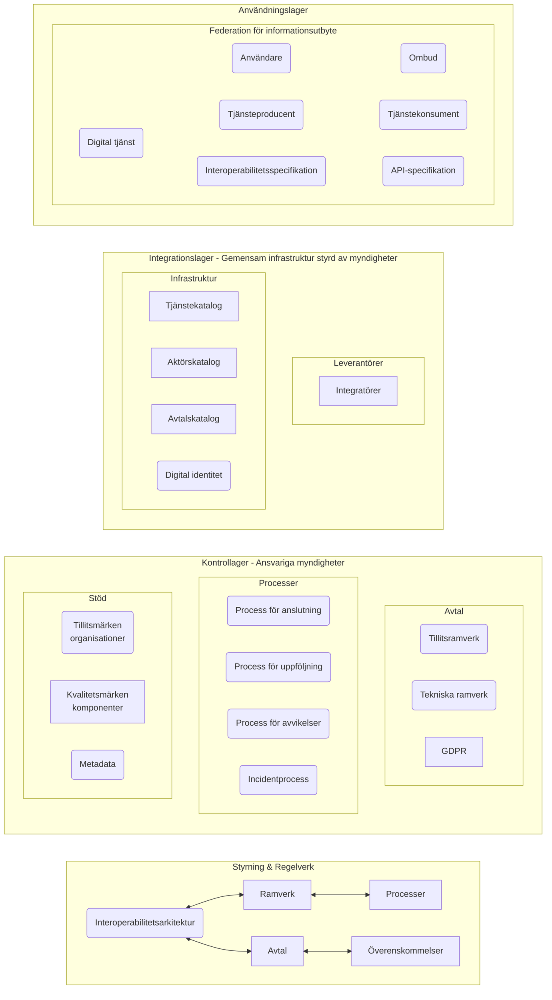

```mermaid
graph TB
subgraph l1[Styrning & Regelverk]
    ia(Interoperabilitetsarkitektur)
    <-->Ramverk
    <-->Processer
    ia
    <-->Avtal
    <-->Överenskommelser
    
    
end

subgraph l2[Kontrollager - Ansvariga myndigheter]
    direction TB
    subgraph l2a[Avtal]
        tr(Tillitsramverk)
        fa(Tekniska ramverk)
        GDPR
    end
    subgraph l2p[Processer]
        pan(Process för anslutning)
        pu(Process för uppföljning)
        pav(Process för avvikelser)
        pi(Incidentprocess)
    end
    subgraph l2s[Stöd]
        tm(Tillitsmärken<br>organisationer)
        qa[Kvalitetsmärken<br>komponenter]
        mk(Metadata)
    end
end

subgraph l3[Integrationslager - Gemensam infrastruktur styrd av myndigheter]
    direction TB
    subgraph lev[Leverantörer]
        Integratörer

    end

    subgraph infra[Infrastruktur]
        Tjänstekatalog
        Aktörskatalog
        Avtalskatalog
        di(Digital identitet)
    end
end

subgraph l4[Användningslager]
    direction TB
    subgraph l3a[Federation för informationsutbyte]
        u(Användare)
        o(Ombud)
        p(Tjänsteproducent)
        k(Tjänstekonsument)
        t(Digital tjänst)
        i(Interoperabilitetsspecifikation)
        a(API-specifikation)

        u~~~o
        t~~~p & i
        p~~~k
        i~~~a
    end
end

l4 ~~~ l3 ~~~ l2 ~~~ l1
```
