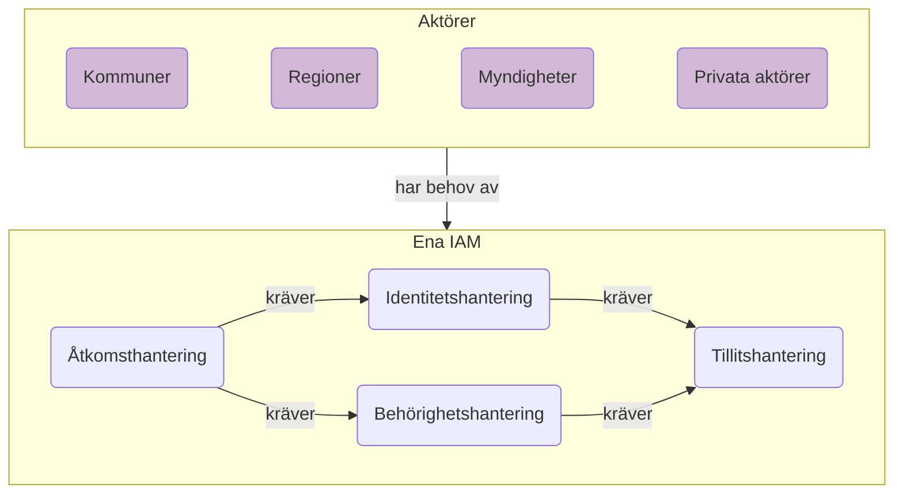
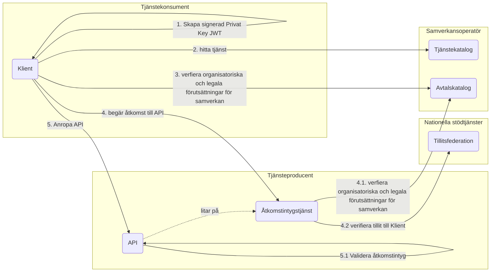
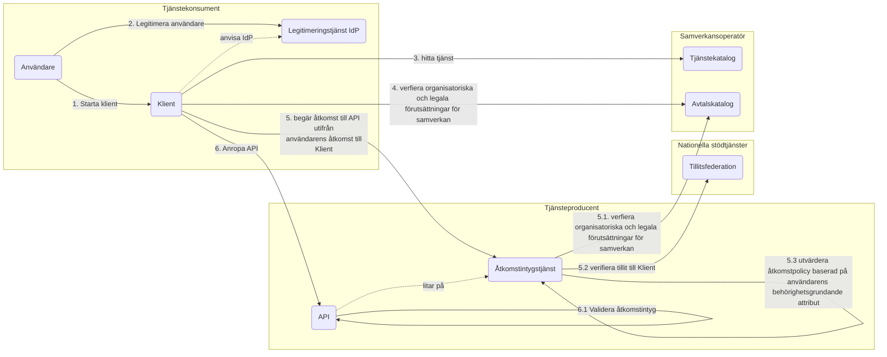
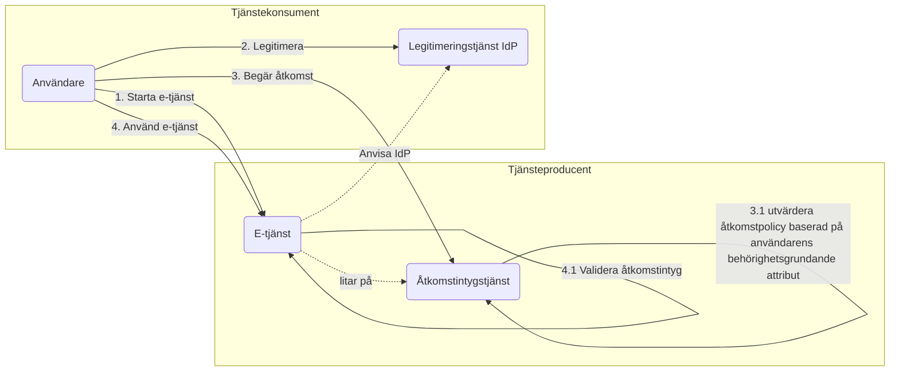
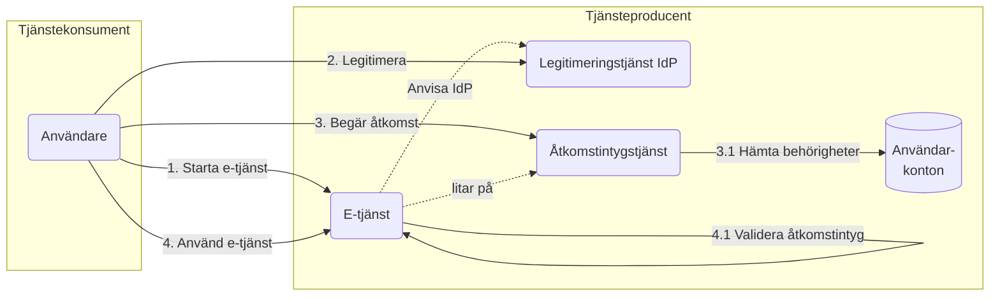
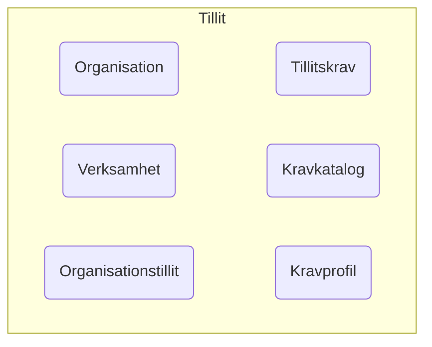
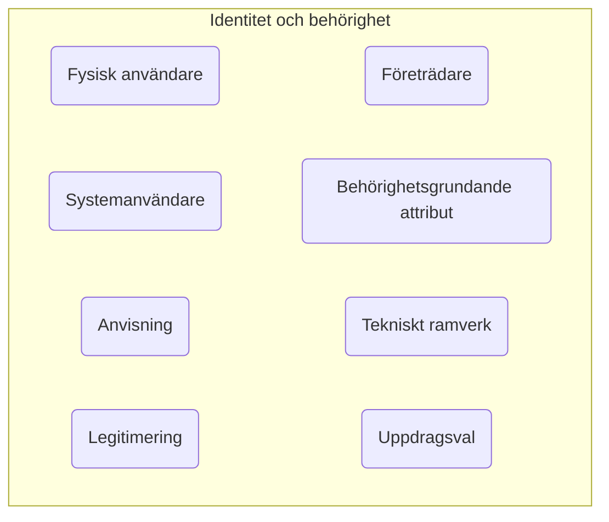
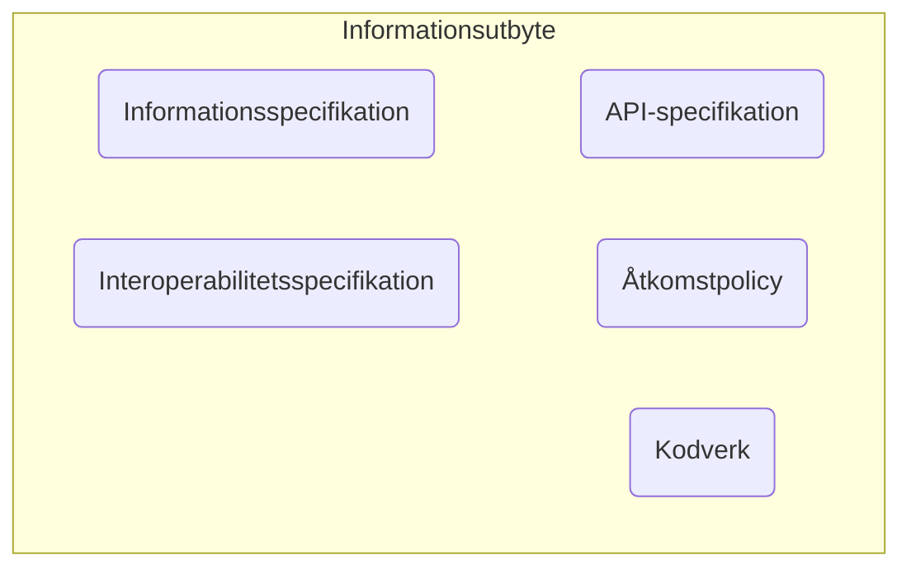
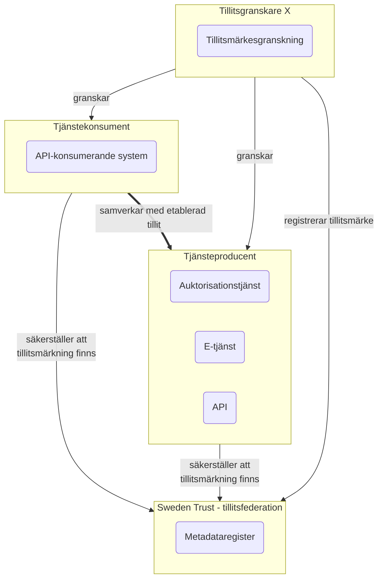
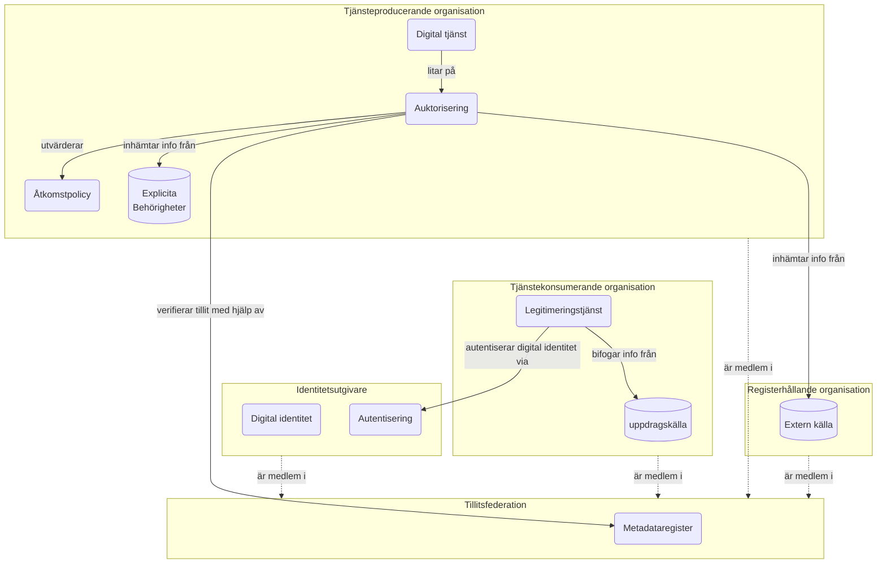

# Målarkitektur för en Svensk identitets- och åtkomsthantering

**Innehållsförteckning**
- [1. Inledning](#1-inledning)
  - [1.1 Syfte](#11-syfte)
  - [1.2 Avgränsningar](#12-avgränsningar)  
- [2. Behovsanalys/mönster](#2-behovsanalysmönster)
  - [2.1 System anropar system, under egen identitet](#21-system-anropar-system-under-egen-identitet)
  - [2.2 System anropar system, på uppdrag av användare](#22-system-anropar-system-på-uppdrag-av-användare)
  - [2.3 Medarbetare anropar extern e-tjänst, utan förprovisionerat konto](#23-medarbetare-anropar-extern-e-tjänst-utan-förprovisionerat-konto)
  - [2.4 Medarbetare anropar extern tjänst, med förprovisionerat användarkonto](#24-medarbetare-anropar-extern-tjänst-med-förprovisionerat-användarkonto)
- [3. Scenarion](#3-scenarion)
  - [3.1 Finansiell status](#31-finansiell-status)
- [4. Målarkitektur](#4-målarkitektur)
  - [4.1 Arkitektoniska principer](#41-arkitektoniska-principer)
  - [4.2 Ena IAM](#42-ena-iam)
  - [4.3 Begreppsmodell](#43-begreppsmodell)
  - [4.4 Tillit](#44-tillit)
  - [4.5 Identitet](#45-identitet)
  - [4.6 Behörighet](#46-behörighet)
  - [4.7 Åtkomst](#47-åtkomst)

<hr>

## Funderingar att diskutera
*Alla kan fylla på nedan*

<table bgcolor=yellow><tr><td>
<li>Representeras LoA-nivåerna inte egentligen av olika <b>kravprofiler</b> i "federationen", vilken realiserar vårt framtida IAM-system?
<li>Kan vi inte generellt koppla ihop "uppfyllande av kravprofil" med konceptet <b>kvalitetsmärke</b>!? <i>T.ex. Svensk e-legitimation är en kravprofil som en viss utgivare av digitala identiteter uppfyller.</i>
<li>Hur relaterar kvalitetsmärke till tillitsmärke? Är tillitsmärkeken inte bara en mekanism i OpenID Federation som vibland annat använder för att representera kvalitetsmärken/uppfyllande av kravprofil? 
<li>Kan Sveriges realisering av OpenID Federation och trust marks bli en generell lösning för att attributera förmågor till digitala aktörer? Eller vill vi begränsa det till Diggs uppdrag?
<li>Borde inte OpenID Federation-realiseringen heta <b>Sweden Trust</b> :)
</td></tr><table>


## 1. Inledning 
För en tillitsfull och kostnadseffektiv samverkan över organisationsgränser inom offentlig förvaltning behöver vi utveckla och förankra nationell arkitektur, infrastruktur och tillämpningsanvisningar för identitets- och åtkomsthantering. Denna målarkitektur syftar till att ge en bild över hur en nationella standardisering av IAM-hantering (Identity and Access Management) kan och bör utformas för att möjliggöra en tids- och kostnadseffektiv digitalisering av svensk offentlig sektor.


*Logisk bild över hur områdena tillitshantering, identitetshantering och behörighetshantering ger förutsättningar för åtkomsthantering i digitala tjänster*

Inom alla dessa områden finns det redan idag olika grad av standardisering. Det används dock olika standarder inom olika verksamhetsområden och detta leder till att parter som behöver samverka inom flera av dessa verksamhetsområden behöver investera i att stödja många standarder parallellt. Med ett gemensamt system för att hantera digitala identiteter och åtkomstbeslut kan samverkan mellan aktörer verksamma inom svensk offentlig förvaltning underlättas avsevärt. 

### 1.1 Syfte
Målarkitekturen även omfatta en enklare strategisk plan för vilka förflyttningar som behöver genomföras över tid och beroenden dem emellan. Den strategiska plan behöver förhålla sig till existerande arkitektur och infrastrur, samt redan gjorda investeringar i digitaliseringstillämpningar. Planen bör även innehålla vägledning för om, när och hur existerande digitala tjänster ska migrera över till ENA IAMs samverkansmönster och nyttja ny infrastruktur.

Målarkitekturen är tänkt att fungera som underlag för diskussioner inom svensk offentlig förvaltning och nå samsyn kring hur ett framtida IAM-funktionalitet kan och bör utformas. Ena IAM behöver omfatta följande områden:
- Hantering av tillit till organisationer, system och användare
- Utgivning av digitala identiteter - för fysiska användare och system
- Förmedling av behörighetsstyrande information - för individer, medarbetare och system
- Standardisering av digital legitimering och åtkomstbeslut - för fysiska användare och system

### 1.2 Avgränsningar
Målarkitekturen som tas fram här syftar till att fungera normerande för digital samverkan mellan organisationer verksamma inom Svensk offentlig förvaltning. För annan hantering av IAM kan Ena IAM fungera vägledande men kommer inte vara heltäckande.

## 2. Behovsanalys/Mönster
När parter etablerar samverkan via en digital tjänst finns det ett antal olika mönster. Nedan presenteras identifierade mönster och exempel på tillämpningar där dess mönster används.

### 2.1 System anropar system, under egen identitet




### 2.2 System anropar system, på uppdrag av användare



### 2.3 Medarbetare anropar extern e-tjänst, utan förprovisionerat konto



### 2.4 Medarbetare anropar extern tjänst, med förprovisionerat användarkonto 



## 3. Scenarion
### 3.1 Finansiell status

#### Nuläge


##### Förutsättningar
1. Kommunadministratör kontaktar FK om att få administratörsrättigheter i e-tjänst
2. Kommun fyller i blankett(er)
3. Kommun kompletterar med kopior av beslut
4. Kommun kompletterar med andra uppgifter
5. FK skickar brev till kommun
6. Kommun svarar via fax/brev, med administratörens uppgifter
7. Kommun väntar på lång handläggningstid
8. FK kontaktar kommun om kompletteringar
9. Administratör godkänns, läggs upp i e-tjänst
10. Administratör ansöker om e-tjänstekort (EFOS)
11. Administratör får e-tjänstekort och kan börja administrera kommunens handläggare i e-tjänst
12. Upprepas vid varje extern tjänst eller vid byte av administratör
13. (<i>I flera fall finns ingen kommunadministratör, ersätt då ovanstånde att gälla för alla enskilda användare.</i>)


#### Börläge
*Lite förenklad bild med komponenter per aktör, utan varje interaktion* - Pelle väljer!

```mermaid
graph TD

subgraph x[Kommun X]
    xu(Handläggare kommun X<br>&lt&lt Medarbetare &gt&gt)
    xidp(IdP kommun X<br> &lt&lt Legitimeringstjänst IdP&gt&gt)
    xuv(&lt&lt Uppdragsväljare &gt&gt)
    xak[(Personalsystem<br> &lt&lt Attributkälla &gt&gt)]
end

subgraph k[Kronofogden]
    kd[(Informationskälla<br> &lt&lt Attributkälla &gt&gt)]
end

subgraph b[Bolagsverket]
    bd[(Informationskälla<br> &lt&lt Attributkälla &gt&gt)]
end

subgraph fk[Försäkringskassan]
    fkt(Finansiell status<br>&lt&lt E-tjänst &gt&gt)
    fka(&lt&lt Anvisningstjänst &gt&gt)
end

subgraph id[Identitetsutfärdare]
    ida(Autentiseringstjänst)
end

subgraph fed[Federation]
    fedt[tillitsmetadata]
    fedmk(federationsmedlemskatalog)
    fedprof(tjänstemetadata<br>per teknik)
end

id & fk & x & k -.-> fed
id--ger ut identiteter-->x
x--anropar tjänst-->fk
fk--ber om legitimering<br>av användare-->x
fk--hämtar behörighetsgrundande<br>information-->k & b
```

##### Förutsättningar
Obligatoriska förutsättningar
- Kommun: Medlem i federationen som organisation
- Kommun: Intygsutfärdartjänst och attributskälla måste vara granskad och godkänd på tillräcklig tillitsnivå av federationen
- Kommun: Användare måste ha en av federationen godkänd e-legitimation, på tillräcklig tillitsnivå
- Kommunens intygsutfärdartjänst: Metadata registreradhos federationsoperatören; nyckelcertifikat, tillitsnivå, et
- Kommunanvändaren: Upplagd i kommunens lokala attributskälla
- Kommunanvändaren: Metadata skickas med i anrop till e-tjänst – pekare till adress till kommunens intygsutfärdartjänst (alternativt används en anvisningstjänst kopplat till e-tjänsten)
- E-tjänst: Dess organisation medlem i federation
- E-tjänst: Medlem i federation som e-tjänst på viss tillitsnivå
- E-tjänst: Metadata registrerad; nyckelcertifikat, krav på tillitsnivå, krav på attribut, etc
- E-tjänst: Uppfyller kraven på server-2-server-kommunikation som federationen anvisar, som konsument av information
- Kronofogden: Medlem i federation
- Kronofogden: Metadata för e-tjänst registrerad hos federationsoperatören, som producent av information
- Kronofogden: Uppfyller kraven på server-2-server-kommunikation som federationen anvisar

Möjliga förutsättningar
- Bolagsverket: Medlem i federation (ej krav pga offentlig tillgänglig information i tjänst)
- Agent/ombud: Granskad och godkänd av federationen att stötta andra organisationer med deras federationsansökan, e-tjänster, intygsutfärdartjänst, attributskälla, e-legitimationer


## 4. Målarkitektur
<table bgcolor="lightblue" border=1><tr><td>
Det finns ett förslag på en ny EU-förordning, <a href="https://commission.europa.eu/system/files/2022-11/com2022720_0.pdf">Interoperabilitetsförordningen</a>, vilken tar avstamp i European Interoperability Framwork (EIF) och reglerar hur man säkerställer att digitala tjänster som tas fram inom EU linjerar mot EIF.
<br/>
<br/>
I december 2023 överlämnades ett betänkande <a href="https://www.regeringen.se/rattsliga-dokument/statens-offentliga-utredningar/2023/12/sou-202396/">En reform för datadelning (SOU 2023:96)</a> till regeringen. Denna utreder Interoperabilitetsförordningen utifrån ett Svenskt kontext.
</td></tr></table>

<table bgcolor="lightyellow" border=1><tr><td>
Jag har i mina arkitekturskisser nedan använt termer från T2, men beskrivningarna har förenklats något för detta kontext. Terminologin genomgår en första revidering under 2024. Rekommendationen är att vi använder nuvarande termer tills revideringen är klar.
<br>
<br><a href="https://inera.atlassian.net/wiki/spaces/OITIFV">T2 - referensarkitektur för interoperabilitet inom svensk välfärd</a>
<br><a href="https://inera.atlassian.net/wiki/spaces/OITAFIIVOO">T2 - referensarkitektur för interoperabilitet inom svensk vård och omsorg</a>
</td></tr></table>


### 4.1 Arkitektoniska principer
[Svenskt ramverk för digital samverkan (Digg)](https://www.digg.se/kunskap-och-stod/svenskt-ramverk-for-digital-samverkan) är en svensk anpassning av det europeiska ramverket för interoperabilitet (EIF). Det innehåller principer för digtalisering, samt rekommendationer för hur dessa principer tillämpas. För IAM-området kan vi komma att behöva ta fram specifika rekommendationer. 

Vi kompletterar det svenska ramverket med ett antal konkreta rekommendationer för etableringen av IAM-systemet - nedan insorterade under ramverkets grundprinciper

1. Samverka som förstahandsval
2. Arbeta aktivt med juridiken
    - Ett nationellt IAM-system måste ha utrymme för privata aktörer att bidra till svensk offentlig förvaltnings digitala ekosystem, såväl som utförare av offentligt finansierad verksamhet, leverantörer av IAM-funktionalitet, eller agenter för andra sådana offentliga eller privata aktörer.
    - Då dagens IAM-system tvingar fram bedrägliga betteenden i och med att systemet ej är utformat för att vara tillgängligt för alla invånare, bör man i design av ett nytt IAM-system lyfta behov av utökat legalt stöd för att söka hjälp utan att begå avtals- och lagbrott. Tillse redan nu att en framtida förenklad hantering av ombud via fullmakt eller annan ställföretraädarroll inte försvåras.
3. Öppna upp
4. Skapa transparens till den interna hanteringen
5. Återanvänd från andra
    - Bygg IAM-systemet på brett förankrade standarder och <i>best practices</i>. Delta i standardiseringsprocesser hellre än att profilera befintliga standarder. Profilera hellre befintliga standarder än att hitta på egna.
6. Se till att information och data kan överföras
    - Bygg vidare på existerande kodverk för behörighetsstyrande attribut och försök förankra attributmappningar mellan existerande och nya kodverk. Över tid kan man främja en linjering gentemot en standard, men genom att respektera gjorda investeringar främjas en ökad digitaliseringstakt och dessutom ett ansvarsfullt nyttjande av skattemedel.
7. Sätt användaren i centrum
8. Gör digitala tjänster tillgängliga och inkluderande
    - Sök att i designbeslut på alla nivåer beakta problematiken med digitalt utanförskap genom att skapa förutsättningar för tillämpningar med hög tillgänglighet enligt [Lag (2018:1937) om tillgänglighet till digital offentlig service](https://www.riksdagen.se/sv/dokument-och-lagar/dokument/svensk-forfattningssamling/lag-20181937-om-tillganglighet-till-digital_sfs-2018-1937/) och [Kognitiv tillgänglighet – Del 1: Allmänna riktlinjer (ISO 21801-1:2020, IDT)](https://www.sis.se/produkter/halso-och-sjukvard/hjalpmedel-for-personer-med-funktionsnedsattning/hjalpmedel-for-personer-med-funktionsnedsattningar/ss-en-iso-21801-120212/)
9. Gör det säkert
    - Beakta säkerheten avseende alla nivåer. Teknisk säkerhet i IAM-systemet i sig. Hög tillgänglighet avseende robusthet i systemets ingående komponenter. Hög tillgänglighet avseende användarinteraktioner med systemet. Säkerhetsmekanismer på adekvat nivå för att skydda respektive komponent och den information som behandlas av denne.
10. Hitta rätt balans för den personliga integriteten
11. Använd ett språk som användarna förstår
12. Gör administrationen enkel
    - Skapa ett IAM-system, med huvudsakligen en anslutningsprocess per anslutande part. Låt anslutningar till specifika verksamhetstillämpningar bygga på genomförd anslutning till IAM-systemet för att därmed minimera den administrativa bördan.
13. Ha helhetssyn på informationshantering

### 4.2 Ena IAM
På den högsta nivån ser vi nedanstående bild av ett framtida Svensk standardisering inom IAM. Vi har nationella federationer för hantering av tillit, identitet och behörighet. Dessa nationella federationer kombinerat med nationellt förvaltade tekniska systemstöd skapar förutsättningar för att skapa syftesspecifika informationsutbyten mellan en grupp av aktörer 

*Logisk bild över hur centrala förmågor för hantering av tillit, identiteter och behörigheter, skapar förutsättningar för samverkan*

| Begrepp | Beskrivning 
|:-|:-
| Federation för identitet och behörighet | Ett antal aktörer som i avtalad samverkan delat information kring identiteter och behörighetsgrundande information med hjälp av gemensamt definierade regler avseende teknik, semantik, legala tolkningar, samt organisatoriska regler och policyer.
| Federation för informationsutbyte | Ett antal aktörer som i avtalad samverkan delar information i ett gemensamt syfte med hjälp av gemensamt definierade regler för informationsutbytet både avseende teknik, semantik, legala tolkningar, samt organisatoriska regler och policyer. Namnges även *Informationsfederation*
| Federation för tillit |  Ett antal aktörer som avtalad samverkan som realiserar tillitsskapande förmågor, främst inom informationssäkerhetsområdet, i hela eller delar av sin organisation. De tillitsskapande förmågorna definieras som krav, där varje krav också kan inkludera **hur** och **hur väl** väl en viss förmåga realiseras
| Federationsoperatör | Den aktör som styr och koordinerar en federation, dess medlemmar, avtal, samt regler och villkor. 
| Tjänstekonsument | Organisation som har behov  av att nyttja en digital tjänst (Public Service Consumer från EIRA) 
| Tjänsteproducent | Organisation som erbjuder en digital tjänst till andra tjänstekonsumenter (Public Service Producer från EIRA)

### 4.3 Begreppsmodell

En viktig del av en målarkitektur är att använda beskrivna begrepp. Nedan redovisas begrepp som används i arkitektoniska modeller, samverkansmönster och scenarion i denna målarkitektur.

| Begrepp | Beskrivning 
|:-|:-
| Organisation | Juridiskt identifierbar entitet som kan ha en roll i relation till ett informationsutbyte
| Verksamhet | Mål­inriktat arbete som fort­löpande ut­förs in­om ramen för organisation
| Organisationstillit | Tillit mellan organisationer baserad på lagstiftning eller avtal, ibland understödd av granskningsprocess
| Tillitskrav | Beskrivning av ett specifikt krav som om det uppfylls stärker tilliten till en organisation eller verksamhet
| Kravkatalog | Katalog med definierade tillitskrav
| Kravprofil | Namngivet urval av tillitskrav från en kravkatalog 



| Begrepp | Beskrivning 
|:-|:-
|Fysisk användare|Användare av kött och blod
|Systemanvändare|IT-system som agerar använder en digital tjänst
|Anvisning|En e-tjänsts förmåga att möjliggöra legitimering av användare i den legitimeringstjänst som har tillitlig behörighetsgrundande information om användaren 
|Legitimering| Här, förmågan att bevisa sin identitet med stöd av tillit till en tredje parts 
|Behörighetsgrundande attribut|Digital representation av egenskap hos en användare som påverkas dennes behörigheter i en digital tjänst
|Företrädare|En användare som använder en digital tjänst å en annan användares räkning
behörigheter användaren ska ges i en viss digital tjänst 
|Tekniskt ramverk|Teknisk specifikation över hur information inom ett visst kontext ska representeras digitalt 
|Uppdragsval|




| Begrepp | Beskrivning 
|:-|:-
|Informationsspecifikation|En specificering av en datamodell för en viss domän
|Interoperabilitetsspecifikation|Ett samlingsbegrepp för överenskommelser som beskriver förutsättningar och krav för digitala tjänster
|API-specifikation|Teknisk specifikation för ett visst API
|Åtkomstpolicy|Ett regelverk som mappar en användares behörighetsgrundande attribut, samt eventuell företrädarroll gentemot annan användare, mot vilka 
|Kodverk| Mappning mellan en identifierare och en överenskommen tolkning av hur information "kodat" med den identifieraren ska tolkas

### 4.4 Tillit

Vid all samverkan behöver man ha tillit till den part man samverkar med. Det finns idag ett antal tillvägagångssätt för detta som syftar till att både privatpersoner och organisationer ska känna tillit till att information som delas via e-tjänster och APIer inom samhället hanteras på ett korrekt sätt.

Hur skapas denna tillit och hur säkerställs den över tid?

För att kunna samverka över organisationsgränser behövs tillit på två nivåer:

1. Teknisk nivå 
1. Organisatorisk nivå
 
 På teknisk nivå behöver det säkerställas att olika parter utför sin roll i samverkan på ett tekniskt korrekt sätt, enligt överenskomna ramverk, standarder, specifikationer och profileringar.

 På organisatorisk nivå behöver man kravställa att de olika parterna som på något sätt deltar i samverkan har den organisation, de processer, samt den kompetens som krävs för att hålla en god kvalitet i hur de utför sina ansvar. Detta kan till exempel vara att ha ett ledningssystem för informationssäkerhet, samt processer för att säkerställa efterlevnad och kontinuerligt förbättringsarbete. 

Säkerställandet av tillitsskapande förmågor kan behöva ske med olika grad av försäkran beroende på samverkanskontext och skyddskrav för den funktionalitet och information som delas. Kraven som ställs behöver också kunna skilja sig mellan olika typer av aktörer.

Teknisk efterlevnad säkerställas genom testning eller certifiering. Organistorisk efterlevnad säkerställs genom lagstiftning, avtal och/eller certifiering. 

Inom cyber- och informationssäkerhetsområdena ser man ökande risker, vilket ställer kontinuerligt högre krav på tillit. Speciellt offentliga aktörer förväntas stärka sina tillitsskapande förmågor då fokus är stort på att realisera samhällsnyttor genom digitalisering och nyttjande av de möjligheter som digitalisering ger förutsätter tillit. 

#### Nuläge
Vilka tillitsskapande förmågor som krävs och hur dessa styrks regleras ofta i avtal bilateralt mellan samverkande parter eller via en federationsoperatör.

Tillit är typiskt antingen grundmurad eller avtalsbaserad. Tillitsskapande förmågor styrks ofta genom självdeklaration, ibland byggd på internrevision. Ibland krävs dock revision av extern part, eller till och med certifiering utförd av ackrediterad part.

 - Svenska myndigheter har lagstadgad organisationstillit mellan varandra.
 - Sveriges regioner och kommuner tillämpar avtalsbaserad tillit mellan samverkande organisationer, styrkt med överenskommelser kring kvalitetssäkring, samt självdeklarationer av följsamhet.


#### Vision
För att möjliggöra kostnadseffektiv digitalisering av Svensk offentlig förvaltning bör bygga upp ett system där bilaterala avtal inte behöver reglera tilliten utan att detta styrs nationellt via en tillitsfederation.

En tillitsfederation bör definiera vilka krav som ska gälle för respektive typ av aktörs, graderat i olika tillitsnivåer.



*Schematisk bild över hur tillit mellan samverkande parter kan regleras via en tillitsfederation*

Det behöver finnas utrymme för många olika typer av kvalitetsmärken för de olika roller en aktör kan inneha samt kanske även olika tillitsmärken för olika tillitsnivåer som krävs beroende på samverkanskontextet.

<table border=1 bgcolor="lightblue"><tr><td>
Tillitsmärken för olika nivåer av organisatorisk tillit skulle kunna användas och namnges LoT1, LoT2, LoT3 och LoT4 (<i>"Level of trust"</i>).  
Att en organisation tilldelats ett kvalitetsmärke för en högre LoT-nivå skulle då kunna innebära att organisationen granskats mot högre krav avseende dess tillitsskapande förmågor.</td></tr></table> 

Att en aktör tilldelats ett visst LoT-tillitsmärke skulle kunna ingå som del i kvalificering för en avtalsskrivning, eller som åtkomststyrande attribut för åtkomstbeslut vid ett faktiskt tjänsteanrop.

### 4.5 Identitet

#### Nuläge
För privatepersoner har Digg ansvar för kvalitetsmärket Svensk e-legitimation. Detta möjliggör olika aktörer att erbjuda digitala identiteter till privatpersoner förutsatt att de kvalitetssäkrats av Digg. Idag erbjuder BankId, Freja och Svenska Pass denna typ av e-legitimationer.

För medarbetare med behov av att legitimera sig digitalt inom sitt tjänsteutövande har Digg idag ett liknande kvalitetsmärke för utgivning av e-tjänstelegitimationer. Här har Freja och EFOS(???) avtal med Digg idag. Det finns sedan ett antal fristående utgivare av e-tjänstelegitimationer - störst här är SITHS som ger ut e-tjänstelegitimationer till en majoritet av medarbetarna inom Svensk vård och omsorg.

De digitala identiteterna för fysiska personer autentiseras i regel av en legitimeringstjänst som ansvaras för av utgivaren. Den tjänsteproducerande aktören (även benämnd förlitande part) behöver ha explicit tillit till legitimeringstjänsten.

För systemaktörer finns idag ingen nationell samordning av utgivning av digitala identiteter. Det finns ett antal aktörer som ger ut certifikat som kan nyttjas i mer eller mindre avgränsade syften. SITHS och EFOS ger ut så kallade funktionscertifikat (X.509-certifikat att nyttjas av systemaktörer). Digg ger ut funktionscertifikat till avtalsparter inom Säker Digital Kommunikation (SDK). 

För individer utan vare sig svenskt personnummer eller styrkt samordningsnummer finns idag ingen möjlighet att få en digital identitet. Inom vården används reservidn för detta ändamål, men för interaktion med annan offentlig förvaltning saknas lösning idag - TODO: DOKUMENTERA!!!

<table border=1 bgcolor="lightblue"><tr><td>
Tilliten mellan systemaktörer regleras ofta till det verksamhetskontext där utgivningen skett eller explicit till specifika certifikat baserat på bilaterala avtal
</td></tr></table>

#### Vision
Dagens utgivna digitala identiteter behöver fungera även för framtida samverkan inom svensk offentlig förvaltning. Detta då man under lång tid investerat stora summor inom IAM-området och ansvarsfullt användande av statens finanser och skattemedel är av stor betydelse. 

Vi ser även ett behov av ett nationellt kvalitetsmärke för utgivare av funktionscertifikat. Ett sådant kvalitetsmärke kan, i kombination med ett nationellt tillitsfederation, möjliggöra tillitsfull samverkan mellan system.


### 4.6 Behörighet
För att kunna garantera kvaliteten i den åtkomsthantering som sker bör informationsförsörjningen av behörighetsgrundande information ske med en tillförlitlighet på en nivå som motsvarar skyddsbehovet för den digitala tjänst som beslutet avser.

Högst kvalitet på behörighetsgrundande information fås genom att den part som äger och administrera informationen också används som källa för informationsförsörjningen. Exempelvis bör information om läkarlegitimationer informationsförsörjas från Socialstyrelsens HOSP-register. På samma sätt bör medarbetares uppdragsgivare informationsförsörja information som härrör till de uppdrag medarbetaren har.

#### Nuläge

#### Vision
**SKRIV OM-->ATTRIBUT...**
*Vidare behöver en person kunna agera utifrån olika uppdrag inom en och samma organisation och utifrån valt uppdrag få olika tillgång till information och funktioner.*

*En behörighetsmodell behöver även ge stöd för att uttrycka ställföreträdande- och andra ombudsroller och det behöver tas fram kodverk och strukturer för att överföra denna information digitalt.*


I många fall är det tidsödande eller ogörligt att informationsförsörja behörighetsstyrande information direkt från källan utan man kopierar informationen till enn annan plats varifrån den enklare kan inhämtas. Detta kan till exempel handla om att en organisation hämtar en fräsch kopia av HOSP varje dag, eller att en legitimeringstjänst cachar dataposter från en informationskälla under en timme innan den inhämtas igen. Detta i syfte att skapa ökad robusthet och bättre svarstider. 

Vad som är en adekvat nivå av säkerhet för cahning behöver man komma överens om, samt om detta ska kunna skilja sig för olika tillämpningsområden eller informationsmängder.

**Rekommendationer:**
<ol>
<li>Behörighetsgrundande information ska ha en utpekad källa</li>
<li>Behörighetsgrundande information kan cachas för mer robust och effektiv åtkomstbeslutshantering</li>
<li>De parter som bifogar behörighetsgrundande information till en digital identitet bör ha granskats för att detta sker kontrollerat och tillitsfullt, exempelvis genom granskning mot ett kvalitetsmärke</li>
</ol>

### 4.7 Åtkomst
I åtkomsthanteringen knyts alla aspekter av digitalaidentiteter, tillitskedjor, samt informationsförsörjning av behörighetsgrundande information samman.

Korrekta åtkomsbeslut kan vara beroende av informationsförsörjning av behörighetsgrundande från både externa och lokala källor utöver information som tillförts under legitimeringen. 


*Beroenden mellan olika aktörer och komponenter för att möjliggöra tillitsfulla åtkomstbeslut*


