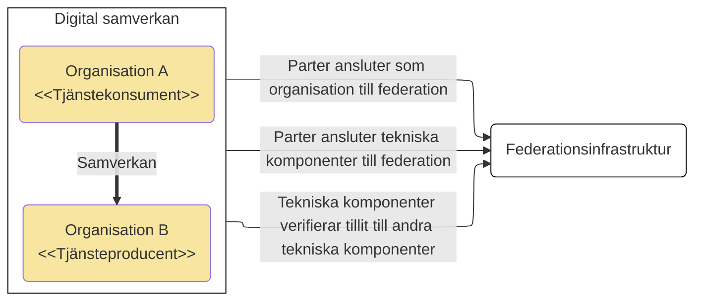

# Federationsinfrastruktur för identitets- och åtkomsthantering inom Sverige

## Innehållsförteckning

1. [**Inledning**](#inledning)

    1.1 [Syfte](#syfte)
    
    1.2 [Avgränsningar](#avgransningar)

2. [**Behovsanalys/mönster**](#behovsanalysmonster)

    2.1 [Medarbetare anropar extern e-tjänst, utan förprovisionerade användaruppgifter](#medarbetare-anropar-extern-e-tjanst-utan-forprovisionerade-anvandaruppgifter)

    2.2 [Medarbetare anropar extern tjänst, med förprovisionerat användarkonto](#medarbetare-anropar-extern-tjanst-med-forprovisionerat-anvandarkonto)

    2.3 [System anropar system, under egen identitet](#system-anropar-system-under-egen-identitet)

    2.4 [System anropar system, på uppdrag av invånare](#system-anropar-system-pa-uppdrag-av-invanare)

    2.5 [System anropar system, på uppdrag av medarbetare](#system-anropar-system-pa-uppdrag-av-medarbetare)

3. [**Scenario - Nationella läkemedelslistan**](#scenario-nll)

4. [**Målarkitektur**](#malarkitektur)

    4.1 [Tillitsmärken](#tillitsmarken)

    4.2 [Infrastruktur](#infrastruktur)

    4.3 [Roller](#roller)

    4.4 [Samverkan via digitala tjänster](#samverkan-via-digitala-tjanster)

5. [**Strategisk plan för införande**](#strategisk-plan-for-inforande)

6. [**Utvärdering av interoperabilitet**](#utvardering-av-interoperabilitet)

## 1. Inledning 
För en tillitsfull och kostnadseffektiv samverkan över organisationsgränser inom offentlig förvaltning behöver vi ta fram nationell arkitektur, infrastruktur och tillämpningsanvisningar för identitets- och åtkomsthantering. 

Det som tas fram får dock inte begränsas till att kunna användas inom offentlig förvaltning utan ska kunna tillämpas även i annan digitalisering.

*Logisk bild över hur områdena tillitshantering, identitetshantering och behörighetshantering ger förutsättningar för åtkomsthantering i digitala tjänster*

Inom alla dessa områden finns det redan idag olika grad av standardisering. Det används dock olika standarder inom olika verksamhetsområden och detta leder till att parter som behöver samverka inom flera av dessa verksamhetsområden behöver investera i att stödja många standarder parallellt. Med ett gemensamt system för att hantera digitala identiteter och åtkomstbeslut kan samverkan mellan aktörer verksamma underlättas avsevärt. 

### 1.1 Syfte
Detta dokument syftar till att ge en bild över hur en svensk federationsinfratruktur för hantering av IAM-området (Identity and Access Management) kan och bör utformas för att stödja behov av identitets- och åtkomsthantering över organisationsgränser, samt möjliggöra en tids- och kostnadseffektiv digitalisering av samhället. 

Dokumentet bör kunna ligga som grund för en framtida strategisk plan för infrastrukturella förflyttningar som behöver genomföras, samt beroenden dem emellan. En strategisk plan behöver förhålla sig till existerande arkitektur och infrastruktur, samt redan gjorda investeringar i digitaliseringstillämpningar. Planen bör även innehålla vägledning för om, när och hur existerande digitala tjänster ska migrera över till Enas nya samverkansmönster och nyttja ny federationsinfrastruktur.

Beskrivningen av federationsinfrastrukturen är även tänkt att fungera som underlag för diskussioner inom svensk offentlig förvaltning och leda till samsyn kring hur framtida interoperabla digitala tjänster kan och bör utformas. En nationell federationsinfrastruktur för IAM över organisationsgränser behöver omfatta följande områden:
- Hantering av tillit till organisationer, system och användare
- Hantering av digitala identiteter för alla typer av användare, såväl individer, medarbetare och system
- Förmedling av behörighetsstyrande information - för individer, medarbetare och system
- Standardisering av digital legitimering och åtkomstbeslut - för fysiska användare och system

Redan idag finns arkitektur för hantering av invånares e-legitimationer och medarbetares e-tjänstelegitimationer. Det som saknas är framförallt ett övergripande stöd för hantering av systemanvändare identiteter, samt tillitsgrundande information för organisationer och medarbetare. Arkitekturella mönster, standarder och infrastruktur för dessa ändamål är presenteras i detta dokument.

### 1.2 Avgränsningar

Federationsinfrastrukturen för IAM som beskrivs syftar till att fungera normerande för digital samverkan i Sverige. För hantering av IAM i specifika tillämpningar kan de nationella standarderna behöva kompletteras eller profileras.

## 2. Behovsanalys/mönster

När parter etablerar samverkan via en digital tjänst finns det ett antal olika mönster. Nedan presenteras identifierade mönster och exempel på tillämpningar där dess mönster används.

Det övergripande mönstret beskrivs logiskt i nedanstående bild.

Genom anslutning till federationsinfrastrukturen bevisar tjänstekonsument och tjänsteproducent att de lever upp till de krav som ställs på dels dem som organisationer, dels att de tekniska komponenter de ansluter uppfyller överenskomna krav.

Mönster och specifikationer för hur förmedling av IAM-relaterad information (såsom uppgift om identitet och behörighet) ger en förutsägbarhet i hur digital samverkan mellan organisationer går till. Detta förenklar anpassning av tjänster och möjliggör exempelvis tydlig kravställning vid upphandling och standardiserade komponenter.

Exakta krav kvarstår att utforma, men nedan listas några exempel på krav som kan ställas på en organisation:

1. Registrerad hos Skatteverket
2. Har ansvarsförsäkring
3. Har ledningssystem för informationssäkerhetsarbete
4. Processer för säkerhetsgranskning, kodhantering, patchhantering, incidenthantering, m.m. efterlevs och kan påvisas genom dokumentation.
5. Årlig IT-revision genomförs
6. Uppfyller överenskomna tekniska standarder och profiler
7. Har avsatta resurser för löpande förvaltning av anslutna tekniska komponenter

De tekniska kraven är olika beroende på vilka förmågor som erbjuds av en viss komponent man ansluter till federationsinfrastrukturen. Gemensamt för alla är att man har en adekvata tekniska förmågor att hantera kryptografiskt material och att behandla överförda personuppgifter och annan skyddsvärd information. Därefter kan det komma att skilja sig beroende på om komponenten agerar som API-klient, E-tjänst, eller API-producent. Man kan också ansluta komponenter som erbjuder funktionalitet för till exempel e-legitimering, attributförsörjning, eller åtkomstbeslut. För dessa komponenter kan det ställas helt andra krav.

Åtkomstbeslut baseras på identitet på konsumerande system och dess anslutning till dels federationsinfrastrukturen, dels den specifika samverkan (jmfr <a href="https://inera.atlassian.net/wiki/spaces/RTA/pages/4353360176/M+larkitektur+f+r+samverkan+enligt+T2+inom+svensk+v+lf+rd#4.4-Akt%C3%B6rer-och-komponenter">T2:s informationsfederationer</a>). Åtkomst kan också baseras på åtkomsstyrande attribut för den användare som orsakat åtkomstbegäran.

I efterföljande bilder detaljeras identifierade samverkansmönster och vilka krav de tillgodoser. I dessa bilder utelämnas federationsinfrastrukturen och komponenters interaktioner med den för att säkerställa tillit.

### 2.1. Medarbetare anropar extern e-tjänst, utan förprovisionerade användaruppgifter

1. Medarbetare öppnar E-tjänsten
2. Medarbetaren väljer att legitimera sig emot sin uppdragsgivares IdP
3. E-tjänsten redirectar medarbetaren till tjänsteproducentens åtkomstintygstjänst
4. Åtkomsintygstjänsten tar ett åtkomstbeslut baserat på medarbetarens attribut som beskriver roller och uppdrag medarbetaren har i sin uppdragsgivare organisation, och eventuellt andra attributkällor som åtkomstintygstjänsten har tillgång till.

### 2.2 Medarbetare anropar extern tjänst, med förprovisionerat användarkonto

1. Medarbetare öppnar E-tjänsten
2. Medarbetaren väljer att legitimera sig emot en IdP som stödjer medarbetarens e-tjänstelegitimation
3. E-tjänsten redirectar medarbetaren till tjänsteproducentens åtkomstintygstjänst
4. Åtkomsintygstjänsten tar ett åtkomstbeslut baserat på det förprovisionerade kontot för medarbetaren

### 2.3 System anropar system, under egen identitet

I detta mönster delegerar tjänsteproducenten åtkomsthantering till tjänstekonsumentens API-klient. Detta kan göras i vissa fall baserat på lag, i andra fall baserat på ingångna avtal.

- Klient begär åtkomst baserat på sin egen identitet från åtkomstintygstjänsten
- Klienten och dess organisationstillhörighet behöver finnas registrerad i federationsinfrastrukturens metadata

### 2.4 System anropar system, på uppdrag av invånare

- Invånare legitimerar sig mot klienten via en IdP som stödjer användarens e-legitimation
- Klienten begär åtkomst och bifogar invånarens identitet som beslutsunderlag 
- Åtkomstintygstjänsten tar åtkomstbeslut till APIet baserat på klientens identitet och tar beslut om den specifika resursen som anropas baserat på invånarens identitet.

### 2.5 System anropar system, på uppdrag av medarbetare

1. Medarbetare legitimerar sig mot klienten via sin uppdrgasgivares medarbetar-IdP
2. Medarbetare ges åtkomst till klienten via sin uppdragsgivares åtkomstintygstjänst, vilken inhämtar åtkomststyrande attribut från en attributkälla - detta gäller de attribut som inte följde med från legitimeringen.
3. Klienten begär delegerad åtkomst till ett externt API å medarbetarens vägnar. Åtkomstbegäran görs mot tjänsteproducentens åtkomstintygstjänst och medarbetarens åtkomststyrande attribut behöver på något sätt bifogas. (**Not: denna åtkomstbegäran kan tekniskt komma att realiseras genom integration mellan tjänstekonsuments och tjänsteproducents åtkomstintygstjänster för att underlätta för API-klienters realisering**)

## 3. Scenario - Nationella läkemedelslistan

### 3.1 Via regionalt journalsystem
För de flesta förskrivningar vill läkare kunna använda sitt eget journalsystem även för förskrivningar som hanteras i NLL. Journalsystemen behöver därför integreras direkt med NLL.

#### Förutsättningar
1. Vårdgivarens legitimeringstjänst är tillitsgranskad enligt Svensk e-legitimation 
1. Vårdgivarens legitimeringstjänst är tillitsgranskad och registrerad som attributkälla i Federationsinfrastrukturen **OM** den tillför attribut som inte omfattas av IdP-granskningen
1. Vårdgivarens åtkomstintygstjänst behöver vara tillitsgranskad och registrerad som attributkälla i Federationsinfrastrukturen **OM** den tillför attribut som andra åtkomstintygstjänster använder i senare åtkomstbeslut.
1. Vårdgivarens åtkomstintygstjänst behöver vara tillitsgranskad och registrerad som auktorisationstjänst i Federationsinfrastrukturen
1. Journalsystemet är tillitsgranskat och registrerad som API-klient i Federationsinfrastrukturen
1. E-hälsomyndighetens åtkomstintygstjänst behöver vara tillitsgranskad och registrerad som auktorisationstjänst i Federationsinfrastrukturen
1. NLL API behöver vara tillitsgranskad och registrerad som resursserver i Federationsinfrastrukturen

### 3.2 Via Pascal
Pascal används av all vårdpersonal främst för att skriva ut och beställa läkemedel och handelsvaror för patienter som får sina mediciner fördelade i påsar, så kallade dospatienter. Tjänsten riktar sig till regioner, kommuner och privata vårdgivare.

#### Förutsättningar
När man nyttjar Pascal för förskrivning istället för det egna journalsystemet flyttas även vissa krav på tillitsgranskning av komponenter.

1. Ineras legitimeringstjänst är tillitsgranskad enligt Svensk e-legitimation 
1. Ineras legitimeringstjänst är tillitsgranskad och registrerad som attributkälla i Federationsinfrastrukturen **OM** den tillför attribut som inte omfattas av IdP-granskningen
1. Ineras åtkomstintygstjänst behöver vara tillitsgranskad och registrerad som attributkälla i Federationsinfrastrukturen **OM** den tillför attribut som andra åtkomstintygstjänster använder i senare åtkomstbeslut.
1. Ineras åtkomstintygstjänst behöver vara tillitsgranskad och registrerad som auktorisationstjänst i Federationsinfrastrukturen
1. Pascal är tillitsgranskat och registrerad som API-klient i Federationsinfrastrukturen

## 4. Målarkitektur

<table bgcolor="lightyellow" border=1><tr><td>
Målarkitekturen använder termer från <a href="https://inera.atlassian.net/wiki/spaces/OITIFV/pages/3020324865/T2+-+v+lf+rden">T2 - referensarkitektur för interoperabilitet inom svensk välfärd</a>. En ny ordlista är under framtagande inom Enas byggblock Auktorisation och rekommendationen är att revidera nedanstående beskrivningar som del av fortsatt arbete.
</td></tr></table>

Målet med det arbete som idag pågår inom Ena - Sveriges digitala infrastruktur är en överenskommen nationell arkitektur,  en digital infrastruktur, samt grundläggande digitala tjänster som nyttjas av aktörer med offentliga uppdrag för att lyckas med en effektiv digitalisering inom olika offentliga verksamhetsområden. Tanken är vidare att alla digitala tjänster inom det offentliga uppdraget ska kunna nyttja framtagen arkitektur och infrastruktur och att man så sätt kan få till stånd en snabbare digitalisering av det svenska samhället i stort.

Denna målarkitektur är uppdelad i tre huvudområden. 

Det första området är tillitshantering som beskriver behovet av en nationellt överenskommen hantering av tillitsskapande för att möjliggöra digital samverkan mellan organisationer och system. Denna hantering utgår ifrån en modellen att olika uppsättningar krav bygger upp så kallade tillitsmärken och att samverkan inom ett visst område ställer krav på att olika typer av komponenter uppfyller kraven som ingår i specificerade tillitsmärken.
 Exakt utformning av tillitsmärken behandlas inte här, men då den digitala federationsinfrastrukturen behöver kunna lagra och överföra information om dessa tillitsmärken så beskriver vi grundtanken bakom dessa här.

Det andra området är den federationsinfrastruktur som behövs för att möjliggöra och underlätta säker samverkan mellan organisationer och system. Här beskrivs exempelvis tjänster och organisationer ett federerat metadata tillsammans med den tillit som är etablerad. Detta genom användande av Tillitsmärken som fästs på exempelvis tjänster i metadata. Infrastrukturtjänster (exempelvis resolvertjänst) gör det enkelt att läsa och tolka innehållet i det federerade metadatat. Federationsinfrastrukturen gör det även möjligt och förutsägbart att ansluta nya tjänster och system till metadata genom att tillhandahålla processer och it-stöd för anslutningsoperatörer.

Det tredje området syftar till att beskriva hur digital samverkan mellan exempelvis två tjänster går till. Detta genom att dels beskriva det tekniska utbytet mellan exempelvis en tjänstekonsument och en tjänsteproducent, genom nationell profilerade standarder. Dels genom att beskriva hur uppslag i federationens metadata går till för att slå upp system och eventuella Tillitsmärken.

Översiktsbilden nedan visar en översikt över det tre områdena tillitshantering, digital infrastruktur, och digital samverkan. Bilden visar roller i gult, digitala förmågor i blått. Bilden utelämnar avsiktligt många detaljer för att kunna ge vara konceptuellt lättförståelig. De standarder som behöver tas fram och ingå i federationens ramverk visas i rosa.

### 4.1 Tillitsmärken

Målet med tillitsmärkena är att ge aktörer inom svensk offentlig förvaltning ett sätt att bevisa sin mognad inom informationssäkerhetsområdet och sin förmåga att agera ansvarsfull i samverkan med andra aktörer. Dessutom kan de behöva visa på en specifik mognadsgrad eller att de besitter en viss grad av teknisk mognad, eller specifika tekniska förmågor, för att delta i vissa samverkansområden där informationsklassning eller skyddskraven är högre.

Federationsinfrastrukturen innehåller ett koncept med en kravkatalog där man samlar och jämkar befintliga krav från existerande tillitsfederationer (Sambi, HSA, Skolfederation, Sweden Connect, med flera) och utifrån dessa skapar tillitsmärken som ger en "mognadstrappa" för samverkande parter. Digitala tjänster som erbjuds inom Enas federationsinfrastruktur kan då ställa krav på samverkande parter att inneha ett vissa tillitsmärken utöver att de ur legalt och avtalsmässigt perspektiv har förutsättningar att delta i samverkan

Exakt utformning av tillitsmärken ska utredas vidare.

### 4.2 Infrastruktur

Federationsinfrastrukturen behöver möjliggöra federativ hantering av tillitsgrundande information, digitala identiter och annan metadata. Sveriges <i>Single Digital Gateway</i>-realisering är i färd att ta fram en första version av denna federationsinfrastruktur, som vi förhoppningsvis kan bygga vidare på.

<b>Not:</b> Sveriges digitala infrastruktur omfattar även identitetshantering för invånare (Svensk e-legitimation) och Sveriges eIDAS-nod (Sweden Connect) för hantering av EU-medborgares identifiering. Arkitektur och tekniska komponenter för detta ändamål finns redan etablerade och har därför exkluderats från översikten ovan i syfte att minska komplexiteten.

### 4.3 Roller
Den svenska federationsinfrastrukturen innehåller fyra roller:

1. Ena infrastrukturansvarig - en roll som innebär att man har ett koordineringsansvar för att tillse att en svensk digital infrastruktur skapas och förvaltas. Digg innehar rollen idag.
1. Federationsansvarig - en roll som ansvarar för att hålla metadata om federationsinfrastrukturens anslutningsoperatörer och tillitsmärkesutfärdare. Man ska som federationsansvarig även tillhandahålla en tillitsuppslagstjänst.
1. Tillitsmärkesutfärdare - en roll inom infrastrukturen för de aktörer som tillser att aktörers uppfyllnad av krav uppfylls med en för tillitsmärkets adekvat tillförlitlighet. Exempel på tillförlitlighetsnivåer i dessa granskningar kan vara självdeklaration, intern revision, eller extern revision. Tillitsmärkesutfärdaren registrerar utfärdade tillitsmärken i en federationsmetadatatjänst som är åtkomlig för federationsansvariges tillitsuppslagstjänst.
1. Anslutningsoperatör - en roll för de parter som tillser att aktörer som vill samverka via digitala tjänster inom Ena uppfyller SKALL-krav gällande tillitsmärken och därefter registrerar aktörens metadata i sin federationsmetadatatjänst.

### 4.4 Samverkan via digitala tjänster

Samverkan via digitala tjänster kan ske antingen via direkt avtal med en tjänsteproducent i de fall det endast finns **en** tjänsteproducent för aktuell samverkan. Alternativt, om det finns multipla tjänstekonsumenter och tjänsteproducenter är det motiverat att forma en federation för informationsutbyte (benämns även informationsfederation). Detta görs främst för att underlätta tecknande av avtal och GDPR personuppgiftsbiträdesavtal (PUB-avtal), men en informationsfederation kan också ge en effektiv struktur för styrning, kontroll och förvaltning av överenskommelser kring informationsutbytet. 

#### Förutsättningar
* Klientapplikationen vet vilken tjänsteproducent man vill anropa, alternativt vilken typ av tjänst man vill få utförd (enligt vilken interoperabilitetsspecifikation)
* Klientapplikationen är byggd för att kontakta tjänsteproducenter enligt interoperabilitetsspecifikation 
* Den digitala tjänsten är byggd för att kunna ta emot anrop enligt interoperabilitetsspecifikationen

**Notera** att tjänsteproducerande system SKALL stödja minst två parallella huvudversioner av interoperabilitetsspecifikationen för att stödja tjänsters livscykelhantering. Detsamma gäller klientapplikationer  för samverkan där det finns fler än en tjänsteproducent.

#### Anropskedja
1. Klienten söker digital tjänst i tjänstekatalogen 
1. Klient validerar att den digitala tjänst man tänker sig anropa är med i samma federation för informationsutbyte som tjänstekonsumenten
1. Tjänsteklienten begär åtkomst till den digitala tjänstens API från åtkomstintygstjänsten tillhörande den digitala tjänsten
1. Tjänsteklienten anropar APIet

## 5. Strategisk plan för införande

Det finns behov av att formulera en strategisk plan för etablering av hanteringen av de tillitsmärkena vad gäller uppdrag och finansiering, styrning, etablering av organisation och processer, samt standardisering. Inom tillitsområdet behöver det också tas höjd för hur samverkan och samverkande aktörer kan förflytta sig från nuvarande tillitshantering till en ny hantering, över tid.

Det finns behov av en strategisk plan för etablering av en nationell digital federationsinfrastruktur och en distribuerad hantering av metadata. Hur skalas den organisation som behövs efter de behov som ställs, över tid. Det kan också behövas en plan för hur man över tid skärper kraven gällande informationssäkerhetsmognad för att få till stånd en inbyggd kontinuerlig förbättrad förmåga att möta utmaningar och skapa en mer resilient svensk offentlig förvaltning överlag.

Det behöver också finnas en strategisk och taktisk plan för vilka interoperabla lösningar man prioriterar och i vilken ordning man etablerar dem. Detta bör göras med hänsyn tagen till hur man kan driva på en stegvis etablering och förvaltning av den federationsinfrastrukturen.

## 6. Utvärdering av interoperabilitet

<a href="https://www.riksdagen.se/sv/dokument-och-lagar/dokument/fakta-pm-om-eu-forslag/forordning-om-ett-interoperabelt-europa_ha06fpm33/">Förordning om ett interoperabelt Europa</a> innehåller krav på utvärdering av interoperabilitet för att följa upp effekter av uppdateringar i it-system av betydelse för gränsöverskridande interoperabilitet inom EU. Förordningen pekar på att utvärderingen ska göras i relation till det europeiska ramverket för interoperabilitet (EIF). 

[Svenskt ramverk för digital samverkan (Digg)](https://www.digg.se/kunskap-och-stod/svenskt-ramverk-for-digital-samverkan) är en svensk anpassning av EIF. Det innehåller principer för digtalisering, samt rekommendationer för hur dessa principer tillämpas. För IAM-området kan vi komma att behöva ta fram specifika rekommendationer. 

Exakt utformning av struktur och processer för denna interoperabilitetsutvärdering finns ej tillgänglig i dagsläget, men nedan belyses federationsinfrastrukturen gentemot ramverkets grundprinciper och gjorda reflektioner redovisas.

1. Samverka som förstahandsval
2. Arbeta aktivt med juridiken
    - En nationell federationsinfrastruktur måste ha utrymme för privata aktörer att bidra till svensk offentlig förvaltnings digitala ekosystem, såväl som utförare av offentligt finansierad verksamhet, leverantörer av tekniska komponenter, eller agenter för andra sådana offentliga eller privata aktörer.
    - Då dagens federationsinfrastruktur tvingar fram bedrägliga betteenden hos invånare i och med att digitala lösningar i regel  ej är utformade för att vara tillgängligt för alla invånare, bör man i design av en nytt federationsinfrastruktur lyfta behov av utökat legalt stöd för att interagera via digitala tjänster med stöd av andra utan att begå avtals- och lagbrott. Tillse redan nu att en framtida förenklad hantering av ombud via fullmakt eller företrädarroll inte försvåras.
3. Öppna upp
4. Skapa transparens till den interna hanteringen
5. Återanvänd från andra
    - Bygg federationsinfrastrukturen på brett förankrade standarder och <i>best practices</i>. Delta i och påverka standardiseringsarbeten hellre än att profilera befintliga standarder. Profilera hellre befintliga standarder än att hitta på egna.
6. Se till att information och data kan överföras
    - Bygg vidare på existerande kodverk för behörighetsstyrande attribut och försök förankra attributmappningar mellan existerande och nya kodverk. Över tid kan man främja en linjering gentemot en standard, men genom att respektera gjorda investeringar främjas en ökad digitaliseringstakt och dessutom ett ansvarsfullt nyttjande av skattemedel.
7. Sätt användaren i centrum
    - Användare (invånare och medarbetare) bör ges stöd i att så effektivt som möjligt utföra förfaranden gentemot offentliga aktörer. Inom IAM-området innebär detta att man i största möjliga mån ska nyttja single-sign-on och tillitsstrukturer för att automatisera åtkomsbeslut utan att behöva belasta användare med multipla legitimeringar eller införskaffanden av "onödiga" samtycken.
8. Gör digitala tjänster tillgängliga och inkluderande
    - Sök att i designbeslut på alla nivåer beakta problematiken med digitalt utanförskap genom att skapa förutsättningar för tillämpningars tillgänglighetsanpassning. 
    - Att legitimera sig digitalt måste vara möjligt för alla invånare oavsett deras fysiska och kognitiva förmåga. Utgå ifrån [Lag (2018:1937) om tillgänglighet till digital offentlig service](https://www.riksdagen.se/sv/dokument-och-lagar/dokument/svensk-forfattningssamling/lag-20181937-om-tillganglighet-till-digital_sfs-2018-1937/ och komplettera design utifrån [Kognitiv tillgänglighet – Del 1: Allmänna riktlinjer (ISO 21801-1:2020, IDT)](https://www.sis.se/produkter/halso-och-sjukvard/hjalpmedel-for-personer-med-funktionsnedsattning/hjalpmedel-for-personer-med-funktionsnedsattningar/ss-en-iso-21801-120212/). 
    - Detta kräver tillgänglighetsanpassade förfaranden, samt möjlighet för ombudsförfaranden för de som behöver de som behöver stöd. Manuella förfaranden är ingen långsiktig lösning då dessa, om det är enda anpassningen, cementerar det digitala utanförskapet.
9. Gör det säkert
    - Beakta säkerheten avseende alla nivåer. Teknisk säkerhet i federationsinfrastrukturen i sig. Hög tillgänglighet avseende robusthet i systemets ingående komponenter. Hög tillgänglighet avseende användarinteraktioner. Säkerhetsmekanismer på adekvat nivå för att skydda respektive komponent och den information som behandlas.
10. Hitta rätt balans för den personliga integriteten
    - En majoritet av invånare prioriterar förenklade förfaranden gentemot offentliga aktörer och deras processer framför att själva tvingas ansvara för informationsförsörjning via ofta svårförståeliga formulär i digitala tjänster. När det finns möjlighet att utbyta information mellan aktörer ska detta göras. Om invånare förväntas inhämta information från en aktör och överföra den till en annan aktör bör invånare kunna ge en digital tjänst behörighet att agera i invånarens namn och inhämta den information som behövs.
11. Använd ett språk som användarna förstår
12. Gör administrationen enkel
    - Skapa en federationsinfrastruktur med huvudsakligen en anslutningsprocess per anslutande part. Låt anslutningar till specifika verksamhetstillämpningar bygga vidare på genomförd anslutning till federationsinfrastrukturen för att därmed minimera den administrativa bördan.
13. Ha helhetssyn på informationshantering
