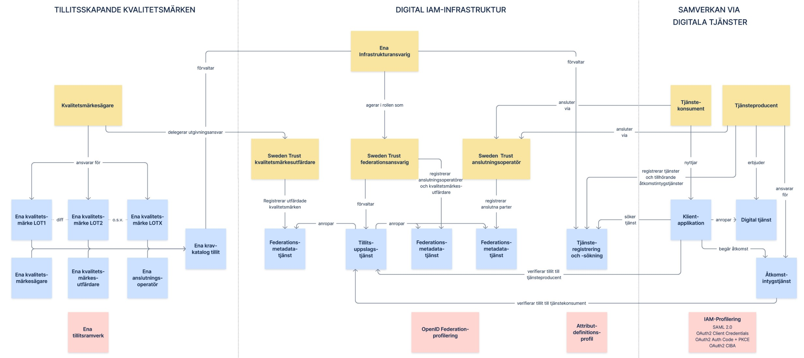

# Målarkitektur för en Svensk identitets- och åtkomsthantering

**Innehållsförteckning**
- [1. Inledning](#1-inledning)
- [2. Behovsanalys/mönster](#2-behovsanalysmönster)
- [3. Scenarion](#3-scenarion)
- [4. Målarkitektur](#4-målarkitektur)

## Funderingar att diskutera
*Alla kan fylla på nedan*

<table bgcolor=yellow><tr><td>
<li>Representeras LoA-nivåerna inte egentligen av olika <b>kravprofiler</b> i "federationen", vilken realiserar vårt framtida IAM-system?
<li>Kan vi inte generellt koppla ihop "uppfyllande av kravprofil" med konceptet <b>kvalitetsmärke</b>!? <i>T.ex. Svensk e-legitimation är en kravprofil som en viss utgivare av digitala identiteter uppfyller.</i>
<li>Hur relaterar kvalitetsmärke till tillitsmärke? Är tillitsmärkeken inte bara en mekanism i OpenID Federation som vibland annat använder för att representera kvalitetsmärken/uppfyllande av kravprofil? 
<li>Kan Sveriges realisering av OpenID Federation och trust marks bli en generell lösning för att attributera förmågor till digitala aktörer? Eller vill vi begränsa det till Diggs uppdrag?
<li>Borde inte OpenID Federation-realiseringen heta <b>Sweden Trust</b> :)
</td></tr><table>

## 1. Inledning 
För en tillitsfull och kostnadseffektiv samverkan över organisationsgränser inom offentlig förvaltning behöver vi utveckla och förankra nationell arkitektur, infrastruktur och tillämpningsanvisningar för identitets- och åtkomsthantering. Denna målarkitektur syftar till att ge en bild över hur en nationella standardisering av IAM-hantering (Identity and Access Management) kan och bör utformas för att möjliggöra en tids- och kostnadseffektiv digitalisering av svensk offentlig sektor.

*Logisk bild över hur områdena tillitshantering, identitetshantering och behörighetshantering ger förutsättningar för åtkomsthantering i digitala tjänster*

Inom alla dessa områden finns det redan idag olika grad av standardisering. Det används dock olika standarder inom olika verksamhetsområden och detta leder till att parter som behöver samverka inom flera av dessa verksamhetsområden behöver investera i att stödja många standarder parallellt. Med ett gemensamt system för att hantera digitala identiteter och åtkomstbeslut kan samverkan mellan aktörer verksamma inom svensk offentlig förvaltning underlättas avsevärt. 

### 1.1 Syfte
Målarkitekturen även omfatta en enklare strategisk plan för vilka förflyttningar som behöver genomföras över tid och beroenden dem emellan. Den strategiska plan behöver förhålla sig till existerande arkitektur och infrastrur, samt redan gjorda investeringar i digitaliseringstillämpningar. Planen bör även innehålla vägledning för om, när och hur existerande digitala tjänster ska migrera över till ENA IAMs samverkansmönster och nyttja ny infrastruktur.

Målarkitekturen är tänkt att fungera som underlag för diskussioner inom svensk offentlig förvaltning och nå samsyn kring hur ett framtida IAM-funktionalitet kan och bör utformas. Nationell arkitektur och digital infrastruktur för IAM-området behöver omfatta följande områden:
- Hantering av tillit till organisationer, system och användare
- Hantering av digitala identiteter för alla typer av användare, såväl individer, medarbetare och system
- Förmedling av behörighetsstyrande information - för individer, medarbetare och system
- Standardisering av digital legitimering och åtkomstbeslut - för fysiska användare och system

Redan idag finns arkitektur för hantering av invånares e-legitimationer och medarbetares e-tjänstelegitimationer. Det som saknas är framförallt ett övergripande stöd för hantering av systemanvändare identiteter, samt tillitsgrundande information för organisationer och medarbetare. Arkitekturella mönster, standarder och nationell infrastruktur för dessa ändamål är målet för den mårarkitektur som presenteras i detta dokument.

### 1.2 Avgränsningar
Målarkitekturen som tas fram här syftar till att fungera normerande för digital samverkan mellan organisationer verksamma inom Svensk offentlig förvaltning. För hantering av IAM kan standarder framtagna för den nationella digitala IAM-infrastrukturen fungera vägledande men de kommer inte vara heltäckande utan kan behöva kompletteras eller profileras ytterligare.

## 2. Behovsanalys/Mönster
När parter etablerar samverkan via en digital tjänst finns det ett antal olika mönster. Nedan presenteras identifierade mönster och exempel på tillämpningar där dess mönster används.

Det övergripande mönstret beskrivs logiskt i nedanstående bild.

 I efterföljande bilder detaljeras bilden för olika mönster som möter olika behov.

### 2.1 System anropar system, under egen identitet

### 2.2 System anropar system, på uppdrag av användare
#### 2.2.1 Intygsväxling

#### 2.2.2 Återautentisering

### 2.3 Medarbetare anropar extern e-tjänst, utan förprovisionerat konto

### 2.4 Medarbetare anropar extern tjänst, med förprovisionerat användarkonto 

#### 2.4.1 Alt 1? 

#### 2.4.1 Alt 2? 

## 3. Scenarion

### 3.1 Finansiell status

#### Nuläge

##### Förutsättningar
1. Kommunadministratör kontaktar FK om att få administratörsrättigheter i e-tjänst
2. Kommun fyller i blankett(er)
3. Kommun kompletterar med kopior av beslut
4. Kommun kompletterar med andra uppgifter
5. FK skickar brev till kommun
6. Kommun svarar via fax/brev, med administratörens uppgifter
7. Kommun väntar på lång handläggningstid
8. FK kontaktar kommun om kompletteringar
9. Administratör godkänns, läggs upp i e-tjänst
10. Administratör ansöker om e-tjänstekort (EFOS)
11. Administratör får e-tjänstekort och kan börja administrera kommunens handläggare i e-tjänst
12. Upprepas vid varje extern tjänst eller vid byte av administratör
13. (<i>I flera fall finns ingen kommunadministratör, ersätt då ovanstånde att gälla för alla enskilda användare.</i>)

#### Börläge
*Lite förenklad bild med komponenter per aktör, utan varje interaktion* - Pelle väljer!

##### Förutsättningar
Obligatoriska förutsättningar
- Kommun: Medlem i federationen som organisation
- Kommun: Intygsutfärdartjänst och attributskälla måste vara granskad och godkänd på tillräcklig tillitsnivå av federationen
- Kommun: Användare måste ha en av federationen godkänd e-legitimation, på tillräcklig tillitsnivå
- Kommunens intygsutfärdartjänst: Metadata registreradhos federationsoperatören; nyckelcertifikat, tillitsnivå, et
- Kommunanvändaren: Upplagd i kommunens lokala attributskälla
- Kommunanvändaren: Metadata skickas med i anrop till e-tjänst – pekare till adress till kommunens intygsutfärdartjänst (alternativt används en anvisningstjänst kopplat till e-tjänsten)
- E-tjänst: Dess organisation medlem i federation
- E-tjänst: Medlem i federation som e-tjänst på viss tillitsnivå
- E-tjänst: Metadata registrerad; nyckelcertifikat, krav på tillitsnivå, krav på attribut, etc
- E-tjänst: Uppfyller kraven på server-2-server-kommunikation som federationen anvisar, som konsument av information
- Kronofogden: Medlem i federation
- Kronofogden: Metadata för e-tjänst registrerad hos federationsoperatören, som producent av information
- Kronofogden: Uppfyller kraven på server-2-server-kommunikation som federationen anvisar

Möjliga förutsättningar
- Bolagsverket: Medlem i federation (ej krav pga offentlig tillgänglig information i tjänst)
- Agent/ombud: Granskad och godkänd av federationen att stötta andra organisationer med deras federationsansökan, e-tjänster, intygsutfärdartjänst, attributskälla, e-legitimationer

## 4. Målarkitektur
<table bgcolor="lightyellow" border=1><tr><td>
Målarkitekturen använder termer från <a href="https://inera.atlassian.net/wiki/spaces/OITIFV/pages/3020324865/T2+-+v+lf+rden">T2 - referensarkitektur för interoperabilitet inom svensk välfärd</a>. En ny ordlista är under framtagande inom Enas byggblock Auktorisation och rekommendationen är att revidera nedanstående beskrivningar innan fastställande av denna målarkitektur.
</td></tr></table>

Målet med det arbete som idag pågår inom Ena - Sveriges digitala infrastruktur är en överenskommen nationell arkitektur,  en digital infrastruktur, samt grundläggande digitala tjänster som nyttjas av aktörer med offentliga uppdrag för att lyckas med en effektiv digitalisering inom olika offentliga verksamhetsområden. Tanken är vidare att alla digitala tjänster inom det offentliga uppdraget ska kunna nyttja framtagen arkitektur och infrastruktur och att man så sätt kan få till stånd en snabbare digitalisering av det svenska samhället i stort.

Denna målarkitektur är uppdelad i tre huvudområden. 

Det första området är tillitsskapande kvalitetsmärken och det beskriver behovet av en nationellt överenskommen hantering av tillitsskapande krav på aktörer som deltar i, eller möjliggör, digital samverkan. Dessa krav benämns kvalitetsmärken. Olika kvalitetsmärken kan innehålla olika uppsättningar krav och ge tillgång till olika utbud av digitala tjänster eller federationer för informationsutbyte. Exakt utformning av kvalitetsmärken behandlas inte här, men då den digitala IAM-infrastrukturen behöver kunna lagra och överföra information om dessa kvalitetsmärken så beskriver vi grundtanken bakom dessa här.

Det andra området är den digital infrastruktur som behövs för att möjliggöra och underlätta säker samverkan mellan välfärdens aktörer. Detta genom kvalificering gentemot kvalitetsmärken, stöd med anslutning till infrastrukturen, och faktisk teknisk integrationen mot digitala tjänster med hjälp av diverse stödtjänster.

Det tredje området syftar till att beskriva hur den digitala infrastrukturen och underliggande arkitektur och nationellt profilerade standarder faktiskt nyttjas för att etablera samverkan via digitala tjänster.

Översiktsbilden nedan visar en översikt över det tre områdena tillitsskapande kvalitetsmärken, digital infrastruktur, och samverkan via digitala tjänster. Bilden visar roller i gult, digitala förmågor i blått. Bilden utelämnar avsiktligt många detaljer för att kunna ge vara konceptuellt lättförståelig. De artefakter som behöver säkerställas att de tas fram, alternativt tas fram inom Ena, visas i rosa.

<i>Översiktbild som beskriver IAM-infrastrukturens aktörer och förmågor, samt hur dessa möjliggör samverkan via digitala tjänster. (<a href="https://inera.atlassian.net/wiki/spaces/T2/whiteboard/4092854491">länk till originalbild hos Inera</a>)</i>

### 4.1 Tillitsskapande kvalitetsmärken
Målet med de tillitsskapande kvalitetsmärkena är att ge aktörer inom svensk offentlig förvaltning ett sätt att bevisa sin mognad inom informationssäkerhetsområdet och sin förmåga att agera ansvarsfull i samverkan med andra aktörer. Dessutom kan de behöva visa på en specifik mognadsgrad eller att de besitter en viss grad av teknisk mognad, eller specifika tekniska förmågor, för att delta i vissa samverkansområden där informationsklassning eller skyddskraven är högre.

Målarkitekturen innehåller ett koncept med en kravkatalog där man samlar och jämkar befintliga krav från existerande tillitsfederationer (Sambi, HSA, Skolfederation, Sweden Connect, med flera) och utifrån dessa skapar kvalitetsmärken som ger en "mognadstrappa" för samverkande parter. Digitala tjänster som erbjuds inom Enas IAM-infrastruktur kan då ställa krav på samverkande parter att inneha ett specifikt kvalitetsmärke.

Exakt utformning av kvalitetsmärken tas fram inom Enas byggblick Tillit.

### 4.2 Digital IAM-infrastruktur
Den IAM-infrastrukturen realiseras baserat på standarden OpenID Federation (OIDF), vilken möjliggör federativ hantering av tillitsgrundande information, digitala identiter och annan IAM-metadata. OIDF är ännu inte en fastställd standard, men den används redan i Italiens IAM-infrastruktur och i Sveriges <i>Single Digital Gateway</i>-realisering. Digg håller på att ta fram en svensk profileringen av standarden.

<b>Not:</b> Sveriges IAM-infrastruktur omfattar även identitetshantering för invånare (Svensk e-legitimation) och Sveriges eIDAS-nod (Sweden Connect) för hantering av EU-medborgares identifiering. Arkitektur och tekniska komponenter för detta ändamål finns redan etablerade och har därför exkluderats från översikten ovan i syfte att minska komplexiteten.

Den svenska IAM-infrastrukturen innehåller fyra roller:

1. Ena infrastrukturansvarig - en roll som innebär att man har ett koordineringsansvar för att tillse att en svensk digital infrastruktur skapas och förvaltas. Digg innehar rollen idag.
1. Sweden Trust federationsansvarig - en roll som ansvarar för att hålla metadata om IAM-infrastrukturens anslutningsoperatörer och kvalitetsmärkesutfärdare. Man ska som federationsansvarig även tillhandahålla en tillitsuppslagstjänst.
1. Sweden Trust kvalitetsmärkesutfärdare - en roll inom infrastrukturen för de aktörer som tillser att aktörers uppfyllnad av krav uppfylls med en för kvalitetsmärkets adekvat tillförlitlighet. Exempel på tillförlitlighetsnivåer i dessa granskningar kan vara självdeklaration, intern revision, eller extern revision. Kvalitetsmärkesutfärdaren registrerar utfärdade kvalitetsmärken i en federationsmetadatatjänst som är åtkomlig för federationsansvariges tillitsuppslagstjänst.
1. Sweden Trust anslutningsoperatör - en roll för de parter som tillser att aktörer som vill samverka via digitala tjänster inom Ena uppfyller SKALL-krav gällande kvalitetsmärken och därefter registrerar IAM-aktörens metadata i sin federationsmetadatatjänst.

### 4.3 Samverkan via digitala tjänster
Samverkan via digitala tjänster kan ske antingen via direkt avtal med en tjänsteproducent i de fall det endast finns **en** tjänsteproducent för aktuell samverkan. Alternativt, om det finns multipla tjänstekonsumenter och tjänsteproducenter är det motiverat att forma en federation för informationsutbyte (benämns även informationsfederation). Detta görs främst för att underlätta tecknande av komersiella avtal och GDPR personuppgiftsbiträdesavtal (PUB-avtal), men en informationsfederation kan också ge en effektiv struktur för styrning, kontroll och förvaltning av överenskommelser kring informationsutbytet. 

#### Förutsättningar
* Klientapplikationen vet vilken tjänsteproducent man vill anropa, alternativt vilken typ av tjänst man vill få utförd (enligt vilken interoperabilitetsspecifikation)
* Klientapplikationen är byggd för att kontakta tjänsteproducenter enligt interoperabilitetsspecifikation 
* Den digitala tjänsten är byggd för att kunna ta emot anrop enligt interoperabilitetsspecifikationen

**Notera** att tjänsteproducerande system SKALL stödja minst två parallella huvudversioner av interoperabilitetsspecifikationen för att stödja tjänsters livscykelhantering. Detsamma gäller klientapplikationer  för samverkan där det finns fler än en tjänsteproducent.

#### Anropskedja
1. Klienten söker digital tjänst i tjänstekatalogen 
1. Klient validerar att den digitala tjänst man tänker sig anropa är med i samma federation för informationsutbyte som tjänstekonsumenten
1. Tjänsteklienten begär åtkomst till den digitala tjänstens API från åtkomstintygstjänsten tillhörande den digitala tjänsten
1. Tjänsteklienten 

### 4.4 Utvärdering av interoperabilitet
<a href="https://www.riksdagen.se/sv/dokument-och-lagar/dokument/fakta-pm-om-eu-forslag/forordning-om-ett-interoperabelt-europa_ha06fpm33/">Förordning om ett interoperabelt Europa</a> innehåller krav på utvärdering av interoperabilitet för att följa upp effekter av uppdateringar i it-system av betydelse för gränsöverskridande interoperabilitet inom EU. Förordningen pekar på att utvärderingen ska göras i relation till det europeiska ramverket för interoperabilitet (EIF). 

[Svenskt ramverk för digital samverkan (Digg)](https://www.digg.se/kunskap-och-stod/svenskt-ramverk-for-digital-samverkan) är en svensk anpassning av EIF. Det innehåller principer för digtalisering, samt rekommendationer för hur dessa principer tillämpas. För IAM-området kan vi komma att behöva ta fram specifika rekommendationer. 

Exakt utformning av struktur och processer för denna interoperabilitetsutvärdering finns ej tillgänglig i dagsläget, men nedan belyses IAM-infrastrukturen gentemot ramverkets grundprinciper och gjorda reflektioner redovisas.

1. Samverka som förstahandsval
2. Arbeta aktivt med juridiken
    - En nationell IAM-infrastruktur måste ha utrymme för privata aktörer att bidra till svensk offentlig förvaltnings digitala ekosystem, såväl som utförare av offentligt finansierad verksamhet, leverantörer av IAM-funktionalitet, eller agenter för andra sådana offentliga eller privata aktörer.
    - Då dagens IAM-infrastruktur tvingar fram bedrägliga betteenden hos invånare i och med att digitala lösningar i regel  ej är utformade för att vara tillgängligt för alla invånare, bör man i design av en nytt IAM-infrastruktur lyfta behov av utökat legalt stöd för att interagera via digitala tjänster med stöd av andra utan att begå avtals- och lagbrott. Tillse redan nu att en framtida förenklad hantering av ombud via fullmakt eller annan ställföretraädarroll inte försvåras.
3. Öppna upp
4. Skapa transparens till den interna hanteringen
5. Återanvänd från andra
    - Bygg IAM-infrastrukturen på brett förankrade standarder och <i>best practices</i>. Delta i standardiseringsprocesser hellre än att profilera befintliga standarder. Profilera hellre befintliga standarder än att hitta på egna.
6. Se till att information och data kan överföras
    - Bygg vidare på existerande kodverk för behörighetsstyrande attribut och försök förankra attributmappningar mellan existerande och nya kodverk. Över tid kan man främja en linjering gentemot en standard, men genom att respektera gjorda investeringar främjas en ökad digitaliseringstakt och dessutom ett ansvarsfullt nyttjande av skattemedel.
7. Sätt användaren i centrum
8. Gör digitala tjänster tillgängliga och inkluderande
    - Sök att i designbeslut på alla nivåer beakta problematiken med digitalt utanförskap genom att skapa förutsättningar för tillämpningar med hög tillgänglighet. 
    - Att legitimera sig digitalt måste vara möjligt för alla invånare oavsett deras fysiska och kognitiva förmåga (se [Lag (2018:1937) om tillgänglighet till digital offentlig service](https://www.riksdagen.se/sv/dokument-och-lagar/dokument/svensk-forfattningssamling/lag-20181937-om-tillganglighet-till-digital_sfs-2018-1937/) och [Kognitiv tillgänglighet – Del 1: Allmänna riktlinjer (ISO 21801-1:2020, IDT)](https://www.sis.se/produkter/halso-och-sjukvard/hjalpmedel-for-personer-med-funktionsnedsattning/hjalpmedel-for-personer-med-funktionsnedsattningar/ss-en-iso-21801-120212/)). 
    - Detta kräver tillgänglighetsanpassade förfaranden, samt möjlighet för ombudsförfaranden för de som behöver de som behöver stöd. Manuella alternativ är ingen lösning då dessa, om det är enda anpassningen, cementerar det digitala utanförskapet.
9. Gör det säkert
    - Beakta säkerheten avseende alla nivåer. Teknisk säkerhet i IAM-infrastrukturen i sig. Hög tillgänglighet avseende robusthet i systemets ingående komponenter. Hög tillgänglighet avseende användarinteraktioner. Säkerhetsmekanismer på adekvat nivå för att skydda respektive komponent och den information som behandlas av denne.
10. Hitta rätt balans för den personliga integriteten
11. Använd ett språk som användarna förstår
12. Gör administrationen enkel
    - Skapa en IAM-infrastruktur med huvudsakligen en anslutningsprocess per anslutande part. Låt anslutningar till specifika verksamhetstillämpningar bygga vidare på genomförd anslutning till IAM-infrastrukturen för att därmed minimera den administrativa bördan.
13. Ha helhetssyn på informationshantering
