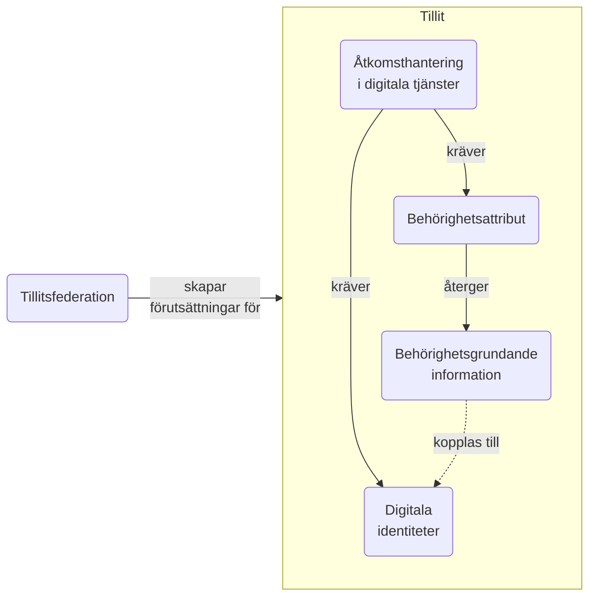
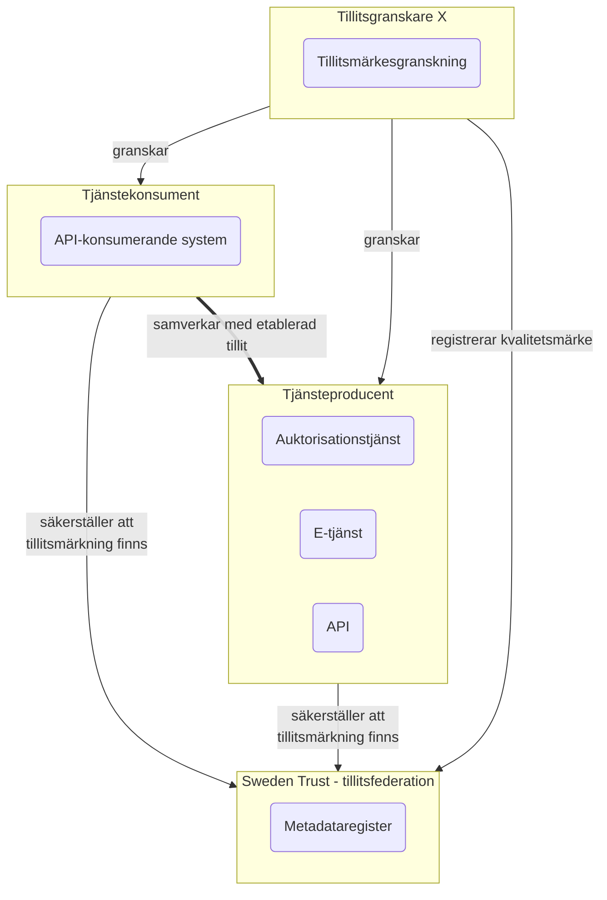

# Målarkitektur för nationell hantering av tillit, identitet och behörighet

## Målarkitekturens syfte

För en tillitsfull och kostnadseffektiv samverkan inom offentlig förvaltning behöver vi utveckla och förankra nationella anvisningar för IAM inom områdena visade i nedanstående bild

*Bild över hur områdena tillitsskapande förmågor, digitala identiteter, behörighetsattribut, behörighetsgrundande information och åtkomsthantering i digitala tjänster beror av varandra*

Inom alla dessa områden finns det redan idag olika grad av standardisering i syfte att möjliggöra digitaliseringen av olika verksamhetsområden. Få lösningar idag är dock förankrade och nyttjade på nationell skala och det försöker vi adressera med denna målarkitektur.

För varje område presenteras kort nuläget, visionen och strategiska förflyttningar som tar oss mot visionen.

### Principer för målarkitekturens utformning

I vårt arbete med målarkitekturen utgår vi ifrån principerna i  [Svenskt ramverk för digital samverkan, Digg](https://www.digg.se/kunskap-och-stod/svenskt-ramverk-for-digital-samverkan). 

Svenskt ramverk för digital samverkan innehåller även ett antal rekommendationer för hur man tillämpar principerna. För IAM-området kan vi komma att behöva ta fram ett antal specificerade principer och rekommendationer. 

<table bgcolor="lightblue" border=1><tr><td>
Det fi,nns ett förslag på en ny EU-förordning, <a href="https://commission.europa.eu/system/files/2022-11/com2022720_0.pdf">Interoperabilitetsförordningen</a>, vilken tar avstamp i European Interoperability Framwork (EIF) och reglerar hur man säkerställer att digitala tjänster som tas fram inom EU linjerar mot EIF.
  
Svenskt ramverk för digital samverkan är den svenska översättningen av EIF.
</td></tr></table>

## Tillitsfederation

Vid all samverkan behöver man ha tillit till den part man samverkar med. Det finns idag ett antal tillvägagångssätt för detta som syftar till att både privatpersoner och organisationer ska känna tillit till att information som delas via e-tjänster och APIer inom samhället hanteras på ett korrekt sätt.

Hus skapas denna tillit och hur säkerställs den över tid?

För att kunna samverka över organisationsgränser behövs tillit på två nivåer:

1. Teknisk nivå 
1. Organisatorisk nivå
 
 På teknisk nivå behöver det säkerställas att olika parter utför sin roll i samverkan på ett tekniskt korrekt sätt, enligt överenskomna ramverk, standarder, specifikationer och profileringar.

 På organisatorisk nivå behöver man kravställa att de olika parterna som på något sätt deltar i samverkan har den organisation, de processer, samt den kompetens som krävs för att hålla en god kvalitet i hur de utför sina ansvar. Detta kan till exempel vara att ha ett ledningssystem för informationssäkerhet, samt processer för att säkerställa efterlevnad och kontinuerligt förbättringsarbete. 

Säkerställandet av tillitsskapande förmågor kan behöva ske med olika grad av försäkran beroende på samverkanskontext och skyddskrav för den funktionalitet och information som delas. Kraven som ställs behöver också kunna skilja sig mellan olika typer av aktörer.

Teknisk efterlevnad kan ofta säkerställas genom tekniska test. Organistorisk efterlevnad säkerställs ofta genom granskning av regelverk, policyer och rapportering efter genomförada processer. 

### Nuläge
Vilka tillitsskapande förmågor som krävs och hur dessa behöver styrkas regleras ofta i avtal bilateralt mellan samverkande parter eller via en federationsoperatör.

Mycket av tilliten är grundmurad, exempelvis den organisatoriska tilliten till statliga myndigheter ifrågasätts sällan av andra parter.

### Vision
För att möjliggöra kostnadseffektiv digitalisering av Svensk offentlig förvaltning bör bygga upp ett system där bilaterala avtal inte behöver reglera tilliten utan att detta styrs nationellt via en tillitsfederation.

En tillitsfederation bör definiera vilka krav som ska gälle för respektive typ av aktörs, graderat i olika tillitsnivåer.

<table border=1 bgcolor="lightblue"><tr><td>
Olika nivåer av tillit rekommenderar vi benämns <i>"Level of trust"</i> och förkortas LoT1, LoT2, LoT3 och LoT4. En högre LoT-nivå ställer högre krav på tillitsskapande förmågor hos en aktör. 
</td></tr></table> 

*Schematisk bild över hur tillit mellan samverkande parter kan regleras via en tillitsfederation*

Det behöver finnas utrymme för många olika typer av kvalitetsmärken för de olika roller en aktör kan inneha samt kanske även olika kvalitetsmärken för olika tillitsnivåer som krävs beroende på samverkanskontextet.

För att minimera administration och användning av tillitsmärken bör dessa vara så få som möjligt.

## Digitala identiteter

### Nuläge
För privatepersoner har Digg ansvar för kvalitetsmärket Svensk e-legitimation. Detta möjliggör olika aktörer att erbjuda digitala identiteter till privatpersoner förutsatt att de kvalitetssäkrats av Digg. Idag erbjuder BankId, Freja och Svenska Pass denna typ av e-legitimationer.

För medarbetare med behov av att legitimera sig digitalt inom sitt tjänsteutövande har Digg idag ett liknande kvalitetsmärke för utgivning av e-tjänstelegitimationer. Här har Freja och EFOS(???) avtal med Digg idag. Det finns sedan ett antal fristående utgivare av e-tjänstelegitimationer - störst här är SITHS som ger ut e-tjänstelegitimationer till en majoritet av medarbetarna inom Svensk vård och omsorg.

De digitala identiteterna för fysiska personer autentiseras i regel av en legitimeringstjänst som ansvaras för av utgivaren. Den tjänsteproducerande aktören (även benämnd förlitande part) behöver ha explicit tillit till legitimeringstjänsten.

För systemaktörer finns idag ingen nationell samordning av utgivning av digitala identiteter. Det finns ett antal aktörer som ger ut certifikat som kan nyttjas i mer eller mindre avgränsade syften. SITHS och EFOS ger ut så kallade funktionscertifikat (X.509-certifikat att nyttjas av systemaktörer). Digg ger ut funktionscertifikat till avtalsparter inom Säker Digital Kommunikation (SDK). 

<table border=1 bgcolor="lightblue"><tr><td>
Tilliten mellan systemaktörer regleras ofta till det verksamhetskontext där utgivningen skett eller explicit till specifika certifikat baserat på bilaterala avtal
</td></tr></table>

### Vision
Dagens utgivna digitala identiteter behöver fungera även för framtida samverkan inom svensk offentlig förvaltning. Detta då man under lång tid investerat stora summor inom IAM-området och ansvarsfullt användande av statens finanser och skattemedel är av stor betydelse. 

Vi ser även ett behov av ett nationellt kvalitetsmärke för utgivare av funktionscertifikat. Ett sådant kvalitetsmärke kan, i kombination med ett nationellt tillitsfederation, möjliggöra tillitsfull samverkan mellan system.

## Behörighetsgrundande information
För att kunna garantera kvaliteten i den åtkomsthantering som sker bör informationsförsörjningen av behörighetsgrundande information ske med en tillförlitlighet på en nivå som motsvarar skyddsbehovet för den digitala tjänst som beslutet avser.

Högst kvalitet på behörighetsgrundande information fås genom att den part som äger och administrera informationen också används som källa för informationsförsörjningen. Exempelvis bör information om läkarlegitimationer informationsförsörjas från Socialstyrelsens HOSP-register. På samma sätt bör medarbetares uppdragsgivare informationsförsörja information som härrör till de uppdrag medarbetaren har.

**SKRIV OM-->ATTRIBUT...**
*Vidare behöver en person kunna agera utifrån olika uppdrag inom en och samma organisation och utifrån valt uppdrag få olika tillgång till information och funktioner.*

*En behörighetsmodell behöver även ge stöd för att uttrycka ställföreträdande- och andra ombudsroller och det behöver tas fram kodverk och strukturer för att överföra denna information digitalt.*

I många fall är det tidsödande eller ogörligt att informationsförsörja behörighetsstyrande information direkt från källan utan man kopierar informationen till enn annan plats varifrån den enklare kan inhämtas. Detta kan till exempel handla om att en organisation hämtar en fräsch kopia av HOSP varje dag, eller att en legitimeringstjänst cachar dataposter från en informationskälla under en timme innan den inhämtas igen. Detta i syfte att skapa ökad robusthet och bättre svarstider. 

Vad som är en adekvat nivå av säkerhet för cahning behöver man komma överens om, samt om detta ska kunna skilja sig för olika tillämpningsområden eller informationsmängder.

**Rekommendationer:**
<ol>
<li>Behörighetsgrundande information ska ha en utpekad källa</li>
<li>Behörighetsgrundande information kan cachas för mer robust och effektiv åtkomstbeslutshantering</li>
<li>De parter som bifogar behörighetsgrundande information till en digital identitet bör ha granskats för att detta sker kontrollerat och tillitsfullt, exempelvis genom granskning mot ett kvalitetsmärke</li>
</ol>

## Åtkomsthantering i digitala tjänster
I åtkomsthanteringen knyts alla aspekter av digitalaidentiteter, tillitskedjor, samt informationsförsörjning av behörighetsgrundande information samman.

Korrekta åtkomsbeslut kan vara beroende av informationsförsörjning av behörighetsgrundande från både externa och lokala källor utöver information som tillförts under legitimeringen. 

*Beroenden mellan olika aktörer och komponenter för att möjliggöra tillitsfulla åtkomstbeslut*

#######################################

## Övrigt ej sorterat

### OICD Federation och tillit
1. Vad är skillnaden mellan trust anchors, intermediates och trust mark issuers? Är det två olika tillitsstrukturer?
2. Sparas trust marks i samma metadataregister som de digitala identiteterna?

### Nationella OAuth2-profiler - behovsinventering

#### 1. Tjänsteperson använder annan organisations e-tjänst

### Modell för behörighetgrundande attribut

### Attributprofiler

