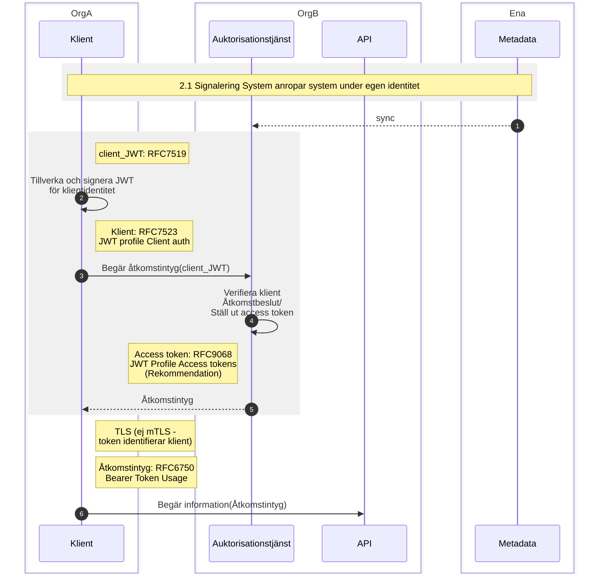

# Signering (2.1) System anropar system, under egen identitet
## Flödesdiagram

1. Centralt metadata för klienter syncas regelbundet mot lokal kopia. En förutsättning för detta är att klienter kan registreras i metadata under viss organisation för att senare kunna verifieras. Ej beskriven här, men en förutsättning för detta.

2. Klient tillverkar JWT (RFC7515) och signerar denna till en JWS (RFC7519). Claims enligt RFC75201 och RFC7523, "client_JWT":
~~~markdown
{
    "iss" : "{client_id}",
    "sub" : "{client_id}",
    "aud" : "{token_endpoint}",
    "jti" : "{uuid}",
    "exp" : "{expiration time}",
    "iat" : "{issuance time}"
}
~~~
Signering sker med privat nyckel vars publika del finns i metadata med client_id som nyckel. Behöver även vara knuten till utfärdande organisation.

3. Klient anropar auktorisationstjänst (token endpoint) och anger client_assertion_type som urn:ietf:params:oauth:client-assertion-type:jwt-bearer och client_assertion med JWS. Scope kan anges men ligger utanför denna specifikation (inget avtryck i metadata eller liknande).

~~~markdown
  POST /token HTTP/1.1
  Host: server.example.com
  Content-Type: application/x-www-form-urlencoded

  grant_type=client_id=s6BhdRkqt3&
    client_assertion_type=
    urn%3Aietf%3Aparams%3Aoauth%3Aclient-assertion-type%3Ajwt-bearer&
    client_assertion=<client_JWT>
~~~
OBS client_id i body utgår eventuellt.

4. Auktorisationstjänst verifierar klient mot metadata, fattar åtkomstbeslut (är detta en klient jag tillåter åtkomst till avseende eventuellt angivet scope) och ställer ut åtkomstintyg (accesstoken) och förnyelseintyg (refreshtoken) enligt RFCXXXX.

5. accesstoken och refreshtoken returneras till klient

6. Anrop sker från klient till API med accesstoken angiven som Bearer Token (RFC6750). TLS för transportkryptering är obligatorisk och tillses av API. mTLS går att sätta upp, men krävs inte och rekommenderas inte. Identitet på klient bärs av token och tidigare verifiering av klient. 

---

Referensmaterial:

RFC6749 The OAuth 2.0 Authorization Framework
https://datatracker.ietf.org/doc/html/rfc6749

RFC7523 JSON Web Token (JWT) Profile for OAuth 2.0 Client Authentication and Authorization Grants
https://datatracker.ietf.org/doc/html/rfc7523

RFC7515 JSON Web Signature (JWS)
https://www.rfc-editor.org/rfc/rfc7515.html

RFC7522 Security Assertion Markup Language (SAML) 2.0 Profile
      for OAuth 2.0 Client Authentication and Authorization Grants
https://datatracker.ietf.org/doc/html/rfc7522      

RFC 7521 Assertion Framework for OAuth 2.0 Client Authentication and Authorization Grants
https://datatracker.ietf.org/doc/html/rfc7521

RFC 9068 JSON Web Token (JWT) Profile for OAuth 2.0 Access Tokens
https://datatracker.ietf.org/doc/rfc9068/

OAuth 2.0 Client Authentication
https://darutk.medium.com/oauth-2-0-client-authentication-4b5f929305d4

Hur används scope - Är det bilateralt mellan klient och API eller något som hanteras i metadata?

private_key_jwt enligt OIDC:
https://openid.net/specs/openid-connect-core-1_0.html#ClientAuthentication

