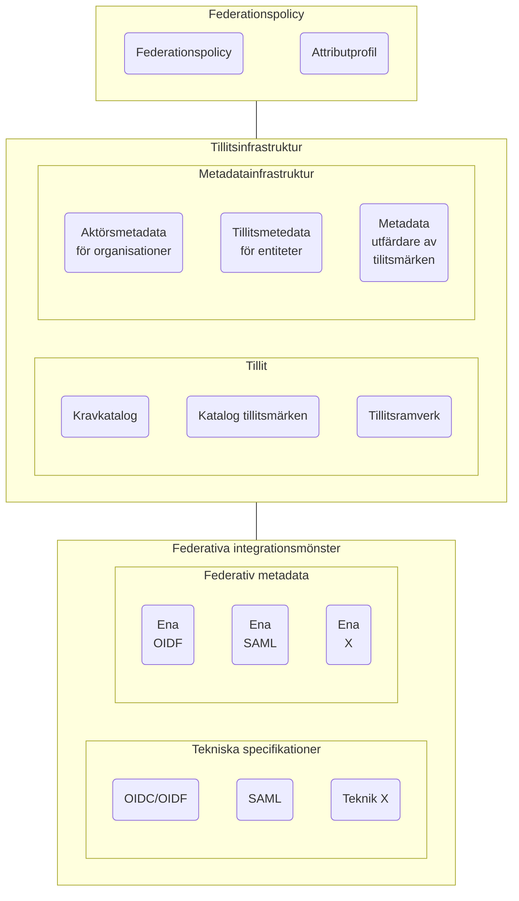

# Nationell federationsinfrastruktur

Den nationalle infrastrukturen för att kunna skapa federativa kontext kan delas in i tre områden.
 - Federationsspolicy
    - Regelverk för anslutning
    - Processer för styrning och samverkan 
 - Federativ tillitsinfrastruktur 
    - Samordnad hantering av tillitskrav på nationell och domännivå
    - Gruppering av tillitskrav i form av tillitsmärken och tillitsramverk 
 - Federativa integrationsmönster
    - Tekniska specifikationer
    - Tekniska integration och anslutning

## Översikt av områden

### Komponenter

#### Federationspolicy

#### Tillitsinfrastruktur
Tillitskrav 
 - Nationell kravkatalog
 - Tillitsmärken
 - Tillitsramverk

Metetadatainfrastruktur

#### Federativa integrationsmönster
##### Tekniska specifikationer
 - Specifikationer och profiliering
##### Metadatainfrastruktur
 - OIDF
 - SAML
