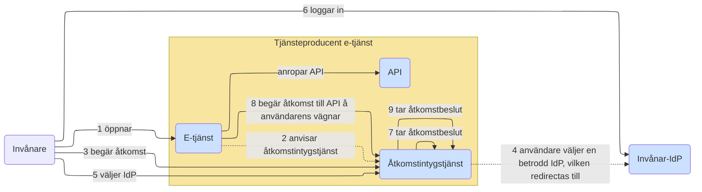
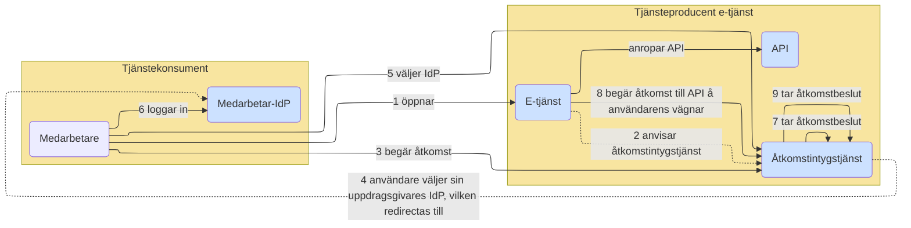
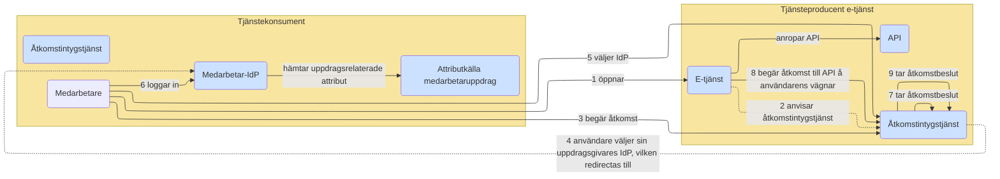

# Åtkomshantering
## Invånarscenario, åtkomst baseras på identitet

```mermaid
%%{init: {"flowchart": {"defaultRenderer": "elk"}} }%%
flowchart LR

classDef org fill:#F8E5A0
classDef comp fill:#CCE1FF
classDef box fill:#ffffff,stroke:#000000
classDef spec fill:#FFC0CB

iu(Invånare)
iidp(Invånar-IdP):::comp

subgraph p1[Tjänsteproducent e-tjänst]
    p1s(E-tjänst):::comp
    p1as(Åtkomstintygstjänst):::comp
    p1api(API):::comp
end
p1:::org

iu--1 öppnar-->p1s
p1s-.2 anvisar åtkomstintygstjänst.->p1as
iu--3 begär åtkomst-->p1as-.4 användare väljer en betrodd IdP, vilken redirectas till.->iidp
iu--5 väljer IdP-->p1as
iu--6 loggar in-->iidp
p1as--7 tar åtkomstbeslut-->p1as
p1s--8 begär åtkomst till API å användarens vägnar-->p1as
p1as--9 tar åtkomstbeslut-->p1as
p1s--anropar  API-->p1api

```
## Medarbetarscenario, åtkomst baseras på user affiliation

```mermaid
%%{init: {"flowchart": {"defaultRenderer": "elk"}} }%%
flowchart LR

classDef org fill:#F8E5A0
classDef comp fill:#CCE1FF
classDef box fill:#ffffff,stroke:#000000
classDef spec fill:#FFC0CB

subgraph k[Tjänstekonsument]
    ku(Medarbetare)
    kidp(Medarbetar-IdP):::comp
%%    kattr(Attributkälla medarbetaruppdrag):::comp
%%    kas(Åtkomstintygstjänst):::comp
end
k:::org

subgraph p1[Tjänsteproducent e-tjänst]
    p1s(E-tjänst):::comp
    p1as(Åtkomstintygstjänst):::comp
    p1api(API):::comp
end
p1:::org

ku--1 öppnar-->p1s
p1s-.2 anvisar åtkomstintygstjänst.->p1as
ku--3 begär åtkomst-->p1as-.4 användare väljer sin uppdragsgivares IdP, vilken redirectas till.->kidp
ku--5 väljer IdP-->p1as
ku--6 loggar in-->kidp
p1as--7 tar åtkomstbeslut-->p1as
p1s--8 begär åtkomst till API å användarens vägnar-->p1as
p1as--9 tar åtkomstbeslut-->p1as
p1s--anropar  API-->p1api

```
## Medarbetarscenario, åtkomst baseras på medarbetaruppdrag

```mermaid
%%{init: {"flowchart": {"defaultRenderer": "elk"}} }%%
flowchart LR

classDef org fill:#F8E5A0
classDef comp fill:#CCE1FF
classDef box fill:#ffffff,stroke:#000000
classDef spec fill:#FFC0CB

subgraph k[Tjänstekonsument]
    ku(Medarbetare)
    kidp(Medarbetar-IdP):::comp
    kattr(Attributkälla medarbetaruppdrag):::comp
    kas(Åtkomstintygstjänst):::comp
end
k:::org

subgraph p1[Tjänsteproducent e-tjänst]
    p1s(E-tjänst):::comp
    p1as(Åtkomstintygstjänst):::comp
    p1api(API):::comp
end
p1:::org

ku--1 öppnar-->p1s
p1s-.2 anvisar åtkomstintygstjänst.->p1as
ku--3 begär åtkomst-->p1as-.4 användare väljer sin uppdragsgivares IdP, vilken redirectas till.->kidp
ku--5 väljer IdP-->p1as
ku--6 loggar in-->kidp
kidp--hämtar uppdragsrelaterade attribut-->kattr 
p1as--7 tar åtkomstbeslut-->p1as
p1s--8 begär åtkomst till API å användarens vägnar-->p1as
p1as--9 tar åtkomstbeslut-->p1as
p1s--anropar  API-->p1api

```