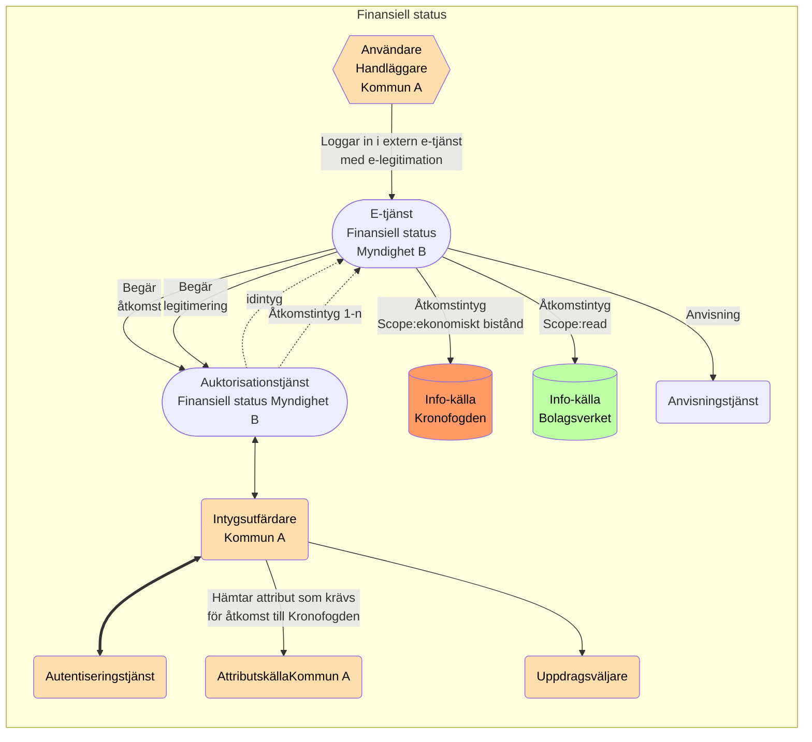

### Flowchart Finansiell status

```mermaid
flowchart LR;
classDef Amber color:#000000,fill:#FFDEAD;
classDef Green color:#000000,fill:#BDFFA4;
classDef orange color:#000000,fill:#f96;

subgraph Finansiell status;

Anv{{Användare<br>Handläggare<br>Kommun A}}:::Amber;
FinStat([E-tjänst<br>Finansiell status<br>Myndighet B]);
Aukt([Auktorisationstjänst\nFinansiell status Myndighet B]);
AnvTj(Anvisningstjänst);
Kfm[(Info-källa<br>Kronofogden)]:::orange;
Bol[(Info-källa<br>Bolagsverket)]:::Green;
Idp(Intygsutfärdare\nKommun A):::Amber;
Auth(Autentiseringstjänst):::Amber;

Ak(AttributskällaKommun A):::Amber;
Upd(Uppdragsväljare):::Amber;

Anv -->|Loggar in i extern e-tjänst<br> med e-legitimation | FinStat;

FinStat --> |Begär\nåtkomst| Aukt;
FinStat --> |Begär\nlegitimering| Aukt;
Aukt -.-> |idintyg| FinStat;
Aukt -.-> |Åtkomstintyg 1-n| FinStat;

FinStat -->|Åtkomstintyg<br>Scope:ekonomiskt bistånd | Kfm;
FinStat --> |Åtkomstintyg<br>Scope:read | Bol;


FinStat --> |Anvisning| AnvTj;

Aukt <--> Idp
Idp <==> Auth;
Idp --> |Hämtar attribut som krävs<br>för åtkomst till Kronofogden| Ak;
Idp --> Upd

end;

```

