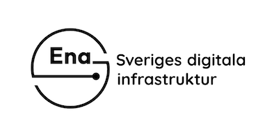
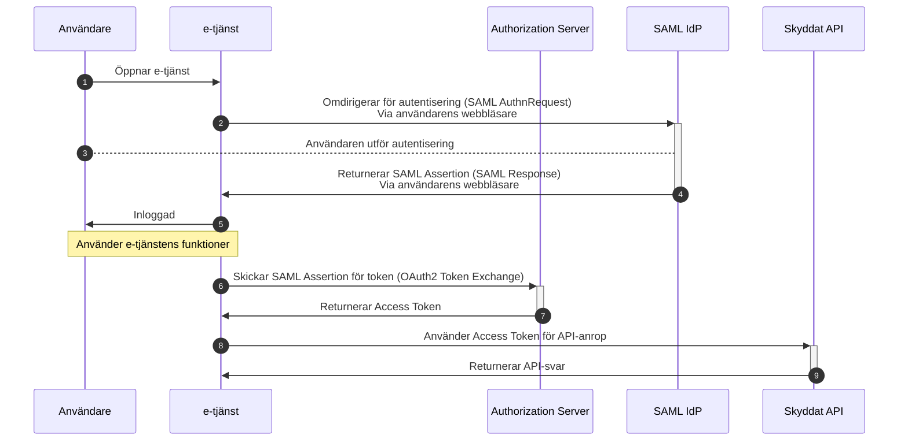
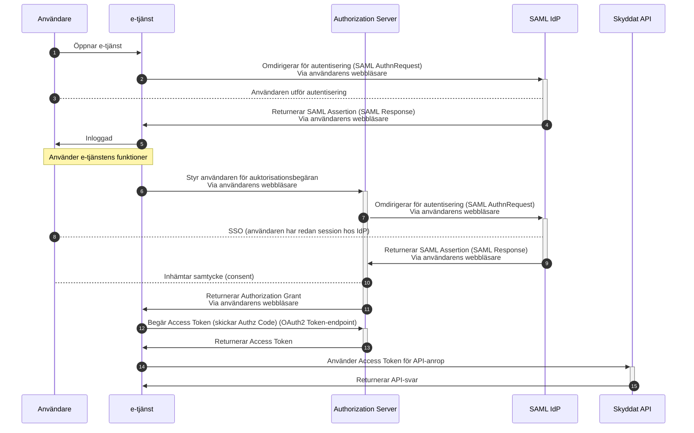
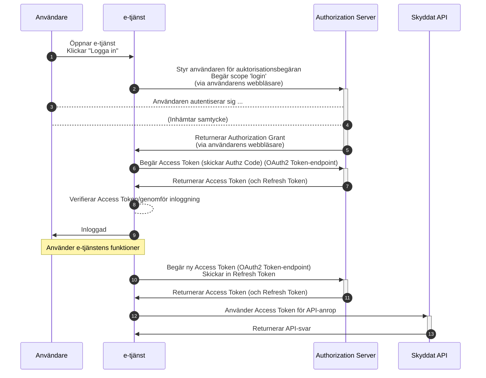
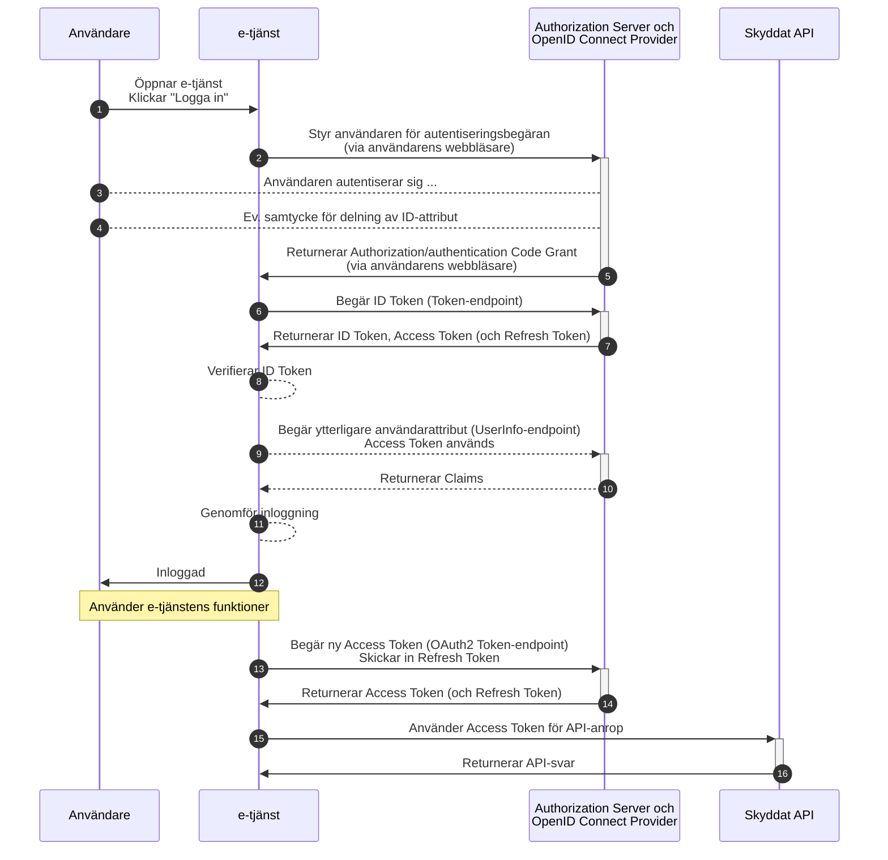

# Mönster för autentisering och auktorisation

## 1. Bakgrund

Många e-tjänster är uppbyggda kring att användaren först styrs till en legitimeringstjänst för legitimering, för att sedan loggas in till e-tjänsten baserat på det identitetsintyg som ställs ut i samband med identifieringen. Baserat på de identitetsattribut, och i vissa fall också behörighetsattribut, som levereras i intyget tar e-tjänsten ett beslut huruvida användaren ska få tillgång till tjänsten.

Denna modell används av de allra flesta e-tjänster, och fungerar bra för sitt primära syfte - att kunna logga in en användare till tjänsten. Många e-tjänster gör dock ytterligare anrop till bakomliggande tjänster kopplat till den inloggade användaren. I många fall är det till tjänster inom samma domän som e-tjänster finns i, men även anrop till tjänster i andra domäner utförs, t.ex. "användarens folkbokföringsdata hämtas från Skatteverkets Navet-tjänst", eller "användarens journaldata hämtas från annan vårdgivare".

I dagsläget bygger många av dessa typer av tjänst-till-tjänst anrop på en direkt tillit mellan parterna, och det finns inga direkta bevis på att klientsidan verkligen agerar å användarens vägnar när data hämtas. Det finns två huvudsakliga problem rörande denna typ av modell:

- Användaren som är inloggad i e-tjänsten får ingen vetskap om att dennes data hämtas från en annan tjänst, och kan inte påverka detta. I vissa fall kan det vara önskvärt att användaren ska godkänna denna datadelning. 

- Eftersom server-sidan inte får något bevis på att användaren finns "på andra sidan" så innebär det i princip att säkerheten för API:et (server-sidan) är beroende på att klienten inte har några säkerhetshål och att den inte tagits över av en illvillig "attacker", som i teorin har möjlighet att dränera API:et på alla individers data.

Om API:et (server-sidan) gör anrop i sin tur så flyttas dessa problem längre ned i kedjan, och problemet blir ännu större.

Lösningen på dessa problem är att använda en gemensamt betrodd auktorisationstjänst (Authorization Server) som ställer ut ett åtkomstintyg (Access Token) som intygar:

- Vem den anropande klienten är,
- att anropande klient har givits ett antal rättigheter (scopes) på efterfrågad resurs å en användares vägnar (subjektet),
- att användaren (subjektet) har autentiserats på erforderligt sätt.

Detta löses med OAuth2 där anropande e-tjänst tar rollen som *Client*, användaren tar rollen som *Resource Owner*1, och där API:et som anropas är *Resource Server*. En OAuth2 *Authorization Server* ansvarar för att säkerställa användarens identitet, samla in dess godkännande (*consent*), autentisera klienten, samt att baserat på en konfiguration tilldela rättigheter till en klient på en resurs å en användares vägnar i ett åtkomstintyg (*Access Token*).

OK, än är vi alla med. Nu kommer vi till det knepiga. Hur ska vi på ett säkert och smidigt sätt skapa ett åtkomstintyg? I kommande kapitel presenteras ett antal olika mönster, där vi för varje mönster diskuterar svagheter och övriga utmaningar.

Notera: Vi diskuterar inte eventuella lösningar där ett identitetsintyg skickas med i en anropskedja som något slags bevis, istället fokuserar vi på olika typer av lösningar som löser vårt problem med bibehållen säkerhet.

> **\[1\]:** Fastna nu inte i frågor om användaren juridiskt äger den data som efterfrågas. Rent logiskt kan vi se det så ...

## 2. Inloggning och åtkomstintyg

Detta stycke ger exempel på ett antal olika typfall för hur en användare kan loggas in till en e-tjänst för att e-tjänsten senare kan begära ett åtkomstintyg för anrop (rörande användaren) till en bakomliggande tjänst.

> I detta kapitel diskuterar vi inga typfall där anrop sker över organisationsgränser. Sådana typfall bygger på delade policies mellan auktorisationstjänster och intygsväxling och beskrivs i dokumentet [API-anrop över domängränser](inter-domain-calls.md). Dock bygger även dessa fall på att ett initialt åtkomstintyg finns.

### 2.1. Växling av SAML-intyg

I de allra flesta fall idag när en e-tjänst delegerar autentisering till en fristående legitimeringstjänst används SAML, där användare styrs till en SAML IdP1 (Identity Provider) för legitimering, och styrs tillbaka till e-tjänsten med ett SAML identitetsintyg (Assertion). Givet detta intyg kan e-tjänsten logga in användaren. 

OK, e-tjänsten vet nu vem användaren är, och kan via identitetsintyget också erhållit vissa behörighetsstyrande attribut2. Men när e-tjänsten nu behöver anropa en resurs (API) för att inhämta mer information om användaren så har vi just helt plötsligt en auktorisationsserver att förhålla oss till. Och denna tjänst har inte en aning om vilken användaren är.

Enligt OAuth2 så är ju flödet för att skaffa ett åtkomstintyg enligt följande:

1. Applikationen styr användaren till auktorisationstjänsten i ett s.k. "authentication request". Denna begäran innehåller önskan om vilka rättigheter (scopes) intyget ska utfärdas för (samt indikation om vilken resurs som intyget ska gälla för).

2. Då användaren når auktorisationstjänsten behöver denne autentiseras (såvida användaren inte har en aktiv session).

3. Efter användaren har autentiserats efterfrågas användarens samtycke (consent) för given applikation och efterfrågade rättigheter. Detta steg kan i vissa fall vara implicit, d.v.s., att en policy hos auktorisationstjänsten säger att användaren aktivt inte behöver godkänna något. Men det är viktigt för allmän OAuth-förståelse att förstå att delegerade rättigheter i allmänhet innefattar att användaren ger applikationen rättigheter att företräda denne för ett visst anrop.

4. Då auktorisationstjänsten inhämtat användarens samtycke och validerat klientens anrop, godkänns anropet och en s.k. "authorization grant code" ställs ut, och användaren styrs tillbaka till applikationen (klienten) tillsammans med denna kod.

5. Givet denna kod kan nu applikationen begära ut ett åtkomstintyg från auktorisationstjänsten.

Detta intyg kan sedan skickas med i anrop till den resurs som applikationen behöver agera å användarens vägnar för.

Efter ovanstående repetition av ett generiskt OAuth2-flöde kommer vi nu till problemet som är punkt 2 ovan - användaren måste autentiseras hos auktorisationstjänsten. Eftersom användaren redan har autentiserat sig i samband med inloggningen till e-tjänsten är detta steg oönskat.

Genom att e-tjänsten istället för att skicka en "authorization grant code" till auktorisationstjänsten (steg 5 ovan), utan istället det SAML-intyg som mottogs av e-tjänsten i samband med att användaren loggade in, kan OAuth2-flödet ändras så att användaren inte behöver autentisera sig hos auktorisationstjänsten utan att det bifogade SAML-intyget accepteras som bevis för användarens autentisering. Eventuellt samtycke från användaren antas då vara inhämtat av e-tjänsten (alternativt styrt via policy).

Detta förfarande beskrivs i specifikationerna \[[RFC7522](#rfc7522)\] och \[[RFC8693](#rfc8693)\]. Nedan visas ett sekvensdiagram för hur en e-tjänst loggar in en användare via SAML, skaffar sig ett åtkomstintyg via "intygsväxling", för att sedan göra ett anrop till en skyddad resurs för att hämta data knutet till användaren.

Detta ser ju enkelt och smidigt ut ... Men, låt oss titta på några saker som gör att detta flöde anses som mindre passande.

- Ett SAML-intyg ställs normalt sett ut för att konsumeras av den part som initierar autentiseringen (e-tjänsten).

- Ett SAML-intyg har en väldigt begränsad livslängd (typiskt mindre än 5 minuter).

Så, om ID:t för den auktorisationstjänst inte finns med som "audiences" i SAML-intyget eller om intygets giltighetstid har löpt ut säger \[[RFC7522](#rfc7522)\] tydligt att intyget inte ska accepteras. 

Detta innebär att om en publik SAML IdP används så är det väldigt osannolikt att denna IdP kan ha någon kännedom om interna auktorisationstjänster därmed ställs intyg ut som inte kan växlas in enligt \[[RFC7522](#rfc7522)\].

Denna lösning är endast möjlig om SAML IdP:n har kunskap om att ställa ut intyget för multipla mottagare (konsumenter) samt att e-tjänsten som vill växla in identitetsintyget mot ett åtkomstintyg gör det i samband med att användaren loggas in (medans SAML-intyget fortfarande är giltigt).

Ett e-tjänst kan alltså inte "spara" SAML-intyget för att senare i den s.k. kundresan växla in intyget. Applikationen måste göra det i samband med inloggningen, och det kan hända att applikationen vid detta läge inte vet vilka anrop till bakomliggande API:er som behöver göras.

Detta mönster rekommenderas därför endast för väldigt specifika fall där legitimeringstjänsten (IdP:n) är anpassad och konfigurerad för utställande av intyg för auktorisationstjänst(er).

**Notera:** Faktum är att de svagheter som lyfts fram ovan också gäller om e-tjänsten använder en central (d.v.s., ej domänknuten) OpenID Connect Provider. Även i dessa fall är det osannolikt att en *ID Token* som ställs ut har organisationens auktorisationstjänst som mottagare. Om däremot en OpenID Connect Provider som är lokal, eller specifik för e-tjänstens domän, används kan mönstret som beskrivs i avsnitt [2.4](#anvand-oidc-op), [Använd OpenID Connect OP som också är en auktorisationstjänst](#anvand-oidc-op), med fördel användas. 

> **\[1\]:** En SAML IdP kan antingen vara en lokal IdP inom en given domän, eller en central IdP som används av flera organisationer. Oavsett vilken typ av IdP som används så är flödet för detta mönster detsamma.

> **\[2\]:** Att skicka med attribut som inte kopplas till identiteten i ett SAML-intyg kanske inte är "kosher" enligt alla skolor, men det förekommer, och vi bör därför ta med det i diskussionerna.

### 2.2. Utnyttjande av SSO mot legitimeringstjänsten

Ovanstående mönster lider av några relativt svåra hinder, speciellt för att kunna använda centrala (delade) legitimeringstjänster. I detta kapitel presenteras ett alternativt mönster där SAML IdP:ns funktionalitet för SSO nyttjas.

Istället för att e-tjänsten anropar auktorisationstjänstens token-endpoint med ett SAML-intyg, bygger denna metod på en "renare" form av OAuth, där användaren styrs till auktorisationstjänsten där denne autentiseras (och ev. ger sitt samtycke), för att auktorisationstjänsten ställer ut en "authorization grant code" som e-tjänsten senare använder för att begära ut ett åtkomstintyg.

Flödet blir alltså enligt:

1. Användaren besöker e-tjänsten och klickar på "Logga in".

2. En SAML "Authentication Request" skapas och skickas till SAML IdP:n via användarens webbläsare (HTTP POST eller Redirect).

3. Användaren genomför autentiseringen hos IdP:n. I samband med detta får användaren en session hos IdP:n.

4. Ett SAML-intyg (Assertion) skapas, och detta intyg skickas i ett responsmeddelande tillbaka till e-tjänsten (via användarens webbläsare som en HTTP Post).

5. Användaren kan nu loggas in hos e-tjänsten.

6. Beroende på användarens aktivitet i applikationen behöver nu denne göra ett API-anrop till en skyddad resurs. För att detta ska kunna göras måste den inhämta ett åtkomstintyg gällande den inloggade användaren. Ett OAuth2 "Authorization Request" (auktorisationsbegäran) sätts samman, och skickas till auktorisationstjänsten (via användarens webbläsare i en HTTP POST eller redirect).

7. Då användarens webbläsare når auktorisationstjänsten behöver denna autentiseras (eftersom hen vid detta tillfälle inte har en session hos tjänsten). Auktorisationstjänsten agerar nu SAML Service Provider och sätter samman en SAML "Authentication Request" och styr användaren till samma SAML IdP där denne tidigare loggade in. Denna "AuthnRequest" har flaggan `ForceAuthn` satt till `false` vilket innebär att autentisering hos IdP:n ska inte framtvingas om en aktiv session finns hos IdP:n för användaren (vilket gäller i vårt fall).  Se nedan för diskussioner om hur vi kan säkerställa att användarens val av IdP/legitimeringsmetod också används av auktorisationstjänsten. 

8. Det faktum att användaren redan har en session hos IdP:n utnyttjas här, och användaren märker inte att denne är hos IdP:n. Inget gränssnitt visas och SSO "kickar in".

9. Ett SAML-intyg (Assertion) skapas, och detta intyg skickas i ett responsmeddelande tillbaka till auktorisationstjänsten (via användarens webbläsare som en HTTP Post). Användaren är nu känd av auktorisationstjänsten.

10. Eftersom användarens webbläsare befinner sig hos auktorisationstjänsten kan nu användarens samtycke (consent) inhämtas. Notera: I vissa fall utelämnas detta steg, men i andra fall kan detta vara en central del av hur man vill kommunicera med användaren, t.ex. "Tillåter du att CSN gör en förfrågan till Kronofogden för att verifiera att du inte har några betalningsanmärkningar?".

11. Då autentisering, eventuellt samtycke, och verifiering av gällande konfiguration och policies (vilka tjänster får göra vad?), kan ett "Authorization Code Grant" ställas ut. Denna kod postas via användarens webbläsare tillbaka till e-tjänsten.

12. Givet den mottagna koden (Authorization Code Grant) kan nu e-tjänsten begära ett åtkomstintyg (Access Token) gällande anrop till det skyddade API:et.

13. Auktorisationstjänsten ställer ut ett åtkomstintyg samt eventuellt också en s.k. "Refresh Token" som kan användas av e-tjänsten för att skaffa nya åtkomstintyg. Detta intyg returneras till e-tjänsten.

14. Givet det utställda åtkomstintyget kan nu e-tjänsten anropa det skyddade API:et. I anropet skickas åtkomstintyget med som en s.k. "Bearer token".

15. API:et (resursen) tar emot anropet, validerar åtkomstintyget, and kan nu returnera ett svar på API-frågan.

Ovanstående är mer eller mindre ett skolexempel på hur OAuth2 används för delegering (och auktorisation), men det är en punkt som kräver ytterligare diskussion. Auktorisationstjänsten och e-tjänsten måste använda samma IdP för autentisering av användaren!

I en enkel konfiguration där användare bara har ett sätt att logga in till e-tjänsten är detta inget problem, men om användaren kan välja på flera olika IdP:er måste följande gälla:

* Auktorisationstjänsten måste vara en SAML SP för alla IdP:er som används av e-tjänsten.

* Då användaren styrs till auktorisationstjänsten in samband med Authorization Request (punkt 6 ovan), måste e-tjänsten inkludera information om vilken IdP som användaren använde i samband med sin inloggning. Vi vill inte att autentiseringen hos auktorisationstjänsten ska vara "synlig" för användaren, och det är därför inte möjligt att fråga efter önskat inloggningsmetod.

Detta verkar inte vara ett problem som man inom OAuth2 (och OpenID Connect) har velat lösa, och det saknas egentligen standardiserat stöd för en klient att ge information till auktorisationstjänsten om hur denne bör autentisera användaren. Det närmsta vi kommer är inom OpenID Connect där parametrarna `acr_values` och `prompt` kan användas.

Inom [OpenID Connect Sweden](https://www.oidc.se), har man tagit fram utökningar för OAuth2 och OpenID Connect. I dokumentet "Authentication Request Parameter Extensions for the Swedish OpenID Connect Profile", \[[OIDC.Sweden.Pars](#oidc-sweden-pars)\], definieras parametern "Requested Authentication Provider", `https://id.oidc.se/param/authnProvider`, som kan användas för att definiera ID:t på den legitimeringstjänst (SAML IdP, OpenID Connect OP eller ett ID för en viss autentiseringsmetod). Med hjälp av denna utökning kan ovanstående mönster användas även då flera olika IdP:er eller autentiseringsmetoder används.

En annan möjlig lösning är att auktorisationstjänsten exponerar ut flera olika "endpoints" för "Authorization Requests", en per autentiseringsmetod, och e-tjänster använder den som motsvarar sättet användaren loggade in. Denna lösning kräver inga specifika parametrar, men dock en anpassning för auktorisationstjänsten.

Fördelarna med detta mönster jämfört med "intygsväxling" enligt kapitel [2.1](#vaxling-av-saml-intyg) ovan är flera:

- Ingen särskild anpassning krävs hos SAML IdP:n för att kunna ställa ut ett intyg till flera mottagare.

- Anrop till auktorisationstjänsten kan ske när som helst efter användaren loggat in eftersom e-tjänsten inte behöver bry sig om när SAML-intyget löper ut i giltighet.

- Möjligheter till samtycke (consent) öppnas upp eftersom användaren styrs till auktorisationstjänsten.

- Vi får ett bevis på att användaren verkligen är involverad i flödet, och auktorisationstjänsten ges också möjligheten att "återautentisera" användaren i de fall dennes session löpt ut hos IdP:n.

- Vi använder OAuth2 som det "är tänkt att fungera".

### 2.3. Logga in via auktorisationstjänst

Det gängse sättet att logga in en användare till en e-tjänst är att först autentisera användare, d.v.s., ta reda på vem användaren är, för att sedan gå igenom ett antal auktorisationssteg för att ta reda på 1) har användaren rätt att logga in till e-tjänsten och 2) vad får denna användare göra/ha tillgång till hos e-tjänsten.

OAuth2 auktorisationstjänster används i allt större utsträckning av e-tjänster för auktorisation och delegering, och detta kapitel diskuterar ett mönster där e-tjänsten enbart kommunicerar med en auktorisationstjänst i samband med att en användare loggar in och ges rättigheter i systemet.

Syftet med en OAuth2 auktorisationstjänst är egentligen att ställa ut bevis på att en "resursägare" (användaren) har delegerat rättigheter till en "klient" (applikationen/e-tjänsten) att komma åt en skyddad resurs (användarens data hos ett API eller annan tjänst/databas). Det normala flödet inom OAuth2 är att auktorisationstjänsten initialt har kontakt med användaren, och vid detta tillfälle autentiserar denne.

I de ovan beskrivna mönstren har autentisering och auktorisation varit tydligt separerade i separata tjänster där en SAML IdP ansvarar för autentiseringen av användaren och e-tjänsten tillsammans med en fristående auktorisationstjänst hanterar auktorisation och delegerade rättigheter. Detta är en "snygg" logisk uppdelning, men det leder också till vissa problem där man måste ta till vissa "specialare" för att användaren inte ska behöva autentisera sig hos auktorisationstjänsten. En annan sak att peka ut är att e-tjänsten måste ha integrationer mot både en legitimeringstjänst och en auktorisationstjänst med allt vad det innebär kring konfiguration av URL:er, nycklar och tillit.

> Här är det också läge att lyfta fram att i praktiken är uppdelningen sällan så elegant mellan legitimering och auktorisation. I många fall levererar en SAML IdP behörighetsstyrande attribut i ett SAML-intyg.

Om vi fortsätter resonemanget och påstår att det enda syftet med legitimering är att veta vem man har att göra med, så att man vet om denna individ ska beviljas tillgång till en viss tjänst. Kan man då inte gå direkt på kärnan och fråga följande till en auktorisationstjänst:

> "Här kommer det en användare som jag inte vem vem det är, kan du ta reda på vem det är och om personen har åtkomst till min tjänst. Och förresten, passa på att slå upp lite ytterligare information om användaren så att jag kan ta lite interna åtkomstbeslut som du inte kan göra.".

Även om frågan är ställd i "human readable format" så är detta nästan en sådan typ av begäran en klient ställer till en auktorisationstjänst. Den enda skillnaden är då att klienten önskar agera å användarens vägnar hos en resurs. Men om vi gör definitionen att e-tjänsten (via webbläsaren) är OAuth2-klient, användarens konto hos e-tjänsten är den skyddade resursen (resource server) och användaren är "resource owner" av sitt konto hos e-tjänsten, så kan e-tjänsten (via webbläsaren), när användaren klickar på "Logga in", styra användarens webbläsare till en auktorisationstjänst i syfte att få användaren autentiserad samt som ett resultat kunna hämta ut ett åtkomstintyg som e-tjänsten kan använda när den "ger ifrån sig användarens konto".

Vi illustrerar detta förfarande, samt inkluderar motsvarande användningsfall som i tidigare mönster där e-tjänsten efter användaren loggat in behöver anropa ett API för att göra en förfrågan "å användarens vägnar" i nedanstående sekvensdiagram.

1. Användaren besöker e-tjänsten och klickar på "Logga in".

2. I detta läge sätter e-tjänsten samman en s.k. OAuth2 Authorization Request, där den anger sitt eget registrerade ID som "resurs" och anger dessutom ett dedikerat OAuth2 scope som representerar inlogging till e-tjänsten (detta scope kan styra vilka claims, eller attribut, som ska inkluderas i det utställda åtkomstintyget). Användarens webbläsare styrs nu till auktorisationstjänsten tillsammans med detta meddelande.

3. Då användaren når auktorisationstjänsten autentiseras denne. Hur detta går till är "out of scope" i detta läge, men det kan innebära att en valsida visas för användaren där denne väljer autentiseringsmetod, för att senare styras till en viss legitimeringstjänst.

4. Auktorisationstjänsten har nu tillfälle att fråga användaren om samtycken till ev. senare API-anrop som ska göras av e-tjänsten. 

5. En OAuth2 "Authorization Grant code" ställs nu ut, och användaren (via webbläsaren) styrs tillbaka till e-tjänsten.

6. I detta läge kan e-tjänsten göra ett anrop till auktorisationstjänstens Token-endpoint för att hämta ut åtkomstintyget (Access Token). 

7. Auktorisationstjänsten returnerar åtkomstintyget (Access Token). Viktigt att lyfta fram här är att auktorisationstjänsten också returnerar ett s.k. "Refresh Token". Detta "intyg" är viktigt för e-tjänstens kommande anrop för att skaffa nya åtkomstintyg gällande API-anrop.

8. I detta läge övergår e-tjänsten från OAuth2-klient till OAuth2 "resource server", och validerar det mottagna åtkomstintyget. Detta intyg är signerat och innehåller de attribut som e-tjänsten behöver för att genomföra inloggningen av användaren.

9. Användaren är nu inloggad och får tillgång till "sin data" hos e-tjänsten.

10. Beroende på användarens aktivitet i e-tjänsten kan ett antal olika API-anrop behöva göras där användarens data hämtas. För att en API-tjänst ska betjäna ett anrop bör den kräva ett åtkomstintyg (access token) gällande användaren vars data efterfrågas. I vårt exempel behöver e-tjänsten göra ett API-anrop, och använder i detta fall den "Refresh Token" som erhölls i steg 7 ovan då ett ny åtkomstintyg (access token) efterfrågas. Notera att användaren inte är delaktig i detta anrop - det är ett rent backend-anrop till Token-endpoint hos auktorisationstjänsten.

11. Auktorisationstjänsten kan nu ställa ut ett nytt åtkomstintyg gällande det scope och resurs som gäller för API-tjänsten. I samma responsmeddelande returneras också ett nytt "Refresh Token" som kan användas vid kommande anrop (eller för att förnya ett befintligt åtkomstintyg).

12. Givet det utställda åtkomstintyget kan nu e-tjänsten anropa det skyddade API:et. I anropet skickas åtkomstintyget med som en s.k. "Bearer token".

13. API:et (resursen) tar emot anropet, validerar åtkomstintyget, and kan nu returnera ett svar på API-frågan.

Fördelarna med ovan beskrivna mönster är att inget "trixande" kring användarens autentisering behöver utföras. Autentiseringen sker hos auktorisationstjänsten, och e-tjänsten ges ett bevis på detta som kan användas för inloggning av användaren. Eftersom användaren har en session hos auktorisationstjänsten redan "från början", blir kommande kommunikation för att hämta åtkomstintyg för API-anrop en enkel sak där enbart backend-anrop till auktorisationstjänstens Token-endpoint behöver göras.

Vissa kan nog bli lite konfunderade, och hävda att vi gör våld på OAuth när ett åtkomstintyg används för inloggning till en e-tjänst, och kanske har de rätt. Detta tar oss till det sista mönstret nedan.

### 2.4. Använd OpenID Connect OP som också är en auktorisationstjänst

I föregående kapitel fokuserade vi på det faktum att användaren autentiserade sig hos auktorisationstjänsten, som ställde ut ett åtkomstintyg till e-tjänsten som användes för att logga in användaren. Flödesmässigt finns i princip ingenting att anmärka på, men vi använder åtkomstintyg och OAuth2 på ett sätt det egentligen inte är menat. 

Steget till en mer renlärig lösning är lyckligtvis inte långt. En OpenID Connect Provider (OP) är per definition också en OAuth2 auktorisationstjänst, och genom att en organisation, eller domän, har en komponent som agerar både som legitimeringstjänst (OIDC OP) och auktorisationstjänst (OAuth2 AS) kan i princip alla utmaningar som vi stött på i tidigare mönster hanteras på ett standardiserat sätt.

Flödet där en användare loggar in till en e-tjänst, och där e-tjänsten sedan gör ett API-anrop rörande användarens data, kommer då att se ut enligt nedan.

1. Användaren besöker e-tjänsten och klickar på "Logga in".

2. E-tjänsten sätter samma en OpenID Connect "Authentication Request", och inkluderar detta meddelande när den styr användaren (via webbläsaren) till "Authorization Endpoint" hos OP/AS.  Ja, det är "Authorization Endpoint" och inte "Authentication Endpoint". Anropet som vi kallar "Authentication Request" är egentligen ett OAuth2-meddelande. Skillnaden är att vi inkluderar OAuth/OIDC "scopet" `openid", vilket talar om för OP/AS att det rör sig om en autentiseringsbegäran.

3. Då användaren når legitimeringstjänsten autentiseras denne. Hur detta går till är "out of scope" i detta läge, men det kan innebära att en valsida visas för användaren där denne väljer autentiseringsmetod, för att senare styras till en viss legitimeringstjänst.

4. I detta läge kan också användarens samtycke till att dela identitetsinformation med e-tjänsten efterfrågas.

5. På samma sätt som i "ren" OAuth2 ställs en "Authorization Grant Code" (det är helt ok att kalla den autentiseringskod), och returneras till e-tjänsten (via användarens webbläsare).

6. Givet den kod som e-tjänsten mottog i föregående steg kan nu ett anrop göras till OP/AS Token endpoint för att hämta ut, primärt en ID token, men också "Access token" och "Refresh token".

7. Legitimeringstjänsten (OIDC OP) som precis autentiserat användaren kan nu ställa ut en s.k. ID token. Denna token innehåller information om hur autentiseringen genomfördes (tidpunkt, tillutsnivå, etc.) samt användarens primära identitet (`subj` claim). Utöver ID token levereras också ett åtkomstintyg (access token) och en "Refresh token". The "access token" som returneras i detta skede är primärt till för att ge klienten åtkomst till UserInfo endpoint (se nedan).

8. E-tjänsten verifierar nu ID-token och m.a.p. dess giltighet och äkthet.

9. Beroende på om det räcker med de attribut som mottogs i ID token eller inte så kan e-tjänsten använda den s.k. UserInfo endpoint att begära ytterligare attribut rörande den autentiserade användaren. Detta är en backend-anrop där e-tjänsten inkluderar det åtkomstintyg som mottogs i steg 7 ovan.

10. De efterfrågade attributen, eller "Claims" som används inom OAuth2 och OpenID Connect-världen, returneras i en signerad JWT.

11. E-tjänsten har nu tillräcklig information för att kunna logga in användaren till tjänsten.

12. Användaren är nu inloggad.

13. Beroende på användarens aktivitet i e-tjänsten kan ett antal olika API-anrop behöva göras där användarens data hämtas. För att en API-tjänst ska betjäna ett anrop bör den kräva ett åtkomstintyg (access token) gällande användaren vars data efterfrågas. I vårt exempel behöver e-tjänsten göra ett API-anrop, och använder i detta fall den "Refresh Token" som erhölls i steg 7 ovan då ett ny åtkomstintyg (access token) efterfrågas. Notera att användaren inte är delaktig i detta anrop - det är ett rent backend-anrop till Token-endpoint hos auktorisationstjänsten.

14. Auktorisationstjänsten (som alldeles nyss agerade legitimeringstjänst) kan nu ställa ut ett nytt åtkomstintyg gällande det scope och resurs som gäller för API-tjänsten. I samma responsmeddelande returneras också ett nytt "Refresh Token" som kan användas vid kommande anrop (eller för att förnya ett befintligt åtkomstintyg).

15. Givet det utställda åtkomstintyget kan nu e-tjänsten anropa det skyddade API:et. I anropet skickas åtkomstintyget med som en s.k. "Bearer token".

16. API:et (resursen) tar emot anropet, validerar åtkomstintyget, and kan nu returnera ett svar på API-frågan.

Ovanstående lösning bygger på att domänen vari e-tjänsten verkar har en dedikerad auktorisationstjänst (Authorization Server) som också tar rollen som legitimeringstjänst (OpenID Connect Provider). Detta hindrar inte att centrala legitimeringstjänster (OpenID Connect eller SAML) används för att autentisera användarna. Den OIDC OP som används i exemplet kan mycket väl vara en proxy för externa legitimeringsmetoder.

Det "rena" i ovanstående lösning är att inga intygsväxlingar eller annat "trixande" med intyg mellan olika tekniker behövs. En annan stor fördel är att attribut kan påföras/returneras där de behövs. En legitimeringstjänst behöver inte lägga på behörighetsstyrande attribut i samband med legitimeringen, utan dessa kan erbjudas via när de behövs.

OAuth2 och OpenID Connect möjliggör också en mycket tydligare uppdelning av delning av data. En e-tjänst måste vara auktoriserad till att ta del av en viss uppsättning användarattribut. För en SAML IdP är detta ofta betydligt mer statiskt där en och samma attributuppsättning alltid levereras, med risk för att "onödiga" attribut levereras och därmed "läcker" en sådan legitimeringstjänst integritetskänslig information.

## 3. Slutsatser

> TODO: Vi vill i största möjliga mån undvika intygsväxling eftersom det ...

> TODO: Intygsväxling kan/bör ske vid anrop mellan domäner, men en e-tjänst ska alltid prata med sin domäns AS.

## Referenser

**\[RFC7522\]**
> [IETF RFC 7522, Security Assertion Markup Language (SAML) 2.0 Profile for OAuth 2.0 Client Authentication and Authorization Grant, May 2015](https://datatracker.ietf.org/doc/html/rfc7522).

**\[RFC78693\]**
> [IETF RFC 8693, OAuth 2.0 Token Exchange, January 2020](https://datatracker.ietf.org/doc/html/rfc8693).

**\[OIDC.Sweden.Pars\]**
> [Authentication Request Parameter Extensions for the Swedish OpenID Connect Profile, Version 1.1, November 2024](https://www.oidc.se/specifications/request-parameter-extensions-1_1.html).

