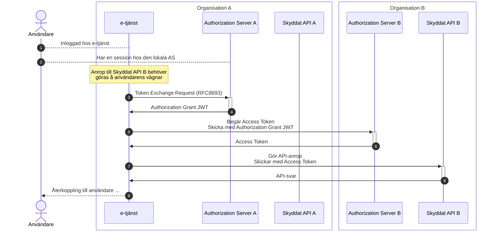
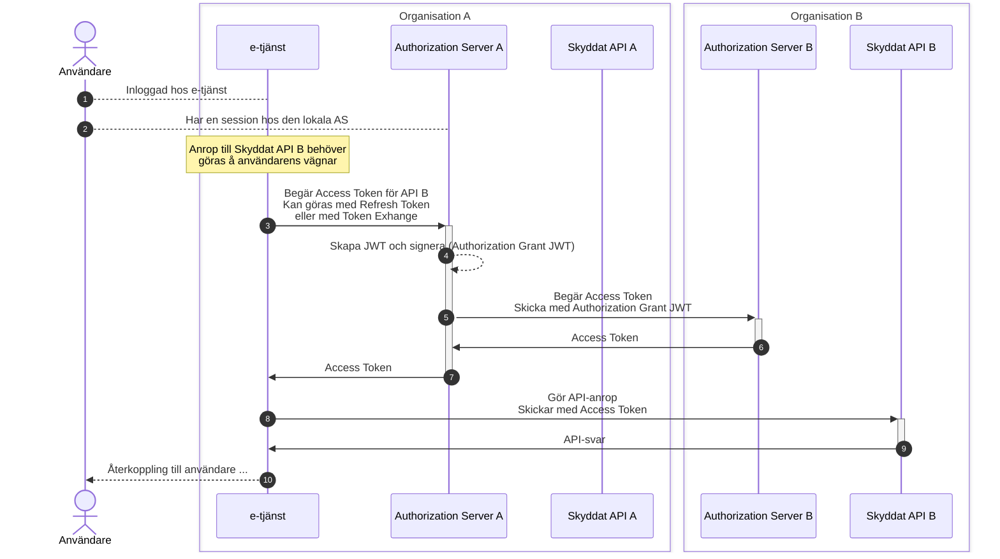

# API-anrop över organisationsgränser

## Innehållsförteckning

1. [**Introduktion**](#introduktion)

    1.1. [Problembeskrivning](#problembeskrivning)

2. [**Mönster för anrop över organisationsgränser**](#monster-for-anrop-over-organisationsgranser)

    2.1. [Applikationen samverkar med flera auktorisationstjänster](#applikationen-samverkar-med-flera-auktorisationstjanster)
    
    2.2. [Applikationen pratar endast med lokal auktorisationstjänst](#applikationen-pratar-endast-med-lokal-auktorisationstjanst)
    
    2.3. [Kedjade anrop](#kedjade-anrop)

    2.4. [Säkerhetsaspekter](#sakerhetsaspekter)

3. [**Autentisering av användare och förmedling av autentiseringsinformation**](#autentisering-av-anvandare-och-formedling-av-autentiseringsinformation)

4. [**Slutsatser**](#slutsatser)

5. [**Referenser**](#referenser)

---

## 1. Introduktion

Applikationer och e-tjänster behöver ofta tillgång till API:er (resurser) som befinner sig i andra "tillitsdomäner", eller organisationer, och där respektive domän eller organisation har sina egna auktorisationstjänster, och i många fall också sina egna sätt att autentisera användare. Detta innebär att en applikation inom organisation A som vill anropa ett API som tillhör organisation B måste förhålla sig till regler och krav för åtkomst som definieras av organisation B.

Ett API-anrop kan leda till att flera anrop passerar genom flera resurser i flera olika organisationer/domäner innan den slutförs. Alla skyddade resurser (API:er) som är involverade i en sådan begäran vill veta:

- Å vilken användares vägnar initierades den ursprungliga begäran?

  - På vilket sätt har denne användare styrkt sin identitet, och eventuellt också vilken legitimeringstjänst som har utfört användarautentiseringen?

- Vilken auktorisation har beviljats, d.v.s., vilka rättigheter har anropande part på den givna resursen?

- Och eventuellt också: Vilka andra parter, utöver anropande part, är involverade i anropet?

För varje anrop i en anropskedja presenteras ett OAuth2 Access Token (åtkomstintyg) som respektive API (resurs) validerar innan åtkomst medges. 

Detta dokument diskuterar hur en aktör inom organisation A anropar ett API (resurs) inom organisation B. Vi illustrerar både "direkta anrop" (1) och "indirekta", eller kedjade, anrop (2).

Dokumentet diskuterar också kopplingen till användarautentisering. Om organisation A och organisation B använder samma typ av användarautentisering. Blir det en skillnad mot om de har sina egna sätt att legitimera användare?

**Notera:** Detta dokument hanterar inte fallen där en applikation från domän A, registreras hos domän B, autentiserar sina användare i enlighet med B, och använder B:s auktorisation. Dessa fall blir helt analoga med "vanliga" intra-domän användningsfall.

### 1.1. Problembeskrivning

> TODO: registrering över domängränser, olika krav kring autentisering, olika sätt att beskriva rättigheter ...

## 2. Mönster för anrop över organisationsgränser

Detta kapitel diskuterar olika mönster för hur ett anrop kan göras över organisationsgränser, och där förutsättningarna och kraven som beskrivs i ovanstående kapitel upprätthålls.

Initialt diskuterar vi mönster där vi abstraherar bort hur användaren har autentiserat sig, och vilken påverkan denna process får på förutsättningarna. Se kapitel [3](#autentisering-av-anvandare-och-formedling-av-autentiseringsinformation) nedan för diskussioner om detta.

För respektive mönster antar vi att användaren har autentiserat sig och att denna är inloggad hos e-tjänsten i organisation A samt att användaren är känd (läs, autentiserad) för auktorisationstjänsten i samma organisation. Detta för att sekvensdiagrammen ska vara så enkla och lättbegripliga som möjligt. Se dokumentet [Mönster för autentisering och auktorisation](authn-authz-patterns.md) för diskussioner rörande hur användaren loggar in till e-tjänsten och kommunicerar med auktorisationstjänsten. 

Vidare antar vi följande:

- Klienten (e-tjänsten) i organisation A kan inte nyttja auktorisationstjänsten i organisation B för "authorization requests", d.v.s., den kan inte styra användare för autentisering och delegering till auktorisationstjänst B. Detta kan t.ex. bero på att de olika organisationerna har olika typer av användarautentisering (t.ex. lokala IdP:er). Vi diskuterar detta vidare i kapitel [3](#autentisering-av-anvandare-och-formedling-av-autentiseringsinformation), [Autentisering av användare och förmedling av autentiseringsinformation](#autentisering-av-anvandare-och-formedling-av-autentiseringsinformation), nedan.

- Det skyddade API:et (resursen) i organisation B godtar endast åtkomstintyg (access tokens) utställda av aktorisationstjänst B. Att knyta till en, och endast en, auktorisationstjänst är det absolut vanligaste tillämpningen av OAuth för skyddade resurser. 

- Det finns en tillit till auktorisationstjänst A konfigurerad i auktorisationstjänst B. Med andra ord, det finns definierade regler och överenskommelser mellan organisation A och B via respektive auktorisationstjänst.

### 2.1. Applikationen samverkar med flera auktorisationstjänster

IETF draften "OAuth Identity and Authorization Chaining Across Domains", \[[OAuth.Chaining](#oauth-chaining)\], berör de frågor som detta dokument hanterar, och i stycke [2.1](https://www.ietf.org/archive/id/draft-ietf-oauth-identity-chaining-03.html#name-overview) av draften presenteras ett sekvensdiagram för en föreslagen lösning. Nedanstående sekvensdiagram illustrerar detta förslag i dokumentets kontext.

1. Användaren antas vara inloggad hos e-tjänsten. Hur detta har gått till berör vi inte i detta exempel. Se [Mönster för autentisering och auktorisation](authn-authz-patterns.md) samt kapitel [3](#autentisering-av-anvandare-och-formedling-av-autentiseringsinformation), [Autentisering av användare och förmedling av autentiseringsinformation](#autentisering-av-anvandare-och-formedling-av-autentiseringsinformation), för diskussioner om autentisering.

2. Vi antar också att den auktorisationstjänsten för organisation A har kännedom av användaren. Antingen genom att användaren tidigare autentiserats där, eller att e-tjänsten har växlat in ett identitetsintyg rörande användarens legitimering. Se [Mönster för autentisering och auktorisation](authn-authz-patterns.md).

3. Användarens aktivitet hos e-tjänsten leder till att applikationen (e-tjänsten) behöver göra ett API-anrop till det skyddade API:et i organisation B. ...

> TODO: Stor nackdel. E-tjänsten måste vara registrerad/känd hos AS B. Om Org A har många olika tjänster som behöver anropa API B växer problemet. Inte nog med att konfigurationen hos A blir komplex, administrationen hos B blir än värre.

> TODO: Administrationen rörande vilka tjänster hos olika organisationer som ska få kommunicera med AS B kommer snabbt att bli ohanterlig. Nycklar krävs för i princip alla komponenter.

> TODO: Ge exempel på hur JWT kan se ut ...

### 2.2. Applikationen pratar endast med lokal auktorisationstjänst

Fördelar: Vi låter organisationernas auktorisationstjänster hantera tillit över organisationsgränserna, och klienter och API:er kan vara relativt "obrydda".

### 2.3. Kedjade anrop

> TODO: Beskriv hur vi hanterar ett anrop som skickas vidare.

### 2.4. Säkerhetsaspekter

Begreppet "Sender constrained tokens", eller "token binding", innebär att mekanismer som förhindrar stöld och återuppspelning av åtkomstintyg (Access Tokens) och "Refresh Tokens" används. "OAuth 2.0 Mutual-TLS Client Authentication and Certificate-Bound Access Tokens", \[[RFC8705](#rfc8705)\], och "OAuth 2.0 Demonstrating Proof of Possession (DPoP)", \[[RFC9449](#rfc9449)\], är de två mekanismerna som fått störst acceptans.

Utkastet (draften) för den kommande standarden för [OAuth 2.1](#oauth21) säger i stycke 1.4.3, "Sender-Constrained Access Tokens" följande:

> Authorization and resource servers SHOULD use mechanisms for sender-constraining access tokens, such as OAuth Demonstration of Proof of Possession (DPoP) [RFC9449] or Mutual TLS for OAuth 2.0 [RFC8705]. 

Framöver bör vi därför analysera våra olika modeller som diskuteras ovan utifrån att anrop till det skyddade API:et måste ha "sender constrained access tokens".

Redan nu kan vi se svårigheter med att använda DPoP för mönstret [Applikationen pratar endast med lokal auktorisationstjänst](#applikationen-pratar-endast-med-lokal-auktorisationstjanst), då auktorisationstjänsten i organisation B skapar ett åtkomstintyg utan att vara i direkt kontakt med klientapplikationen. Det finns dock väger runt detta, och undertecknad har tagit upp frågan med arbetsgruppen för \[[OAuth.Chaining](#oauth-chaining)\], se https://github.com/oauth-wg/oauth-identity-chaining/issues/79.

## 3. Autentisering av användare och förmedling av autentiseringsinformation

Subject-name

Tillitsnivåer

> TODO: Visa mönster där AS B kan motta ID-intyg från applikation A.

## 4. Slutsatser

## 5. Referenser

**\[RFC7523\]**
> [Jones, M., Campbell, B., and C. Mortimore, "JSON Web Token (JWT) Profile for OAuth 2.0 Client Authentication and Authorization Grants", RFC 7523, May 2015](https://www.rfc-editor.org/rfc/rfc7523).

**\[RFC8705\]**
> [Campbell, B., Bradley, J., Sakimura, N., Lodderstedt, T., "OAuth 2.0 Mutual-TLS Client Authentication and Certificate-Bound Access Tokens", RFC 8705, February 2020](https://www.rfc-editor.org/rfc/rfc8705).

**\[RFC8707\]**
> [Campbell, B., Bradley, J., and H. Tschofenig, "Resource Indicators for OAuth 2.0", RFC 8707, February 2020](https://www.rfc-editor.org/rfc/rfc8707).

**\[RFC8693\]**
> [Jones, M., Nadalin, A., Campbell, B., Ed., Bradley, J., and C. Mortimore, "OAuth 2.0 Token Exchange", RFC 8693, January 2020](https://www.rfc-editor.org/rfc/rfc8693).

**\[RFC9449\]**
> [Fett, D., Campbell, B., Bradley, J., Lodderstedt, T., Jones, M., Waite, D., "OAuth 2.0 Demonstrating Proof of Possession (DPoP)", RFC 9449, September 2023](https://www.rfc-editor.org/rfc/rfc9449).

**\[OAuth2.1\]**
> [Hardt, D., Parecki, A., Lodderstedt, T., "The OAuth 2.1 Authorization Framework", November 2024](https://www.ietf.org/archive/id/draft-ietf-oauth-v2-1-12.html).

**\[OAuth.Chaining\]**
> [Schwenkschuster, A., Kasselmann, P., Burgin, K., Jenkins, M., Campbell, B., "OAuth Identity and Authorization Chaining Across Domains", December 2024](https://www.ietf.org/archive/id/draft-ietf-oauth-identity-chaining-03.html)