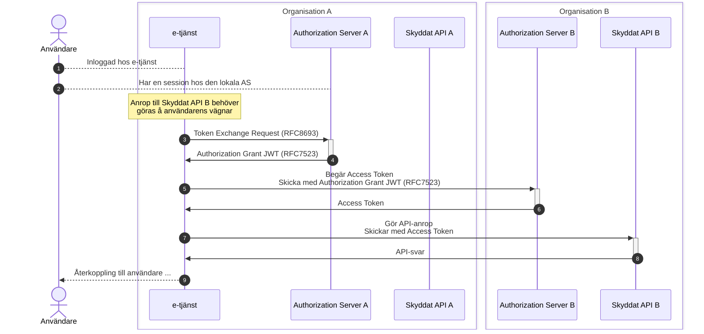
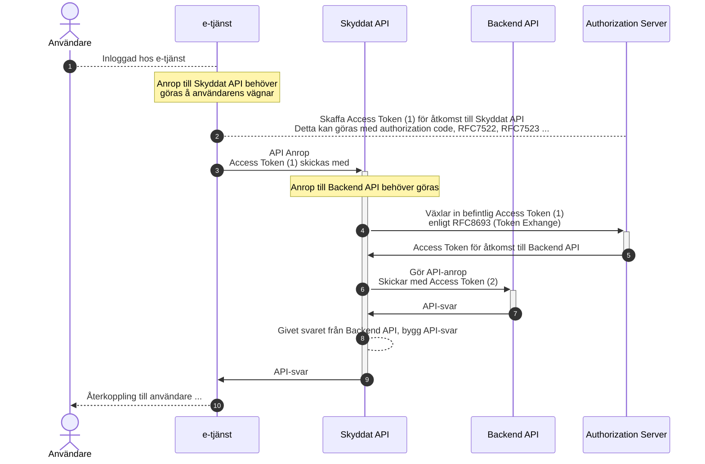

# API-anrop över organisationsgränser

## Innehållsförteckning

1. [**Introduktion**](#introduktion)

    1.1. [Problembeskrivning](#problembeskrivning)

2. [**Mönster för anrop över organisationsgränser**](#monster-for-anrop-over-organisationsgranser)

    2.1. [Applikationen samverkar med flera auktorisationstjänster](#applikationen-samverkar-med-flera-auktorisationstjanster)
    
    2.2. [Applikationen pratar endast med lokal auktorisationstjänst](#applikationen-pratar-endast-med-lokal-auktorisationstjanst)
    
    2.3. [Kedjade anrop](#kedjade-anrop)

    2.4. [Säkerhetsaspekter](#sakerhetsaspekter)

3. [**Autentisering av användare och förmedling av autentiseringsinformation**](#autentisering-av-anvandare-och-formedling-av-autentiseringsinformation)

    3.1. [Krav på autentisering](#krav-pa-autentisering)

    3.2. [Tillit och förmedling av autentiseringsinformation](#tillit-och-formedling-av-autentiseringsinformation)
    
    3.3. [Slutsatser och råd](#slutsatser-och-rad)

4. [**Referenser**](#referenser)

---

## 1. Introduktion

Applikationer och e-tjänster behöver ofta tillgång till API:er (resurser) som befinner sig i andra "tillitsdomäner", eller organisationer, och där respektive domän eller organisation har sina egna auktorisationstjänster, och i många fall också sina egna sätt att autentisera användare. Detta innebär att en applikation inom organisation A som vill anropa ett API som tillhör organisation B måste förhålla sig till regler och krav för åtkomst som definieras av organisation B.

Ett API-anrop kan leda till att flera anrop passerar genom flera resurser i flera olika organisationer/domäner innan den slutförs. Skyddade resurser (API:er) som är involverade i en sådan begäran vill i allmänhet veta:

- Å vilken användares vägnar initierades den ursprungliga begäran?

  - På vilket sätt har denne användare styrkt sin identitet, och eventuellt också vilken legitimeringstjänst som har utfört användarautentiseringen?

- Vilken auktorisation har beviljats, d.v.s., vilka rättigheter har anropande part på den givna resursen?

- Vilken tjänst (och organisation) utför anropet? M.a.o., vilken är den anropande klienten?

- Och eventuellt också: Vilka andra parter, utöver anropande part, är involverade i anropet?

För varje anrop i en anropskedja presenteras ett OAuth2 Access Token (åtkomstintyg) som respektive API (resurs) validerar innan åtkomst medges. 

Detta dokument diskuterar hur en aktör inom organisation A anropar ett API (resurs) inom organisation B. Vi illustrerar både "direkta anrop" (1) och "indirekta", eller kedjade, anrop (2).

--

Dokumentet diskuterar också kopplingen till användarautentisering. Om organisation A och organisation B använder samma typ av användarautentisering. Blir det en skillnad mot om de har sina egna sätt att legitimera användare?

**Notera:** Detta dokument hanterar inte fallen där en applikation från domän A, registreras hos domän B, autentiserar sina användare i enlighet med B, och använder B:s auktorisation. Dessa fall blir helt analoga med "vanliga" intra-domän användningsfall.

### 1.1. Problembeskrivning

Så, vilka utmaningar försöker detta dokument tackla?

Vi vill definiera mönster för anrop över organisationsgränser som kräver så få anpassningar som möjligt för både anropande e-tjänster (klienter/applikationer) och API:er (resurser). Dessa tekniska komponenter konstrueras ofta med hjälp av kommersiella, eller Open Source-, programvaror, och att minimera kostnadsdrivande behov på anpassningar och utökningar bör vara ett viktigt fokus.

Vidare så vill vi komma fram till mönster där överbryggningar mellan organisationers olikheter gällande krav och policies hanteras på så få platser som möjligt. Återigen, de enskilda applikationerna och API:erna bör till största mån hållas ovetande om dessa skillnader.

En given organisation kan ställa upp specifika autentiseringskrav rörande användare (och medarbetare) som delegerar åtkomst till e-tjänster att företräda dem. Detta dokument ska därför diskutera utmaningen att förmedla autentiseringsinformation över organisationsgränserna, och fokusera på hur vi hanterar detta när två organisationer har olika sätt att autentisera användare.

Kommunikation mellan parter kräver i allmänhet registrering av tjänster där identiteter och säkerhetsmaterial (publika nycklar) utbyts. Detta innebär administrativa åtgärder samt kontinuerlig förvaltning som kan bli både komplex och kostsam. Vi bör därför söka efter mönster där antalet komponenter som behöver registreras över organisationstjänster hålls till ett minimum.

## 2. Mönster för anrop över organisationsgränser

Detta kapitel diskuterar olika mönster för hur ett anrop kan göras över organisationsgränser, och där förutsättningarna och kraven som beskrivs i ovanstående kapitel upprätthålls.

Initialt diskuterar vi mönster där vi abstraherar bort hur användaren har autentiserat sig, och vilken påverkan denna process får på förutsättningarna. Se kapitel [3](#autentisering-av-anvandare-och-formedling-av-autentiseringsinformation) nedan för diskussioner om detta.

För respektive mönster antar vi att användaren har autentiserat sig och att denna är inloggad hos e-tjänsten i organisation A samt att användaren är känd (läs, autentiserad) för auktorisationstjänsten i samma organisation. Detta för att sekvensdiagrammen ska vara så enkla och lättbegripliga som möjligt. Se dokumentet [Mönster för autentisering och auktorisation](authn-authz-patterns.md) för diskussioner rörande hur användaren loggar in till e-tjänsten och kommunicerar med auktorisationstjänsten. 

Vidare antar vi följande:

- Klienten (e-tjänsten) i organisation A kan inte nyttja auktorisationstjänsten i organisation B för "authorization requests", d.v.s., den kan inte styra användare för autentisering och delegering till auktorisationstjänst B. Detta kan t.ex. bero på att de olika organisationerna har olika typer av användarautentisering (t.ex. lokala IdP:er). Vi diskuterar detta vidare i kapitel [3](#autentisering-av-anvandare-och-formedling-av-autentiseringsinformation), [Autentisering av användare och förmedling av autentiseringsinformation](#autentisering-av-anvandare-och-formedling-av-autentiseringsinformation), nedan.

- Det skyddade API:et (resursen) i organisation B godtar endast åtkomstintyg (access tokens) utställda av aktorisationstjänst B. Att knyta till en, och endast en, auktorisationstjänst är den absolut vanligaste tillämpningen av OAuth för skyddade resurser. 

- Det finns en tillit till auktorisationstjänst A konfigurerad i auktorisationstjänst B. Med andra ord, det finns definierade regler och överenskommelser mellan organisation A och B via respektive auktorisationstjänst.

### 2.1. Applikationen samverkar med flera auktorisationstjänster

IETF draften "OAuth Identity and Authorization Chaining Across Domains", \[[OAuth.Chaining](#oauth-chaining)\], berör de frågor som detta dokument hanterar, och i stycke [2.1](https://www.ietf.org/archive/id/draft-ietf-oauth-identity-chaining-04.html#name-overview) av draften presenteras ett sekvensdiagram för en föreslagen lösning. Nedanstående sekvensdiagram illustrerar detta förslag i dokumentets kontext.

1. Användaren antas vara inloggad hos e-tjänsten. Hur detta har gått till berör vi inte i detta exempel. Se [Mönster för autentisering och auktorisation](authn-authz-patterns.md) samt kapitel [3](#autentisering-av-anvandare-och-formedling-av-autentiseringsinformation), [Autentisering av användare och förmedling av autentiseringsinformation](#autentisering-av-anvandare-och-formedling-av-autentiseringsinformation), för diskussioner om autentisering.

2. Vi antar också att den auktorisationstjänsten för organisation A har kännedom av användaren. Antingen genom att användaren tidigare autentiserats där, eller att e-tjänsten har växlat in ett identitetsintyg rörande användarens legitimering. Se [Mönster för autentisering och auktorisation](authn-authz-patterns.md).

3. Användarens aktivitet hos e-tjänsten leder till att applikationen (e-tjänsten) behöver göra ett API-anrop till det skyddade API:et i organisation B. I detta mönster behöver e-tjänsten då begära ett åtkomstintyg från auktorisationstjänsten i organisation B. Men eftersom auktorisationstjänsten i organisation B inte har en relation med användaren, och e-tjänsten inte kan/vill styra användaren dit, behöver vi utfärda ett bevis på att användaren redan autentiserats av organisation A. Detta görs genom att e-tjänsten "växlar in" sitt befintliga "token" hos auktorisationstjänst A. Detta anrop, enligt \[[RFC8693](#rfc8693)\], talar om för auktorisationstjänsten att ett anrop till organisation B ska göras (detaljer för detta måste profileras).  I detta läge kan auktorisationstjänsten slå upp ytterligare attribut, eller claims, rörande användaren som den vet krävs av organisation B.

4. Auktorisationstjänsten i organisation A ställer ut en signerad JWT enligt \[[RFC7523](#rfc7523)\]. Denna JWT innehåller information om användarens identitet samt hur användaren autentiserats (bl.a. tillitsnivå). Exakt vilken identitetsinformation som förmedlas styrs av policyn mellan organisation A och B.

5. Givet den JWT e-tjänsten fick från auktorisationstjänst A anropar nu e-tjänsten Token-endpoint hos auktorisationstjänsten i organisation B. I anropet bifogas JWT:n samt de scopes som krävs för anrop av API:et i organisation.

6. Om anropet accepteras av auktorisationstjänst B, och användaren kan auktoriseras för de begärda rättigheterna, ställs ett åtkomstintyg (access token) ut.

7. Givet detta åtkomstintyg kan nu e-tjänsten anropa API:et i organisation B. I anropet bifogas det mottagna åtkomstintyget.

8. API-tjänsten i organisation B validerar nu åtkomstintyget och betjänar anropet och returnerar ett svar.

9. Baserat på svaret från API:et återkopplas nu användaren.

Så, vad kan sägas kring detta mönster utifrån den [problembeskrivning](#problembeskrivning) som gäller för vårt dokument?

Några nackdelar framträder vilka bryter mot vår önskan att låta e-tjänster vara så enkla som möjligt avseende OAuth:

:heavy_minus_sign: I mönstret måste e-tjänsten i organisation A förhålla sig till två olika auktorisationstjänster, dels "sin egen" i organisation A, men också den auktorisationstjänst i organisation B som anropas för att få ett åtkomstintyg för API:et i organisation B. Givet hur många klientlösningar ser ut för OAuth så kan detta innebära komplexitet och dyra anpassningar i e-tjänsten. Det normala är att använda en auktorisationstjänst. Och om e-tjänsten har kopplingar till API:er i andra organisationer behövs ytterligare specialanpassningar.

:heavy_minus_sign: Vidare så måste e-tjänsten som ju kommunicerar direkt med auktorisationstjänsten i organisation B ha kännedom om rättighetsmodellen i organisation B då den begär scopes (rättigheter) för API B. Det bidrar ytterligare till komplexiteten i e-tjänsten.

:heavy_minus_sign: Token exchange, enligt \[[RFC8693](#rfc8693)\], används. \[[RFC8693](#rfc8693)\] är en relativt ny standard, och stöd för detta saknas i många kommersiella klientprogramvaror.

:heavy_minus_sign: Applikationen (e-tjänsten) i organisation A måste vara känd av, och registrerad i auktorisationstjänsten i organisation B. Se nedan.

En annan, relativt stor, nackdel rör auktorisationstjänsten i organisation B:

:heavy_minus_sign: Varje klient (e-tjänst) som anropar en auktorisationstjänst måste vara registerarad hos denne. Bland annat måste dess unika ID samt dess publika nyckel (eller certifikat) vara registrerat. I de kommande OAuth-profilerna för ENA kommer stark klientautentisering vara ett krav där `private_key_jwt` eller mutual TLS, \[[RFC8705](#rfc8705)\], krävs. I båda fallen krävs att en auktorisationstjänst kan knyta ett klient-ID till ett certifikat. Att auktorisationstjänsten i organisation B tvingas registrera alla de e-tjänster från olika organisationer som vill anropa API:er i organisation B kan innebära en mycket stor komplexitet (beroende på antalet tjänster).  Till viss del kan detta problem lösas med OpenID Federation, men även då krävs mekanismer för att avgöra vilka klienter som ska få göra anrop.

Vilka fördelar ser vi då med detta mönster?

:heavy_plus_sign: API:et i organisation B behöver bara förhålla sig till åtkomstintyg utställda av auktorisationstjänsten i sin egen organisation. Det medför att OAuth-standardprogramvara kan användas av tjänsten som implementerar API:et.

:heavy_plus_sign: I och med att klienten (e-tjänsten) kommunicerar med auktorisationstjänsten i organisation B så kan standard-DPoP enligt \[[RFC9449](#rfc9449)\] eller mutual TLS enligt [[RFC8705](#rfc8705)\] användas för "sender constrained tokens" om så skulle krävas av organisation B.

:heavy_plus_sign: Eftersom auktorisationstjänsten i organisation A är inblandad i flödet har den möjlighet att, genom integrationer till diverse datakällor, förse organisation B med ytterligare användarattribut som krävs för åtkomst i organisation B. Att tvinga e-tjänsten till dessa typer av uppslag skulle "skala" dåligt, och det är betydligt bättre att sådana integrationer görs centralt inom organisation A.

OK, vi identifierade alltså ett antal svagheter med den modell som föreslås i IETF draften "OAuth Identity and Authorization Chaining Across Domains", \[[OAuth.Chaining](#oauth-chaining)\]. Kan vi möjligen lösa dessa?

### 2.2. Applikationen pratar endast med lokal auktorisationstjänst

Som en del av vår problembeskrivning vill vi att klienter inte ska tvingas till komplexa OAuth-implementationer samt att vi begränsar behovet av registrering av klienter hos auktorisationstjänster i andra organisationer.

Detta leder oss till en variant av ovanstående mönster där auktorisationstjänsten i organisation A agerar klient mot auktorisationstjänsten i organisation B. 

1. Användaren antas vara inloggad hos e-tjänsten. Hur detta har gått till berör vi inte i detta exempel. Se [Mönster för autentisering och auktorisation](authn-authz-patterns.md) samt kapitel [3](#autentisering-av-anvandare-och-formedling-av-autentiseringsinformation), [Autentisering av användare och förmedling av autentiseringsinformation](#autentisering-av-anvandare-och-formedling-av-autentiseringsinformation), för diskussioner om autentisering.

2. Vi antar också att den auktorisationstjänsten för organisation A har kännedom av användaren. Antingen genom att användaren tidigare autentiserats där, eller att e-tjänsten har växlat in ett identitetsintyg rörande användarens legitimering. Se [Mönster för autentisering och auktorisation](authn-authz-patterns.md).

3. Användarens aktivitet hos e-tjänsten leder till att applikationen (e-tjänsten) behöver göra ett API-anrop till det skyddade API:et i organisation B. I detta mönster skickas en begäran till e-tjänstens "egen" auktorisationstjänst (till skillnad från mönstret ovan). Beroende på om e-tjänsten har ett aktivt åtkomstintyg (access token) och en Refresh token kan anropet antingen vara en intygsväxling enligt \[[RFC8693](#rfc8693)\], eller en "vanlig" token-begäran där Refresh token används.  E-tjänsten behöver i detta läge informera auktorisationstjänsten om att anropet gäller ett visst (externt) API genom att antingen specificera ett visst OAuth-scope1, eller genom att använda `resource` parametern2.

4. Auktorisationstjänsten i organisation A tar emot begäran och inser att den behöver agera OAuth2-klient å e-tjänstens vägnar. Den konstruerar därför en signerad JWT enligt \[[RFC7523](#rfc7523)\] (på samma sätt som i ovanstående mönster). Denna JWT innehåller information om användarens identitet samt hur användaren autentiserats (bl.a. tillitsnivå). Exakt vilken identitetsinformation som förmedlas styrs av policyn mellan organisation A och B. Denna JWT kan också innehålla ytterligare attribut, eller claims, rörande användaren som krävs av organisation B. Auktorisationstjänsten i organisation A kan inhämta dessa med integrationer mot attributkällor.

5. Istället för att returnera JWT:n som skapats tillbaka till e-tjänsten använder auktorisationstjänst A denna i ett token-anrop enligt \[[RFC7523](#rfc7523)\] (authorization grant JWT) som skickas till auktorisationstjänsten i organisation B. Auktorisationstjänst A autentiserar sig som sig själv, men ber om ett åtkomstintyg som ska användas av e-tjänsten i organisation A3.   *Det kan vara relevant att skicka med ursprungsklientens ID i JWT:n om auktorisationstjänster ställer ut åtkomstintyg innehållande `client_id` claim. För vårt mönster ska det inte ha betydelse annat än för loggning/spårbarhet i API:et.*

6. Auktorisationstjänst B ställer ut ett åtkomstintyg i form av en signerad JWT och returnerar detta.

7. Auktorisationstjänsten i organisation A som agerat klient mot auktorisationstjänst B viderebefordrar åtkomstintyget till e-tjänsten.   Notera att åtkomstintyget inte modifieras utan returneras "orört". JWT:n som utgör intyget är nämligen signerat av auktorisationstjänst B, och alla typer av modifieringar av intyget gör att signaturen inte längre är giltig.

8. Givet detta åtkomstintyg kan nu e-tjänsten anropa API:et i organisation B. I anropet bifogas det mottagna åtkomstintyget.

9. API-tjänsten i organisation B validerar nu åtkomstintyget och betjänar anropet och returnerar ett svar.

10. Baserat på svaret från API:et återkopplas nu användaren.

I förra stycket listade vi för- och nackdelar med mönstret. Låt oss göra detsamma för detta mönster. Eftersom vi påstod i inledningen av stycket av detta mönster skulle lösa de problem vi noterade för det föregående mönstret, så ser vi om vi kan vända minustecknen till plustecken:

:heavy_plus_sign: I detta mönster behöver e-tjänsten i organisation A endast förhålla sig till auktorisationstjänsten inom sin egen organisation/domän. Detta är en stor fördel då det resulterar i en betydligt mindre komplex OAuth-integration i e-tjänsten.

:heavy_plus_sign: Eftersom e-tjänsten (OAuth-klienten) skickar token-begäran till "egen" auktorisationstjänst behöver den inte ha kunskap om de scopes som krävs av API:et i organisation B. Den kan använda definierade scopes inom sin egen organisation, som sedan kan "mappas" om av auktorisationstjänsten i organisation A när den kommunicerar med auktorisationstjänsten i organisation B.

:heavy_plus_sign: Token exchange, enligt \[[RFC8693](#rfc8693)\], som har begränsad spridning bland kommersiella klientprogramvaror behöver inte användas, utan e-tjänsten kan förlita sig på metoder med större spridning.

:heavy_plus_sign: Applikationen (e-tjänsten) i organisation A behöver inte vara registrerad hos auktorisationstjänsten i organisation B. Endast auktorisationstjänst A, som ju agerar klient, behöver vara registrerad. Detta gör registreringsprocessen enklare då antalet registrerade komponenter begränsas till en per domän/organisation.

:heavy_plus_sign: På samma sätt som i föregående mönster behöver API:et i organisation B bara förhålla sig till åtkomstintyg utställda av auktorisationstjänsten i sin egen organisation. Det medför att OAuth-standardprogramvara kan användas av tjänsten som implementerar API:et.

:heavy_plus_sign: På samma sätt som i föregående mönster kan auktorisationstjänsten i organisation A, som är inblandad i flödet, ha möjlighet att, genom integrationer till diverse datakällor, förse organisation B med ytterligare användarattribut som krävs för åtkomst i organisation B.

Finns då några nackdelar med detta mönster?

:heavy_minus_sign: Auktorisationstjänsten i organisation A blir mer komplex då den måste kunna agera OAuth2-klient. Detta är dock ingen ovanlighet då auktorisationstjänster kan behöva agera klient för andra ändamål, t.ex., begära åtkomst till attributkällor.

:heavy_minus_sign: Om "sender contrained tokens" krävs av organisation B krävs utökningar till \[[RFC7523](#rfc7523)\] för att auktorisationstjänst A ska kunna förmedla vilket certifikat som ska knyta till åtkomstintyget, se [2.4](#sakerhetsaspekter), [Säkerhetsaspekter](#sakerhetsaspekter), nedan.

> **\[1\]**: Beroende på vilken scope-modell som används kan ett scope tydligt indikera vilken tjänst det gäller för. Microsoft använder scopes där ett prefix indikerar tjänst och ett suffix indikerar vilken typ av rättighet som avses, t.ex. `https://id.calendar.com/read`, där prefixet `https://id.calendar.com` är det unika ID:t för en viss tjänst, och `read` är rättigheten på tjänsten. Mer allmängiltiga scopes såsom `read` och `write` är inte "självbärande" utan måste kompletteras med en ytterligare parameter. 

> **\[2\]**: \[[RFC8707](#rfc8707)\] introducerar OAuth2-parametern `resource` som är menad att ange en viss tjänst, eller del av tjänst, genom att dess URI anges. Denna parameter tillsammans med ett allmängiltigt scope såsom `read` eller `write` kan då användas för att begära ett visst scope på en viss resurs. Viktigt att känna till här är att \[[RFC8707](#rfc8707)\] inte ännu är implementerat av alla kommersiella OAuth2-produkter.

### 2.3. Kedjade anrop

Med konceptet "kedjade anrop", eller "indirekta anrop", avser vi det flödet som visas som (2) i bilden i kapitel [1](#introduktion), [Introduktion](#introduktion). Ett anrop görs av en tjänst till ett API (resurs), som behöver göra ytterligare ett anrop till en bakomliggande tjänst för att kunna svara på API-förfrågan.

Historiskt sett så har, om OAuth använts, de bakomliggande anropen inte blandat in användaren utan de har gjorts som "tjänst-till-tjänst" anrop utan att delegerade rättigheter för användaren representeras. I och med att en standardisering av Token exchange, \[[RFC8693](#rfc8693)\], gjorts kan användarens delegering representeras även längre ned i en anropskedja.

I ett scenario där anrop över organisationsgränser inte förekommer ser ett sådant flöde ut enligt nedan.

I vårt exempel gäller följande förutsättningar:

* E-tjänsten till vilken användaren loggar in använder sig av ett Skyddat API för att hämta användaruppgifter.

* Detta API kräver att användaren delegerar rättigheter till e-tjänsten för att få hämta ut dess data. Med andra ord så krävs ett åtkomstintyg (access token) vars "subject"-fält motsvarar identiteten för den användare vars data begärs.

* Resursen som implementerar det skyddade API:et använder sig i sin tur av ett antal olika "Backend API:er" för att hämta data. E-tjänsten har ingen kunskap om dessa bakomliggande tjänster.

* De bakomliggande tjänsterna kräver också giltiga åtkomstintyg (access token) för att bevilja åtkomst. Också dessa kräver att användarens identitet gäller för intyget.

1. Vi antar att användaren är inloggad hos e-tjänsten. Hur detta har utförts är inte relevant för exemplet i övrigt.

2. Då ett anrop från e-tjänsten till det Skyddade API:et behöver göras skaffar e-tjänsten ett åtkomstintyg (access token). Beroende på situationen kan detta göras på olika sätt, se [Mönster för autentisering och auktorisation](authn-authz-patterns.md).

3. Det åtkomstintyg som ställs ut anger "Skyddat API" som mottagare (audience) och anger användarens identitet (subject).

4. Detta åtkomstintyg skickas nu med i anropet från e-tjänsten till det Skyddade API:et.

5. Då API:et processar anropet visar det sig att API-tjänsten behöver anropa ett bakomliggande API för att kunna svara på anropet. Det åtkomstintyg som togs emot kan inte skickas vidare eftersom det inte är utställt för mottagaren. Det skyddade API:et använder därför "Token exchange", enligt \[[RFC8693](#rfc8693)\], för att växla in det mottagna åtkomstintyget och få ett nytt. Vilka typer av växlingar som får göras är en policy hos auktorisationstjänsten.

6. Ett nytt åtkomstintyg (access token) ställs ut där "Backend API" är mottagare och dess scopes-modell används.

7. Givet detta åtkomstintyg kan ny det Skyddade API:et utföra ett API-anrop till "Backend API".

8. API-svar från Backend API.

9. Givet detta API-svar kan det skyddade API:et sammanställa sitt API-svar...

10. och returnera detta till e-tjänsten.

11. Slutligen kan användaren återkopplas.

Jaha, det verkar som att \[[RFC8693](#rfc8693)\] trots allt behövs? Ja, för just detta användningsfall så vill man ha möjlighet att givet ett åtkomstintyg skaffa ett nytt, för en ny mottagare och ev. för ett nytt syfte. Man skulle också kunna profilera \[[RFC7523](#rfc7523)\], men faktum kvarstår att det behövs anpassningar samt policies hos auktorisationstjänsten (vilka växlingar får göras?).

Alternativet till intygsväxling här är att använda "breda" åtkomstintyg, d.v.s., intyg som ställs ut för multipla mottagare, och även för multipla syften. I vårt exempel skulle då "Skyddat API" helt enkelt vidarebefordra det intyg det tog emot i anropet när det anropar "Backend API". Problemen med denna lösning är många:

- Breda intyg öppnar upp fler säkerhetsrisker, t.ex. ett stulet intyg kan användas på många tjänster.

- Alla konsumenter av dessa intyg måste ha samma åtkomstregler m.a.p. scopes samt vilken information som ska inkluderas i intygen.

- Spårbarhet i systemet "går sönder". Det är inte längre möjligt att inkludera `client_id` i intyget som ger information om anropande klient.

- Och på samma tema. Eftersom det inte går att knyta ett åtkomstintyg till en given klient omöjliggörs "sender constrained tokens" (t.ex. DPop).

- Fungerar inte över organisationsgränser då utställande auktorisationstjänst inte accepteras av målsystemet.

Ja, anrop över organisationsgränser pratar vi ju om. Hur skulle ovanstående exempel se ut i dessa fall? Orkar ni med fler sekvensdiagram?

Inte? Bra, för det behövs egentligen inte. För om vi tänker oss att "Backend API" ligger i en annan organisation kan vi helt enkelt titta på de tidigare mönstren och låta "Skyddat API" motsvara e-tjänsten i dessa. Det blir samma resultat, med samma slutsatser. Specifikt för mönstret [Applikationen pratar endast med lokal auktorisationstjänst](#applikationen-pratar-endast-med-lokal-auktorisationstjanst) så skulle det innebära att punkt 5 i vårt exempel leder till att auktorisationstjänsten i organisation A agerar klient mot AS B. Och sen är allt lika. Ytterligare ett argument för detta mönster.
 

### 2.4. Säkerhetsaspekter

Begreppet "Sender constrained tokens", eller "token binding", innebär att mekanismer som förhindrar stöld och återuppspelning av åtkomstintyg (Access Tokens) och "Refresh Tokens" används. "OAuth 2.0 Mutual-TLS Client Authentication and Certificate-Bound Access Tokens", \[[RFC8705](#rfc8705)\], och "OAuth 2.0 Demonstrating Proof of Possession (DPoP)", \[[RFC9449](#rfc9449)\], är de två mekanismerna som fått störst acceptans.

Utkastet (draften) för den kommande standarden för [OAuth 2.1](#oauth21) säger i stycke 1.4.3, "Sender-Constrained Access Tokens" följande:

> Authorization and resource servers SHOULD use mechanisms for sender-constraining access tokens, such as OAuth Demonstration of Proof of Possession (DPoP) [RFC9449] or Mutual TLS for OAuth 2.0 [RFC8705]. 

Framöver bör vi därför analysera våra olika modeller som diskuteras ovan utifrån att anrop till det skyddade API:et måste ha "sender constrained access tokens".

Redan nu kan vi se svårigheter med att använda DPoP för mönstret [Applikationen pratar endast med lokal auktorisationstjänst](#applikationen-pratar-endast-med-lokal-auktorisationstjanst), då auktorisationstjänsten i organisation B skapar ett åtkomstintyg utan att vara i direkt kontakt med klientapplikationen. Det finns dock väger runt detta, och undertecknad har tagit upp frågan med arbetsgruppen för \[[OAuth.Chaining](#oauth-chaining)\], se https://github.com/oauth-wg/oauth-identity-chaining/issues/79.

Detta har lett till en utökning av \[[OAuth.Chaining](#oauth-chaining)\], där appendix [B.3.](https://www.ietf.org/archive/id/draft-ietf-oauth-identity-chaining-04.html#name-delegated-key-binding), [Delegated Key Binding](https://www.ietf.org/archive/id/draft-ietf-oauth-identity-chaining-04.html#name-delegated-key-binding), föreslår en utökning/profil av \[[RFC7523](#rfc7523)\] där auktorisationstjänst A kan meddela auktorisationstjänst B om nyckelmaterial för det kommande API-anropet.

> Om ingen officiell RFC föreslår en lösning till detta problem, är det möjligt att vi definierar en sådan i ENA-profilerna. Detta givet att DPoP skall användas.

## 3. Autentisering av användare och förmedling av autentiseringsinformation

Fram till och med nu har vi bara antagit att en användare är autentiserad. Dokumentet [Mönster för autentisering och auktorisation](authn-authz-patterns.md) diskuterar användarautentisering och dess koppling till auktorisation, men vad innebär det när anrop görs över organisationsgränser? Vilka krav har vi, och vilka utmaningar finns?

### 3.1. Krav på autentisering

Om vi utgår från mönstren i [kapitel 2](#monster-for-anrop-over-organisationsgranser), [Mönster för anrop över organisationsgränser](#monster-for-anrop-over-organisationsgranser), så är det mottagande organisation (B) som ställer krav för hur användare vara autentiserade. Typiska krav kan vara:

- Autentiseringen ska vara utförd enligt en viss tillitsnivå.

- Autentiseringstidpunkten får inte vara för långt bak i tiden.

- Vissa typer av identitetsattribut måste finnas tillgängliga.

- Och, för vissa sektorer, behörighetsstyrande attribut som har erhållits i samband med användarens autentisering måste finnas tillgängliga.

- För spårbarhet: transaktionsidentifierare som entydigt identifierar autentiseringshändelsen, samt information hos vilken IdP/OP autentiseringen genomfördes. 

Alla, eller valda delar, av denna information måste göras tillgänglig till auktorisationstjänsten i organisation B då denne ska ställa ut ett åtkomstintyg för en klient i organisation A. Däremot behöver nödvändigtvis inte informationen finnas i det resulterande åtkomstintyget. Åtkomst beviljas ju av auktorisationstjänsten, och endast de attribut (claims) som har någon mening för det API som senare ska konsumera intyget behöver inkluderas.

### 3.2. Tillit och förmedling av autentiseringsinformation

I de rena OAuth2-användningsfallen då användaren styrs till en auktorisationstjänst och autentiseras hos denne är tillit till autentiseringen och förmedling av autentiseringsinformation en icke-fråga. Auktorisationstjänsten agerar ju förlitande part till autentiseringen, och kan användaren autentiseras enligt gällande policy är problemet löst.

Då anrop görs över domän-, eller organisationsgränser, där användaren autentiseras av organisation A, men åtkomst av resurs i organisation B begärs å användarens vägnar har vi däremot en fråga om tillit. 

Den part som begär ett åtkomstintyg och i detta förmedlar autentiseringsinformation rörande användaren blir då central. Auktorisationstjänsten i den mottagande organisationen (B) måste då lite på det som klienten i organisation A påstår.

Om organisation B inte har denna tillit kan en begäran om ett åtkomstintyg inte accepteras, och den enda lösningen i dessa fall är att kräva att användaren som förmedlas via organisation A tvingas till autentisering styrd av organisation B.

Återigen, genom att begränsa antalet komponenter som pratar med varandra över organisationsgränserna kan tillitskedjor enklare formaliseras. I våra mönster ovan finns en tillit mellan respektive organisations auktorisationstjänst, medan organisation B inte behöver ha formell tillit till e-tjänsten inom organisation A.

### 3.3. Slutsatser och råd

Så, vad behöver vi tänka på kring autentisering och anrop över organisationsgränser?

* Begränsa tillit rörande förmedling av autentiseringsinformation till centrala komponenter (t.ex., auktorisationstjänster) inom respektive organisation. Sådana komponenter kan granskas och certifieras. Bygger man däremot ett system där tillit krävs för enskilda applikationer hamnar man i en kostnadsdrivande arkitektur där många delar av system måste granskas och certifieras.

* Undvik transitiva tillitskedjor. Ponera att auktorisationstjänsten i organisation A accepterar att \[[RFC7522](#rfc7522)\] eller \[[RFC7523](#rfc7523)\] används av e-tjänsten, d.v.s., auktorisationstjänsten har ingen direkt kontakt med användaren utan "litar på" den JWT eller SAML-token som e-tjänsten förser den med. Om organisation A:s auktorisationstjänst senare ska kopplas samman med auktorisationstjänst i organisation B så innebär ju detta att organisation B implicit tvingas lite på e-tjänsten i organisation A.  Dessa avarter av tillit är väldigt lätt att råka ut för om tillit mellan organisationer inte definieras i något form av tekniskt styrande dokument.

* Sträva efter att begränsa krav rörande autentisering till väl definierade tillitsnivåer. Alla eventuella attribut som tillförs "vid sidan av" den rena autentiseringen måste också hanteras i det policydokument som definierar tilliten mellan organisationerna. 

## 4. Referenser

**\[RFC7522\]**
> [Jones, M., Campbell, B., and C. Mortimore, "Security Assertion Markup Language (SAML) 2.0 Profile for OAuth 2.0 Client Authentication and Authorization Grant", RFC 7522, May 2015](https://datatracker.ietf.org/doc/html/rfc7522).

**\[RFC7523\]**
> [Jones, M., Campbell, B., and C. Mortimore, "JSON Web Token (JWT) Profile for OAuth 2.0 Client Authentication and Authorization Grants", RFC 7523, May 2015](https://www.rfc-editor.org/rfc/rfc7523).

**\[RFC8705\]**
> [Campbell, B., Bradley, J., Sakimura, N., Lodderstedt, T., "OAuth 2.0 Mutual-TLS Client Authentication and Certificate-Bound Access Tokens", RFC 8705, February 2020](https://www.rfc-editor.org/rfc/rfc8705).

**\[RFC8707\]**
> [Campbell, B., Bradley, J., and H. Tschofenig, "Resource Indicators for OAuth 2.0", RFC 8707, February 2020](https://www.rfc-editor.org/rfc/rfc8707).

**\[RFC8693\]**
> [Jones, M., Nadalin, A., Campbell, B., Ed., Bradley, J., and C. Mortimore, "OAuth 2.0 Token Exchange", RFC 8693, January 2020](https://www.rfc-editor.org/rfc/rfc8693).

**\[RFC9449\]**
> [Fett, D., Campbell, B., Bradley, J., Lodderstedt, T., Jones, M., Waite, D., "OAuth 2.0 Demonstrating Proof of Possession (DPoP)", RFC 9449, September 2023](https://www.rfc-editor.org/rfc/rfc9449).

**\[OAuth2.1\]**
> [Hardt, D., Parecki, A., Lodderstedt, T., "The OAuth 2.1 Authorization Framework", November 2024](https://www.ietf.org/archive/id/draft-ietf-oauth-v2-1-12.html).

**\[OAuth.Chaining\]**
> [Schwenkschuster, A., Kasselmann, P., Burgin, K., Jenkins, M., Campbell, B., "OAuth Identity and Authorization Chaining Across Domains", February 2025](https://www.ietf.org/archive/id/draft-ietf-oauth-identity-chaining-04.html)