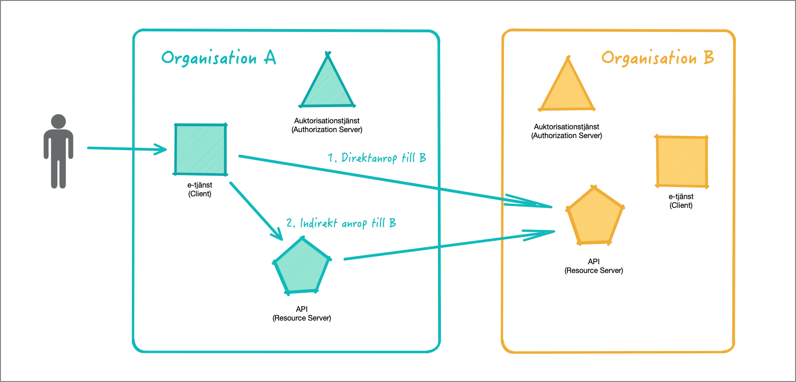
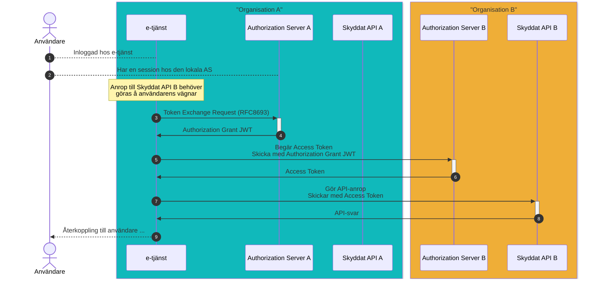
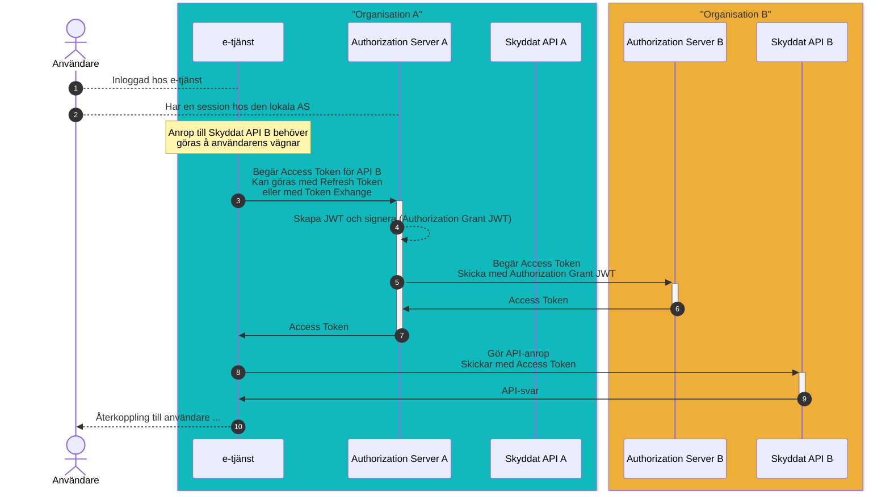

# API-anrop över organisationsgränser

## Innehållsförteckning

1. [**Introduktion**](#introduktion)

> TODO

## 1. Introduktion

> TODO

> Abstrahera bort hur användaren har autentiserat sig. Hänvisa till senare diskussion.

## 2. Mönster för anrop över organisationsgränser

### 2.1. Applikationen samverkar med flera auktorisationstjänster 

Enligt draften "OAuth Identity and Authorization Chaining Across Domains", \[[OAuth.Chaining](#oauth-chaining)\].

> TODO: Stor nackdel. E-tjänsten måste vara registrerad/känd hos AS B. Om Org A har många olika tjänster som behöver anropa API B växer problemet. Inte nog med att konfigurationen hos A blir komplex, administrationen hos B blir än värre.

> TODO: Administrationen rörande vilka tjänster hos olika organisationer som ska få kommunicera med AS B kommer snabbt att bli ohanterlig. Nycklar krävs för i princip alla komponenter.

> TODO: Ge exempel på hur JWT kan se ut ...

### 2.2. Applikationen pratar endast med lokal auktorisationstjänst

## 3. Kedjade anrop

> TODO: En resursserver agerar klient.

## 4. Användarautentisering och anrop över organisationsgränser

## Referenser

**\[OAuth.Chaining\]**
> [OAuth Identity and Authorization Chaining Across Domains, December 2024](https://www.ietf.org/archive/id/draft-ietf-oauth-identity-chaining-03.html)