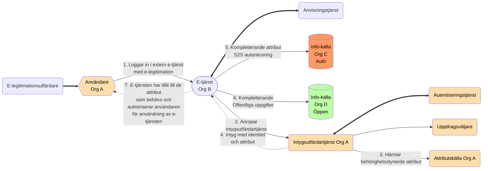

### Teknisk federationsarkitektur

## Tjänstekomponenter i federation

- Möjliga tjänstekomponenter i federationen (diskuteras):
  - E-legitimation
  - E-tjänst
  - Anvisningstjänst
  - Intygsutfärdartjänst/IdP
    - (med uppdragsväljare)
    - åtkomstintygsutfördartjänst
  - Identifieringstjänst (beroende till)
  - Autentiseringstjänst(er)
  - Attributtjänst
  - Regelverkstjänst
    - (med repository)
- Stödtjänster
    - Metadata
    - Revokering
    - Spårbarhet
    - Federations-federationsåtkomst
    - Personuppgifter
    - API-säkerhet
    - Provisioneringstjänst

## Beskrivning tjänstekomponenter i federation

### E-legitimation

E-legitimation är en elektronisk id-handling som du kan använda för att legitimera dig på ett säkert sätt på inom Ena-federationen. Den är granskad och godkänd för användning i en viss Tillitsnivå.

### E-tjänst

Elektroniska tjänster eller E-tjänster är tjänster som produceras och konsumeras i ett elektroniskt medium. E-tjänster i Ena-federationen är granskade och godkända på en viss Tillitsnivå. E-tjänsten ställer krav på konsumenter av tjänsten att uppfyla en viss Tilltisnivå för användning.

### Anvisningstjänst

I en behörighets- och identitetsfederation är det möjligt att erbjuda och konsumera en gemensam anvisningstjänst, som listar vilka Intygsutfärdartjänster som är möjliga för användaren att välja mellan. Syftet med en sådan anvisningstjänst är att låta användaren välja vilken organisation den tillhör och därmed anropa "rätt" Intygsutfärdartjänst.

### Intygsutfärdartjänst/IdP

Intygsutfärdartjänsten ansvarar för att autentisera användaren, sammanställer de uppgifter uppgifter om användaren som E-tjänsten behöver och leverera dessa uppgifter på ett säkert sätt i ett intyg. Intygsutfärdartjänsten använder flera andra tjäsnter för att genomföra detta; en autentiseringstjänst (eller alternativt en spärrtjänst/revokeringslista) och attributkällor. Uppgifterna hämtas från attributtjänster. Intyget används sedan av e-tjänsten för att styra vad användaren ska få se och göra.

### Identifieringstjänst 

Identifieringstjänst är en säkerhetslösning som används för att utfärda elektroniska identitetshandlingar till både personer och system. E-legitimationer används för att identifiera personer och  funktionscertifikat används för att identifiera system. 

### Autentiseringstjänst(er)

Autentiseringstjänsten, som är en stödkomponent som en IdP använder för att tekniskt hantera, läsa och verifiera användarens e-legitimation.

### Attributtjänst

När en användare försöker logga in i en E-tjänst behövs ibland uppgifter hämtas in från ett register för att kunna avgöra vilken behörighet personen har i just denna digitala tjänst. Denna behörighetshantering kallas också för auktorisation. I den digitala världen kan auktorisation ske med hjälp av behörighetsstyrande information som hämtas från en så kallad attributtjänst. 

### Regelverkstjänst

Inom OpenId Connect/OAUTH...

### Stödtjänster

#### Metadatatjänst

En SAML-federation tillhandahåller information om federationens deltagare genom SAML metadata. Som deltagare i en federation räknas såväl aktörer som levererar legitimerings- och attributtjänster i federationen som förlitande parter, d.v.s. aktörer som konsumerar dessa tjänster, t ex. e-tjänster.

Genom federationens metadata kan deltagare inhämta information om andra deltagares tjänster, inklusive de uppgifter som krävs för ett säkert informationsutbyte mellan deltagarna. Metadata måste hållas uppdaterat av respektive part och överensstämma med avtalade förhållanden.

Det viktigaste syftet med metadata är att tillhandahålla de nycklar/certifikat som krävs för säker kommunikation och informationsutväxling mellan tjänster. Utöver nycklar innehåller metadata även annan information som är viktig för samverkan mellan tjänster t ex. attribut som en E-tjänst behöver, adresser till funktioner som krävs, information om tillitsnivåer, tjänstekategorier, användargränssnittsinformation mm.

En identitetsfederation definieras av ett register i XML-format som är signerat med federationsoperatörens certifikat. Filen innehåller information om identitetsfederationens medlemmar inklusive deras certifikat. Eftersom filen med metadata är signerad räcker det med att jämföra ett certifikat med dess motsvarighet i metadata. En infrastruktur baserad på ett centralt federationsregister förutsätter att registret uppdateras kontinuerligt samt att federationsmedlemmarna alltid använder den senaste versionen av filen.

#### Revokeringstjänst

En revokeringstjänst tillhandahåller en revokeringslista som är ett sätt att avgöra om en e-legitimations certifikat är giltigt. Detta är en del av en mer robust metod att autentisera användare än att använda en autentiseringstjänst. 

#### Tjänster för Spårbarhet

#### Tjänster för Federations-federationsåtkomst

#### Tjänst för Personuppgifter

#### Tjänst för API-säkerhet

#### Provisioneringstjänst
