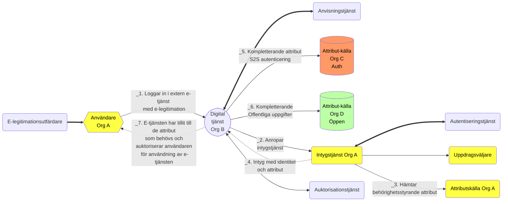

### Teknisk federationsarkitektur

## Tjänstekomponenter i federation

- Möjliga tjänstekomponenter i federationen (diskuteras):
  - E-legitimation
  - Digital tjänst
  - Anvisningstjänst
  - Identitetsintygstjänst/Åtkomstintygstjänst
  - Identifieringstjänst (beroende till)
  - Autentiseringstjänst(er)
  - Attributkälla
  - Stödtjänster
    - Metadata
    - Anvisningstjänst
    - Tillitsintygstjänst
    - Revokering
    - Spårbarhet
    - Federations-federationsåtkomst
    - API-säkerhet
    - Provisioneringstjänst

## Beskrivning tjänstekomponenter i federation

*Se separat ordlista för beskrivning av grundläggande begrepp*

### E-legitimation

E-legitimation är en elektronisk id-handling som du kan använda för att legitimera dig på ett säkert sätt på inom en federationen. Den är granskad och godkänd för användning för en viss tillitsnivå.

### Digital tjänst/E-tjänst

En digital tjänst som tillhandahålls med ett grafiskt användargränssnitt. Digitalak tjänster kan vara utformade för både individer och organisationer och omfattar ett brett spektrum av funktioner, från enkla webbformulär till avancerade interaktiva tjänster. Digitala tjänster i en federation är verifierade/granskade och godkända för att uppnå tillit. Den digitala ställer krav på användarorganisationer och konsumenter av tjänsten att uppfylla tillit för få använda tjänsten.

### Identitetsintygstjänst/Åtkomstintygstjänst (IdP)

Intygstjänsterna ansvarar för att autentisera användaren, sammanställer de uppgifter uppgifter om användaren som en digital tjänst behöver och leverera dessa uppgifter på ett säkert sätt i ett intyg. Tjänsten använder flera andra tjänster för att genomföra detta; en *autentiseringstjänst* (eller alternativt en spärrtjänst/revokeringslista) och *attributkällor*. Intyget används sedan av den digitala tjänsten för att styra vad användaren ska få se och göra. Intygstjänster är föremål för verifiering/granskning i en federation.

### Identifieringstjänst

Identifieringstjänst är en säkerhetslösning som används för att utfärda elektroniska identitetshandlingar till både personer och system. E-legitimationer används för att identifiera personer och  funktionscertifikat används för att identifiera system. 

### Autentiseringstjänst(er)

 Tjänst som används för att fastställa användare eller konsumerande systems (användare eller system) vid åtkomst till en digital tjänst.

### Attributkälla

När en användare försöker logga in i en digital tjänst behövs ibland uppgifter hämtas in från ett register eller katalog för att kunna avgöra vilken behörighet personen har i just denna digitala tjänst. Denna behörighetshantering kallas också för auktorisation. I den digitala världen kan auktorisation ske med hjälp av behörighetsstyrande information som hämtas från en attributkälla. 

### Stödtjänster

#### Metadatatjänst (nyckeltjänst)

En federation tillhandahåller information om federationens deltagare genom metadata. Som deltagare i en federation räknas såväl aktörer som levererar intygs- legitimerings- och attributtjänster i federationen som förlitande parter, d.v.s. aktörer som konsumerar dessa tjänster, t ex. digitala tjänster.

Genom federationens metadata kan deltagare inhämta information om andra deltagares tjänster, inklusive de uppgifter som krävs för ett säkert informationsutbyte mellan deltagarna. Metadata måste hållas uppdaterat av respektive part och överensstämma med avtalade förhållanden.

Det viktigaste syftet med metadata är att tillhandahålla de nycklar/certifikat som krävs för säker kommunikation och informationsutväxling mellan tjänster. Utöver nycklar innehåller metadata även annan information som är viktig för samverkan mellan tjänster t ex. attribut som en digital tjänst behöver, adresser till funktioner som krävs, information om tillitsnivåer, tjänstekategorier, användargränssnittsinformation mm.

#### Anvisningstjänst

I en behörighets- och identitetsfederation är det möjligt att erbjuda och konsumera en gemensam anvisningstjänst, som listar vilka Intygstjänster som är möjliga för användaren att välja mellan. Syftet med en sådan anvisningstjänst är att låta användaren välja vilken organisation den tillhör och därmed anropa "rätt" Intygstjänst.

#### Tillitsintygstjänst

Metadatatjänst som används för att verifiera vilken tillit som en viss tjänst, användare eller organisation har uppnått i federationen. Kan också användas för att se vilken tillit som en viss tj'nst kräver (se OIDC)

#### Revokeringstjänst

En revokeringstjänst tillhandahåller en revokeringslista som är ett sätt att avgöra om en e-legitimations certifikat är giltigt. Detta är en del av en mer robust metod att autentisera användare än att använda en autentiseringstjänst. 

#### Tjänster för spårbarhet

Det är viktigt att alla transaktioner i en federation, där många transaktioner sker i olika tjänster och organisationer, är spårbara. Därför behöver en spårbarhetsarkitektur byggas där berörda parter kan spåra vad som hänt överallt, vid t.e.x felsökning eller misstanke om brott eller felhantering.

#### Tjänster för federations-federationsåtkomst

En metadatatjänst som innehåller nycklar, instruktioner och regelverk för vad som krävs vid kommunikation mellan två olika federationer

#### Tjänst för API-säkerhet (API Gateway)

En tjänst för API-säkerhet kan vara en reglerad del av en federation som används för att säkerställa att tjänstkomponenerna är tillräckligt skyddade.
- Fasad för tjänster genom att acceptera API-anrop och dirigera dem till lämpliga bakomliggande delar.
- Verifiera funktionscertifikat, API-nycklar och andra autentiseringsuppgifter som JWT-token och certifikat som visas med begäranden
- Säkerställa användningskvoter och hastighetsgränser
- Transformera begäranden och svar enligt vad som anges i principinstruktioner
- Konfigurera cachelager för svar för att förbättra svarsfördröjningen och minimera belastningen på serverdelstjänster
- Genererar loggar, mått och spårningar för övervakning, rapportering och felsökning

#### Provisioneringstjänst

Enkelt beskrivet är provisionering en process som möjliggör en automatiserad överföring av data mellan system. Processen är användbar exempelvis inom hantering av användaruppgifter där användarattribut överförs från en masterkälla till andra digitala tjänster. Detta kan vara en lösning som tillhandahålls om det av olika orsaker är svårt att använda ett system med intygsutfördartjänster.

