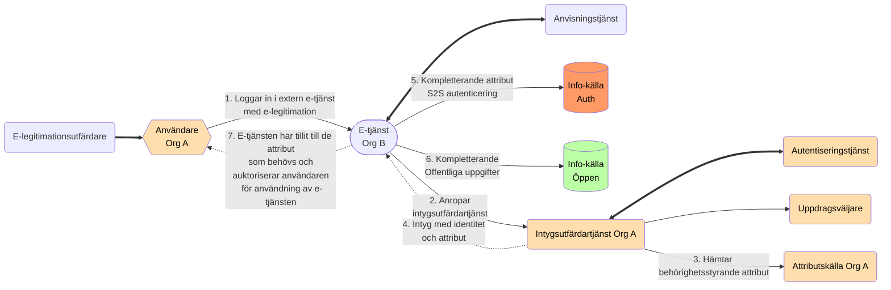

### Teknisk federationsarkitektur

```mermaid
flowchart LR
classDef Amber color:#000000,fill:#FFDEAD
classDef Green color:#000000,fill:#BDFFA4
classDef orange color:#000000,fill:#f96
A{{Användare<br>Org A}}:::Amber
B([E-tjänst<br>Org B])
C(Anvisningstjänst)
D[(Info-källa<br>Auth)]:::orange
E[(Info-källa<br>Öppen)]:::Green
F(Intygsutfärdartjänst Org A):::Amber
G(Autentiseringstjänst):::Amber
H(Uppdragsväljare):::Amber
I(Attributskälla Org A):::Amber
J(E-legitimationsutfärdare)
J ==> A
A -->|1. Loggar in i extern e-tjänst<br> med e-legitimation | B
B <==> C
B --> |2. Anropar<br>intygsutfärdartjänst| F
F <==> G
F --> H
F --> |3. Hämtar behörighetsstyrande attribut| I
F -.-> |4. Intyg med identitet<br>och attribut| B
B -->|5. Kompletterande attribut<br>S2S autenticering| D
B --> |6. Kompletterande<br>Offentliga uppgifter| E
B-.->|7. E-tjänsten har tillit till de attribut<br> som behövs och auktoriserar användaren<br> för användning av e-tjänsten |A
```
