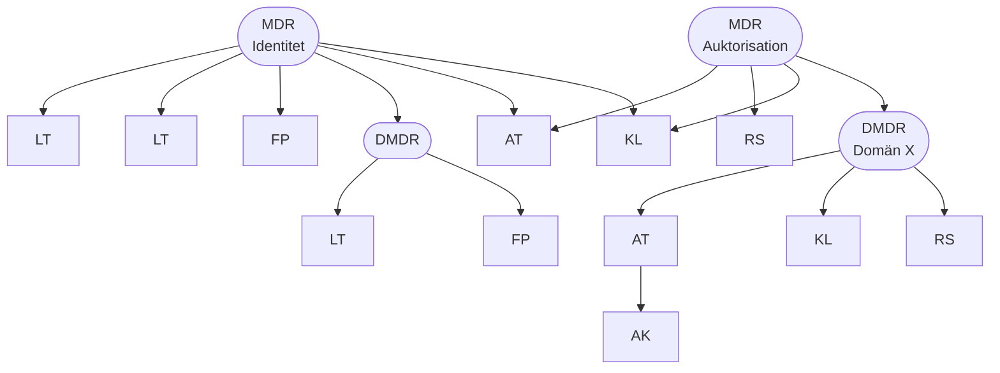

* MDR - Medatataregistrator
* LT - Legitimeringstjänst
* FP - Förlitande part
* DMDR - Delegerad metadataregistrator
* AT - Auktorisationstjänst
* AK - Attributkälla
* KL - Klient
* RS - Resursserver
