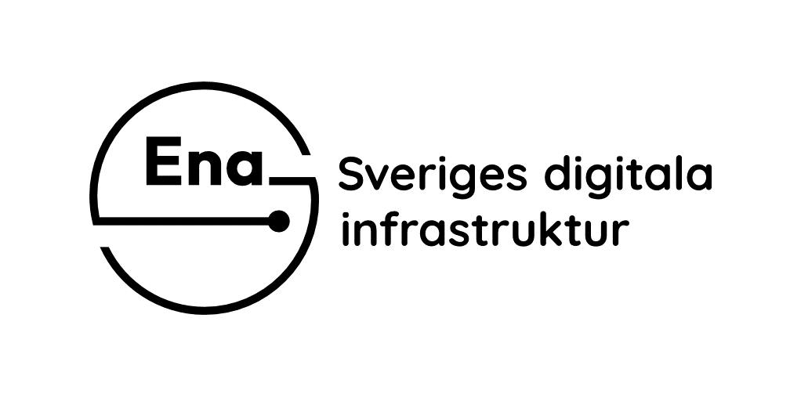

</img>

&nbsp;

:arrow_backward: [Tillbaka](README.md)

Senaste uppdatering: 15 maj 2024

---------

# Tekniska komponenter 
Nedan följer en förklarande lista på tekniska komponenter, termer, förkortningar och definitioner.

| Term  | Beskrivning | Kommentar |
| :------------- | :------------- | :------------- |
| användare | Ett subjekt (människa eller maskin) som interagerar med en digital tjänst. |  |
| auktorisation | En teknisk process för åtkomstbeslut till information eller digital tjänst. Beslut om åtkomst kan fattas genom en sammanvägd bedömning av identitets- och behörighetskontroll samt andra faktorer, till exempel policier som ger tillstånd utifrån plats/miljö och användningssituation. | Engelska: *authorization* |
| auktorisationstjänst | En infrastrukturkompontent som används för att fastställa användares behörighet vid åtkomst till information eller digital tjänst. | Engelska: *authorization server* |
| autentisering | En teknisk process för identifiering av användare. | Engelska: *authentication* |
| autentiseringstjänst | En infrastrukturkompontent som används för att fastställa användares identitet vid inloggning till en digital tjänst. |  |
| digital identitet | En elektronisk identitetsbevis. | Engelska: *security credentials* |
| id-handling | Se *identitetsbevis*. |  |
| identifikation | Se *identifiering*. |  |
| identitet | En registrerad koppling som gjorts mellan en *användare* och en unik identifierare i ett identifieringssystem. Identifieringssystemet kan vara lokalt, nationellt eller globalt. |  |
| identifiering | Process för fastställande av identitet. Syftet med identifiering är att kunna säkerställa entydiga och exakta hänvisningar till ett subjekt (människa eller maskin).  |  |
| identitetsbevis | Ett bevis på att subjekt (människa eller maskin) är unikt kopplad till en viss identitet. Identitetsbeviset behöver vara verifierbart så att en kontrollant kan avgöra handlingens äkthet. |  |
| identitetsintyg | Ett digitalt verifierbart intyg som kan användas som identitetsbevis vid inloggning till digitala tjänster. Det utfärdas till den mottagare, även kallad *förlitande part*, som har beställt identitetskontrollen från en betrodd leverantör av identitetsintyg. |  |
| identitetskontroll | En verifiering som myndighet gör med hjälp av ett *identitetsbevis* i varje enskilt förvaltningsärende för att bedöma om det är angiven individ som kontaktar myndigheten. |  |
| inloggning | En process för åtkomstsbeslut till en digital tjänst. Den involverar i regel identifiering av subjektet (människa eller maskin) genom autentisering och behörighetskontroll genom auktorisation.|  |
| e-legitimation |  |  |
| e-legitimering |  |  |
| e-legitimeringstjänst |  |  |
| e-underskrift |  |  |
| grundidentifiering | En verifiering som utfärdare av e-legitimation gör enligt ett tillitsramverk när en e-legitimation ska utfärdas.  | Reglerna bland annat i eIDAS-förordningen och EU-kommissionens tillämpningsföreskrifter. |

