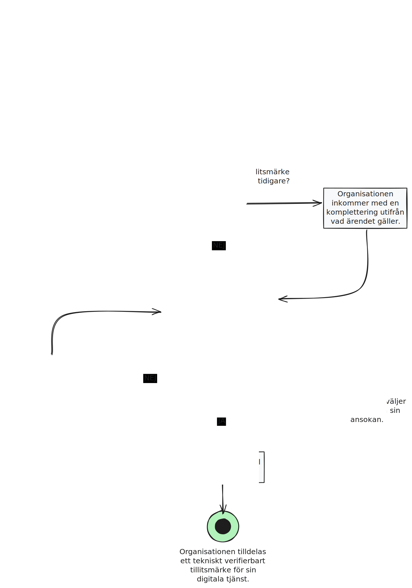

# Anskaffa tillitsmärke
:pushpin: **Processbeskrivning**  
Organisationen som har en digital tjänst ansluten till den federativa infrastrukturen anskaffar tillitsmärke för sin tjänst.

:white_circle: **Start**  
Organisation ansöker om tillitsmärke hos utfärdare av tillitsmärke.

:black_circle: **Slut**  
Organisation tilldelas ett tekniskt verifierbart tillitsmärke eller drar tillbaka sin ansökan.

:bookmark_tabs: **Önskat resultat**  
Organisationer kan anskaffa olika typer av tillitsmärken för sina digitala tjänster i den federativa infrastrukturen.   

  
