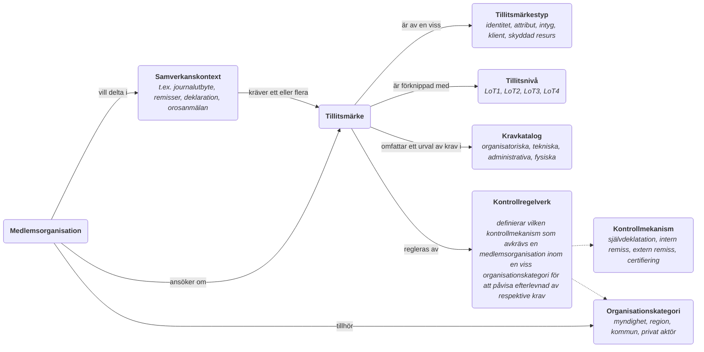

## Hypoteser
1.	Krav beskriver en viss informationssäkerhetsrelaterad förmåga hos en organisation, en verksamhet inom en organisation, eller hos en teknisk komponent. 
1.  Dessa krav kategoriseras som organisatoriska, administrativa, fysiska eller tekniska
2.	Ett tillitsmärke beskriver att en teknisk komponent, alternativt den verksamhet och/eller organisation som ansvarar för komponenten, uppfyller en uppsättning krav med en viss grad av tillförlitlighet
3.	Vilken kontrollmekanism som krävs för att påvisa en viss grad av tillförlitlighet kan skilja mellan olika krav, eller inom ett krav för olika ansvariga aktör eller vilken typ av aktör det är.
4.	Varje ägare av ett tillitsmärke måste öppet publicera sitt regelverk för vilken kontrollmekanism som krävs, per krav, för vilka aktörer eller typ av aktörer.
5.	Tillitsmärken bör utformas på olika nivåer (låg, väsentlig, hög, LoT1, LoT2, LoT3, 1, 2, 3, 4 eller med någon annan sorts skala som anger tillförlitlighetsnivå)
6.	Livscykelhanteringen av tillitsmärken bör sträva efter att kontinuerligt höja kraven i syfte att driva på en kontinuerligt ökande motståndskraft i det svenska samhället inom områdena informationssäkerhet och cybersäkerhet.

### Datamodell

```mermaid
graph LR
km(<b>Kontrollmekanism</b><br><i>självdeklatation, intern remiss, extern remiss, certifiering</i>)
tmtyp(<b>Tillitsmärkestyp</b><br><i>identitet, attribut, intyg, klient, skyddad resurs)
tm(<b>Tillitsmärke</b>)
tmnivå(<b>Tillitsnivå</b><br><i>LoT1, LoT2, LoT3, LoT4</i>)
kk(<b>Kravkatalog</b><br><i>organisatoriska, tekniska, administrativa, fysiska</i>)
kr(<b>Kontrollregelverk</b><br><br><i>definierar vilken kontrollmekanism som avkrävs en medlemsorganisation inom en viss organisationskategori för att påvisa efterlevnad av respektive krav)
m(<b>Medlemsorganisation<b>)
mk(<b>Organisationskategori</b><br><i>myndighet, region, kommun, privat aktör</i>)
d(<b>Samverkanskontext</b><br><i>t.ex. journalutbyte, remisser, deklaration, orosanmälan</i>)
m--ansöker om-->tm
m--tillhör-->mk
m--vill delta i-->d--kräver ett eller flera-->tm

tm--är av en viss-->tmtyp
tm--regleras av-->kr-.->mk & km
tm-- omfattar ett urval av krav i-->kk
tm--är förknippad med-->tmnivå
```