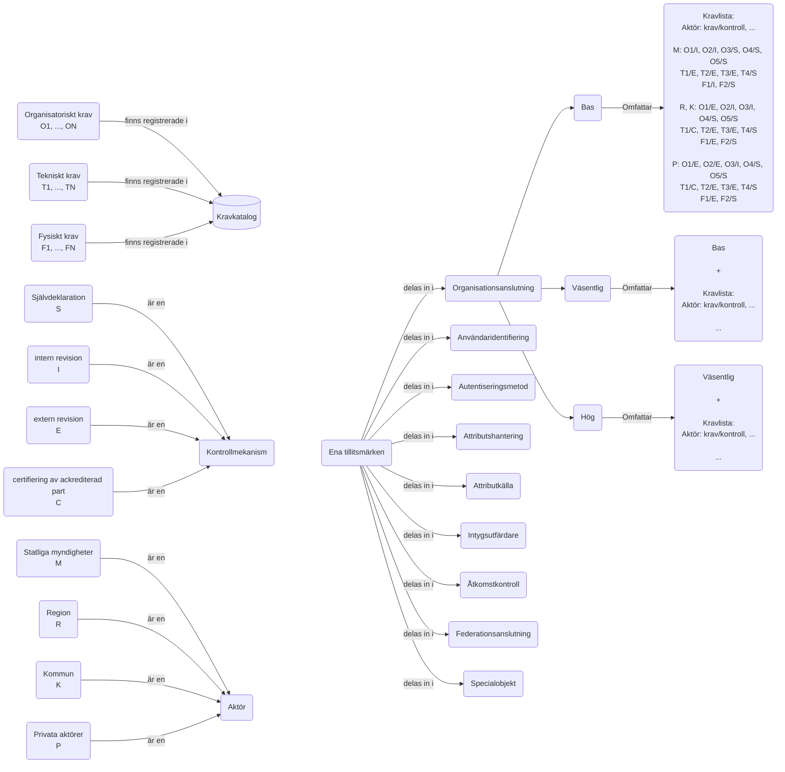

## Hypoteser
1.	Krav beskriver en viss förmåga hos en organisation, hos en verksamhet inom en organisation, alternativt hos en teknisk komponent (som ligger under en utpekad organisations eller verksamhets ansvar).
2.	Ett tillitsmärke beskriver att en teknisk komponent, alternativt den verksamhet och/eller organisation uppfyller en uppsättning krav med en viss grad av tillförlitlighet
3.	Vilken kontrollmekanism som krävs för att påvisa en viss grad av tillförlitlighet kan skilja mellan olika krav, eller inom ett krav för olika ansvariga aktör eller vilken typ av aktör det är.
4.	Varje ägare av ett tillitsmärke måste öppet publicera sitt regelverk för vilken kontrollmekanism som krävs, per krav, för vilka aktörer eller typ av aktörer.
5.	Tillitsmärken bör utformas på olika nivåer -förslag:  låg, väsentlig och hög
6.	Livscykelhanteringen av tillitsmärken bör sträva efter att kontinuerligt höja kraven i syfte att driva på en kontinuerligt ökande motståndskraft i det svenska samhället inom områdena informationssäkerhet och cybersäkerhet.

