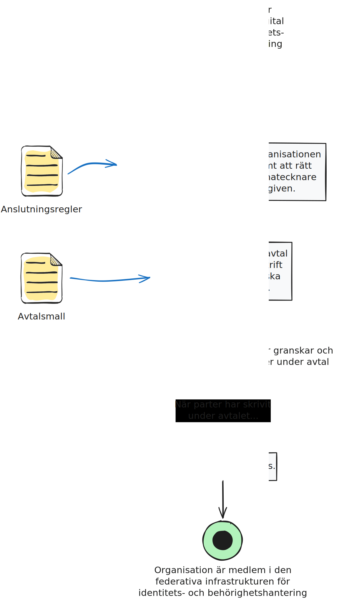
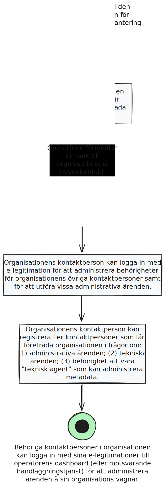
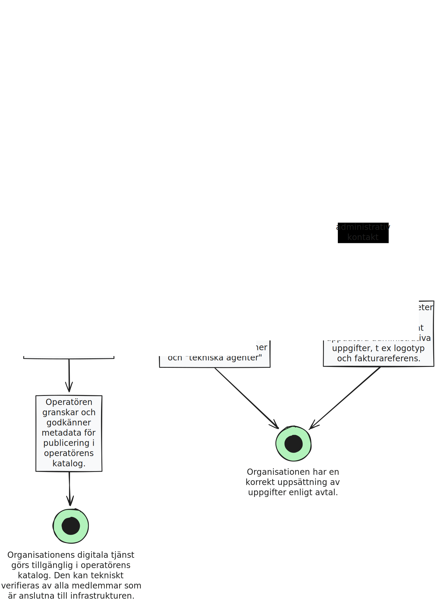

# Ansluta organisation
:pushpin: **Processbeskrivning**  
Anslutning av organisation till den federativa infrastrukturen.

:white_circle: **Start**  
Organisation ansöker om medlemskap till den federativa infrastrukturen för identitets- och behörighetshantering inom ramen för Ena (Sveriges digitala infrastruktur).

:black_circle: **Slut**  
Organisation är medelm i den federativa infrastrukturen.

:bookmark_tabs: **Önskat resultat**  
Operatören kan i enlighet med anslutningsreglerna registrera en kontaktperson som blir huvudkontakt att företräda organisationen.    

  

# Administrera företrädare
:pushpin: **Processbeskrivning**  
Administrativ företrädare för organisationen kan logga in och administrera de kontaktpersoner som ska få företräda organidationen.

:white_circle: **Start**  
Organisation är medelm i den federativa infrastrukturen.

:black_circle: **Slut**  
Behöriga kontaktpersoner i organisationen kan logga in med sina e-legitimationer till operatörens dashboard (eller motsvarande handläggningstjänst)
för att administrera ärenden å sin organisations vägnar.

:bookmark_tabs: **Önskat resultat**  
Organisationen har en korrekt uppsättning av kontaktpersoner, vilka kan logga in med sina e-legitimationer till operatörens dashboard (eller motsvarande tjänst) för att administrera ärenden för organisationens räkning.  
 

  

# Administrera inställningar och digitala tjänster
:pushpin: **Processbeskrivning**  
Företrädare för organisationen kan utföra ärenden, såsom administrera inställningar och digitala tjänster.

:white_circle: **Start**  
Behörigha kontaktpersoner i organisationen kan logga in med sina e-legitimationer till operatörens dashboard (eller motsvarande tjänst) för att administrera ärenden för organisationens räkning.

:black_circle: **Slut**  
Ärenden hanteras och utförs.

:bookmark_tabs: **Önskat resultat**  
Organisationen har har en korrekt och fullständig uppsättning av uppgifter enligt avtal samt att organisationens digitala tjänst finns tillgängliga i operatörens katalog. Dessa kan tekniskt verifieras teknisk av alla medlemmar som är anslutna till infrastrukturen.   

